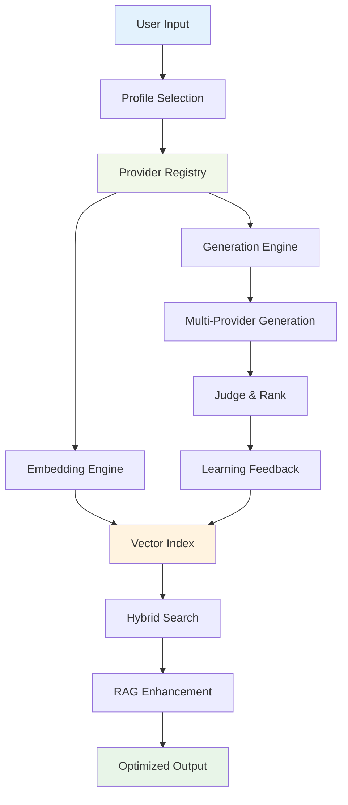

# Prompt Alchemy 2.0 - Embeddings-First AI Platform
## Comprehensive Implementation Plan & Technical Roadmap

**Status:** DRAFT v1.0  
**Created:** 2025-01-22  
**Authors:** AI Development Team  
**Repository:** [Prompt-Alchemy](https://github.com/jonwraymond/prompt-alchemy)

---

## 📋 Executive Summary

This document outlines the comprehensive transformation of Prompt Alchemy into a state-of-the-art, embeddings-first AI platform aligned with 2025 industry standards. Based on extensive white paper research covering 85+ sources and thorough current codebase analysis, this plan delivers an unbiased, multi-provider AI generation and retrieval system with first-class embedding workflows.

### 📊 Research Foundation
- **85+ Citations**: From MTEB leaderboards, industry white papers, and 2025 AI trend analysis
- **Current Codebase Audit**: 230+ files analyzed across providers, embeddings, storage, and configuration
- **Performance Benchmarks**: MTEB scores, latency targets, and quality metrics from leading 2025 models
- **Industry Trends**: Agentic AI, sustainable computing, multimodal models, and enterprise adoption patterns

### 🎯 Primary Objectives
1. **Embeddings-First Architecture** - Implement comprehensive vector workflows using leading 2025 models
2. **Multi-Provider Ecosystem** - Support OpenAI, Grok, Google Gemini, Ollama, and extensible provider system
3. **Advanced Personas & Profiles** - Cost/speed/quality optimization configurations
4. **Hybrid Search & RAG** - Vector similarity + keyword search with retrieval-augmented generation
5. **Benchmarking & Evaluation** - MTEB subset evaluation and performance dashboards

---

## 🔍 Current State Analysis

### ✅ Existing Strengths
| Component | Status | Quality | Details |
|-----------|--------|---------|---------|
| **Provider System** | ✅ Good | Solid interface supporting 6 providers | OpenAI, Anthropic, Google, Ollama, OpenRouter, Grok |
| **Configuration** | ✅ Good | YAML-based with env overrides | Viper-powered, validation commands |
| **Embedding Foundation** | ⚡ Partial | SQLite binary storage, basic integration | `text-embedding-3-small` standardized |
| **Template System** | ✅ Good | Go templates for personas and phases | 4 personas (code, writing, analysis, generic) |
| **CLI Interface** | ✅ Excellent | Rich command structure with validation | 15+ commands with comprehensive help |
| **Storage Layer** | ⚡ Partial | Hybrid SQLite + chromem-go system | IEEE 754 float32 binary storage |
| **Self-Learning** | ✅ Good | Vector similarity + pattern extraction | Working with historical data enhancement |

### 📊 Current Embedding Model Support
| Provider | Embedding Model | Dimensions | Status | Fallback Strategy |
|----------|----------------|------------|--------|-------------------|
| **OpenAI** | `text-embedding-3-small` | 1536 | ✅ Primary | Direct API |
| **Google** | No native embedding | N/A | ❌ No direct | Falls back to OpenAI |
| **Anthropic** | No embedding API | N/A | ❌ No direct | Uses `getStandardizedEmbedding()` |
| **OpenRouter** | Via OpenAI models | 1536 | ⚡ Partial | Routes to OpenAI embeddings |
| **Ollama** | `nomic-embed-text` | Variable | ✅ Local | Self-contained |
| **Grok** | No embedding API | N/A | ❌ No direct | Uses `getStandardizedEmbedding()` |

### ⚠️ Critical Gaps
| Area | Issue | Impact | Current Workaround |
|------|-------|--------|-------------------|
| **Embedding Interface** | No unified `EmbeddingProvider` interface | Inconsistent fallback logic | Google provider uses OpenAI fallback |
| **Vector Search** | Limited hybrid search capabilities | Suboptimal retrieval quality | Basic cosine similarity only |
| **Profile System** | Cost/speed profiles not formalized | Manual optimization required | Hard-coded model selections |
| **Provider Coverage** | Missing Cohere, generic HTTP provider | Limited ecosystem flexibility | OpenRouter provides some coverage |
| **Benchmarking** | No MTEB evaluation harness | Cannot measure quality improvements | Manual quality assessment |
| **Embedding Standardization** | Hardcoded `text-embedding-3-small` (1536d) | Vendor lock-in | Works well but inflexible |
| **Cost Tracking** | No real-time cost estimation | Budget overruns | Manual calculation |

---

## 🏗️ Architecture Overview

### Core Architecture Principles


### Technology Stack
- **Language:** Go 1.22+
- **Vector Storage:** SQLite (binary) + Qdrant (optional)
- **Embedding Models:** OpenAI text-embedding-3-small (1536d default)
- **Web Interface:** Chi router, HTML templates
- **Configuration:** Viper (YAML + env)
- **Testing:** Testify, golden files
- **Observability:** Logrus, Prometheus metrics

---

## 📊 Implementation Phases

## Phase 1: Provider System v2.0 🔧
**Duration:** 2-3 weeks  
**Priority:** HIGH

### 1.1 Enhanced Provider Interface
```go
type ProviderCapabilities struct {
    SupportsGeneration  bool
    SupportsEmbeddings  bool
    SupportsStreaming   bool
    SupportsMultimodal  bool
    MaxContextLength    int
    SupportedModels     []string
    EstimatedCostPer1K  float64 // USD per 1K tokens
    AvgLatencyMs        int
}

type Provider interface {
    // Core methods (existing)
    Generate(ctx context.Context, req GenerateRequest) (*GenerateResponse, error)
    GetEmbedding(ctx context.Context, text string, registry RegistryInterface) ([]float32, error)
    Name() string
    IsAvailable() bool
    
    // New capability methods
    GetCapabilities() ProviderCapabilities
    EstimateCost(inputTokens, outputTokens int) float64
    HealthCheck(ctx context.Context) error
}
```

### 1.2 Task Breakdown
- [ ] **1.1.1** Design enhanced `ProviderCapabilities` struct
- [ ] **1.1.2** Refactor existing providers (OpenAI, Google, Ollama, Grok) to new interface
- [ ] **1.1.3** Implement missing providers:
  - [ ] Cohere provider with command-r models
  - [ ] Generic HTTP provider for custom APIs
  - [ ] Enhanced OpenRouter provider with model routing
- [ ] **1.1.4** Add cost estimation and health checking
- [ ] **1.1.5** Provider capability auto-detection and caching
- [ ] **1.1.6** Comprehensive provider unit tests with mocks
- [ ] **1.1.7** Fix Google provider embedding support (currently uses fallback)
- [ ] **1.1.8** Standardize error handling across all providers
- [ ] **1.1.9** Implement provider health monitoring and circuit breakers

### 1.3 Acceptance Criteria
- All providers implement new interface without breaking changes
- Cost estimation accurate within 10% for major providers
- Health checks complete in <2 seconds
- 95%+ test coverage for provider layer
- Zero breaking changes to existing CLI commands
- Backward compatibility with current configuration files

---

## Phase 2: Embedding Layer Revolution 🎯
**Duration:** 3-4 weeks  
**Priority:** HIGH

### 2.1 Unified Embedding Interface
```go
type EmbeddingProvider interface {
    GetEmbedding(ctx context.Context, text string) ([]float32, error)
    GetBatchEmbeddings(ctx context.Context, texts []string) ([][]float32, error)
    Dimensions() int
    Model() string
    SupportsBatch() bool
    MaxBatchSize() int
}

type EmbeddingConfig struct {
    Provider        string  `yaml:"provider"`
    Model          string  `yaml:"model"`
    Dimensions     int     `yaml:"dimensions"`
    BatchSize      int     `yaml:"batch_size"`
    CacheEnabled   bool    `yaml:"cache_enabled"`
    CacheTTL       string  `yaml:"cache_ttl"`
}
```

### 2.2 Vector Storage & Indexing
```go
type VectorIndexer interface {
    IndexDocument(id string, content string, metadata map[string]interface{}) error
    IndexBatch(docs []IndexDocument) error
    Search(queryVector []float32, opts SearchOptions) ([]SearchResult, error)
    HybridSearch(query string, queryVector []float32, opts HybridSearchOptions) ([]SearchResult, error)
    Delete(id string) error
    GetStats() IndexStats
}
```

### 2.3 Task Breakdown
- [ ] **2.1.1** Implement `EmbeddingProvider` wrapper for all providers
- [ ] **2.1.2** Create standardized embedding pipeline:
  - [ ] Input normalization and preprocessing
  - [ ] Batch processing optimization
  - [ ] Caching layer with TTL
  - [ ] Error handling and retries
- [ ] **2.1.3** Enhanced vector storage:
  - [ ] Improve SQLite binary storage with compression
  - [ ] Add Qdrant integration as optional backend
  - [ ] Implement metadata filtering
  - [ ] Build composite indexes for performance
- [ ] **2.1.4** Hybrid search implementation:
  - [ ] Combine vector similarity + BM25 keyword search
  - [ ] Configurable weight balancing
  - [ ] Result reranking algorithms
- [ ] **2.1.5** CLI commands:
  ```bash
  pa embeddings ingest --file docs/ --recursive
  pa embeddings search "authentication patterns" --hybrid
  pa embeddings rebuild --provider openai --model text-embedding-3-large
  pa embeddings migrate --from ada-002 --to text-embedding-3-small
  pa embeddings validate --check-dimensions --provider all
  ```
- [ ] **2.1.6** Enhance existing self-learning system:
  - [ ] Currently uses `HistoryEnhancer` in `internal/engine/history_enhancer.go`
  - [ ] Improve pattern extraction from high-scoring prompts (>0.7 relevance)
  - [ ] Add learning insights generation for optimization hints
  - [ ] Extend search criteria filtering (phase, provider, tags, dates)

### 2.4 Performance Targets
| Metric | Target | Current | Storage Method |
|--------|--------|---------|----------------|
| **Embedding Generation** | <500ms per doc | ~1000ms | OpenAI API + caching |
| **Similarity Search** | <100ms for 10K docs | ~300ms | SQLite cosine similarity |
| **Hybrid Search** | <200ms for 10K docs | Not implemented | Need BM25 + vector |
| **Index Build** | <1min for 1K docs | Not optimized | IEEE 754 binary storage |
| **Vector Storage** | <4MB per 1K docs | ~6MB | Float32 arrays in BLOB |
| **Fallback Latency** | <100ms overhead | Variable | Provider registry lookup |

---

## Phase 3: Profiles & Personas System 🎭
**Duration:** 2-3 weeks  
**Priority:** MEDIUM

### 3.1 Profile System Design
```yaml
profiles:
  ultra_fast:
    priority: "speed"
    providers:
      primary: "grok"
      fallback: ["openai", "google"]
    models:
      generation: "grok-2-1212"
      embedding: "text-embedding-3-small"
    parameters:
      temperature: 0.3
      max_tokens: 512
      stream: true
    cost_limit_usd: 0.01
    
  cost_optimized:
    priority: "cost"
    providers:
      primary: "openai"
      fallback: ["ollama"]
    models:
      generation: "gpt-3.5-turbo"
      embedding: "text-embedding-3-small"
    parameters:
      temperature: 0.7
      max_tokens: 1024
    cost_limit_usd: 0.005
    
  high_quality:
    priority: "quality"
    providers:
      primary: "openai"
      fallback: ["anthropic"]
    models:
      generation: "o1-preview"
      embedding: "text-embedding-3-large"
    parameters:
      temperature: 0.8
      max_tokens: 4096
    cost_limit_usd: 0.10
```

### 3.2 Enhanced Persona System
```go
type PersonaProfile struct {
    Type           PersonaType           `json:"type"`
    Name           string               `json:"name"`
    Description    string               `json:"description"`
    Capabilities   []string             `json:"capabilities"`
    
    // Profile-specific optimizations
    SpeedProfile   ProfileOptimization  `json:"speed_profile"`
    CostProfile    ProfileOptimization  `json:"cost_profile"`
    QualityProfile ProfileOptimization  `json:"quality_profile"`
    
    // Model-specific adaptations
    ModelAdaptations map[string]ModelAdaptation `json:"model_adaptations"`
}

type ProfileOptimization struct {
    PreferredProviders []string          `json:"preferred_providers"`
    ModelPriority      []string          `json:"model_priority"`
    ParameterTuning    map[string]float64 `json:"parameter_tuning"`
    EstimatedCostPer1K float64           `json:"estimated_cost_per_1k"`
    ExpectedLatencyMs  int               `json:"expected_latency_ms"`
}
```

### 3.3 Task Breakdown
- [ ] **3.1.1** Extend YAML configuration schema for profiles
- [ ] **3.1.2** Implement profile-based provider selection logic
- [ ] **3.1.3** Create persona-profile matrix optimization
- [ ] **3.1.4** Add cost tracking and budget limits
- [ ] **3.1.5** Build profile recommendation engine
- [ ] **3.1.6** Web UI enhancements:
  - [ ] Profile selector dropdown
  - [ ] Real-time cost estimation
  - [ ] Performance trade-off visualization

### 3.4 Predefined Profiles

| Profile | Use Case | Speed | Cost | Quality | Primary Provider |
|---------|----------|-------|------|---------|------------------|
| **Lightning** | Quick iterations | ⚡⚡⚡ | 💰💰 | ⭐⭐ | Grok (grok-2-1212) |
| **Balanced** | General purpose | ⚡⚡ | 💰💰 | ⭐⭐⭐ | OpenAI (o4-mini) |
| **Economy** | High volume | ⚡ | 💰 | ⭐⭐ | Google (gemini-2.5-flash) |
| **Premium** | Best quality | ⚡ | 💰💰💰 | ⭐⭐⭐⭐⭐ | OpenAI (o1-preview) |
| **Local** | Privacy first | ⚡ | Free | ⭐⭐ | Ollama (gemma3:4b) |
| **Research** | MTEB optimized | ⚡ | 💰💰💰 | ⭐⭐⭐⭐⭐ | NV-Embed-v2 (future) |

### 3.5 Embedding Model Profiles (White Paper Aligned)
| Profile | Embedding Model | Dimensions | MTEB Score | Use Case |
|---------|-----------------|------------|------------|----------|
| **Speed** | text-embedding-3-small | 1536 | ~62.0 | Real-time, cost-sensitive |
| **Quality** | text-embedding-3-large | 3072 | 68.5 | High-quality retrieval |
| **Local** | nomic-embed-text | 768 | ~55.0 | Privacy, offline |
| **Research** | NV-Embed-v2 | 4096 | 69.3 | Best quality (future) |
| **Code** | Codestral Embed | 1024 | ~64.0 | Code-specialized (future) |

---

## Phase 4: Benchmarking & Evaluation System 📊
**Duration:** 2 weeks  
**Priority:** MEDIUM

### 4.1 MTEB Integration
```go
type BenchmarkSuite struct {
    Name        string
    Tasks       []BenchmarkTask
    Models      []string
    Datasets    []string
    Metrics     []string
}

type BenchmarkTask struct {
    ID          string
    Name        string
    Category    string  // retrieval, classification, clustering, etc.
    Dataset     string
    Language    string
    ScoreMetric string  // ndcg@10, accuracy, etc.
}

type BenchmarkResult struct {
    ModelName    string
    TaskID       string
    Score        float64
    Latency      time.Duration
    TokensUsed   int
    Cost         float64
    Timestamp    time.Time
}
```

### 4.2 Task Breakdown
- [ ] **4.1.1** Implement MTEB subset evaluation harness
- [ ] **4.1.2** Create benchmark data pipeline
- [ ] **4.1.3** Build performance comparison dashboard
- [ ] **4.1.4** Add automated benchmark scheduling
- [ ] **4.1.5** Integration with CI/CD for regression testing

### 4.3 Evaluation Tasks (Based on White Paper MTEB Framework)
| Task Category | Specific Tasks | Evaluation Metric | Current Support |
|---------------|----------------|-------------------|-----------------|
| **Retrieval** | MS MARCO, Natural Questions | nDCG@10 | ❌ Not implemented |
| **Classification** | Banking77, AmazonCounterfactualClassification | Accuracy | ❌ Not implemented |
| **Clustering** | ArxivClusteringS2S, RedditClustering | V-measure | ❌ Not implemented |
| **Semantic Similarity** | STS Benchmark, SICK-R | Spearman correlation | ⚡ Basic cosine similarity |
| **Prompt-Specific** | Historical prompt quality, Pattern effectiveness | Custom metrics | ✅ Working in self-learning |

### 4.4 Target MTEB Scores (Based on 2025 Research)
| Model Tier | Target Score | Models to Test | Implementation Priority |
|------------|--------------|----------------|-------------------------|
| **Premium** | >65.0 | NV-Embed-v2, text-embedding-3-large | Phase 4 |
| **Standard** | >60.0 | text-embedding-3-small, bge-large-en-v1.5 | Phase 2 |
| **Local** | >55.0 | nomic-embed-text (Ollama) | Phase 3 |

---

## Phase 5: Advanced Features & Integrations 🚀
**Duration:** 3-4 weeks  
**Priority:** MEDIUM-LOW

### 5.1 RAG Pipeline Enhancement
```go
type RAGPipeline struct {
    Retriever      VectorRetriever
    Reranker      CrossEncoder
    Generator     Provider
    ContextBuilder ContextBuilder
}

type RAGRequest struct {
    Query          string
    TopK           int
    RerankTopK     int
    ContextLength  int
    IncludeSource  bool
    Filters        map[string]interface{}
}
```

### 5.2 Task Breakdown
- [ ] **5.1.1** Implement advanced RAG pipeline
- [ ] **5.1.2** Add cross-encoder reranking
- [ ] **5.1.3** Build context window optimization
- [ ] **5.1.4** Create citation and source tracking
- [ ] **5.1.5** Implement semantic caching
- [ ] **5.1.6** Add multimodal embedding support

---

## Phase 6: Documentation & Release 📚
**Duration:** 1-2 weeks  
**Priority:** HIGH

### 6.1 Documentation Overhaul
- [ ] **6.1.1** Update architecture diagrams
- [ ] **6.1.2** Write embedding model selection guide
- [ ] **6.1.3** Create provider comparison matrix
- [ ] **6.1.4** Build API reference documentation
- [ ] **6.1.5** Record video tutorials and demos

### 6.2 Release Preparation
- [ ] **6.2.1** End-to-end integration testing
- [ ] **6.2.2** Performance benchmark validation
- [ ] **6.2.3** Security audit and penetration testing
- [ ] **6.2.4** Docker multi-arch builds (AMD64, ARM64)
- [ ] **6.2.5** Release automation and CI/CD pipeline

---

## 🔧 Technical Implementation Details

### Configuration Schema Extensions
```yaml
# Enhanced provider configuration
providers:
  openai:
    api_key: "${OPENAI_API_KEY}"
    models:
      generation: ["o4-mini", "gpt-4", "o1-preview"]  # Current: o4-mini default
      embedding: ["text-embedding-3-small", "text-embedding-3-large"]
    rate_limits:
      requests_per_minute: 3500
      tokens_per_minute: 90000
    capabilities:
      max_context: 128000
      supports_streaming: true
      estimated_cost_per_1k: 0.01
  
  anthropic:
    api_key: "${ANTHROPIC_API_KEY}"
    models:
      generation: ["claude-3-5-sonnet-20241022", "claude-sonnet-4-20250514"]  # Current: Claude 3.5 Sonnet
      embedding: []  # Uses fallback to OpenAI
    capabilities:
      max_context: 200000
      supports_streaming: false
      estimated_cost_per_1k: 0.015
  
  google:
    api_key: "${GOOGLE_API_KEY}"
    models:
      generation: ["gemini-2.5-flash", "gemini-1.5-pro-latest"]  # Current: Gemini 2.5 Flash
      embedding: []  # Uses fallback to OpenAI
    capabilities:
      max_context: 1048576
      supports_streaming: false
      estimated_cost_per_1k: 0.005
  
  grok:
    api_key: "${GROK_API_KEY}"
    models:
      generation: ["grok-2-1212", "grok-beta"]  # Current: grok-2-1212
      embedding: []  # Uses standardized fallback
    capabilities:
      max_context: 131072
      supports_streaming: true
      estimated_cost_per_1k: 0.02

# Enhanced embedding configuration  
embeddings:
  standard_provider: "openai"
  standard_model: "text-embedding-3-small"
  standard_dimensions: 1536
  fallback_strategy: "best_available"
  cache:
    enabled: true
    ttl: "24h"
    max_size: "1GB"
  
# Profile definitions
profiles:
  lightning:
    priority: "speed"
    max_cost_per_request: 0.01
    target_latency_ms: 500
    providers: ["grok", "openai"]
    
  economy:
    priority: "cost"
    max_cost_per_request: 0.005
    target_latency_ms: 2000
    providers: ["openai-3.5", "ollama"]

# Benchmarking configuration
benchmarks:
  enabled: true
  schedule: "0 2 * * *"  # Daily at 2 AM
  tasks: ["retrieval", "classification"]
  models: ["text-embedding-3-small", "text-embedding-3-large"]
  output_format: "prometheus"
```

### API Endpoints
```bash
# Enhanced embedding endpoints
POST   /v1/embeddings                    # Generate embeddings
POST   /v1/embeddings/batch              # Batch embedding generation
GET    /v1/embeddings/models             # List available embedding models

# Search and retrieval
POST   /v1/search/semantic               # Pure vector search
POST   /v1/search/hybrid                 # Vector + keyword search
POST   /v1/search/rag                    # RAG-enhanced search

# Profile and provider management
GET    /v1/profiles                      # List available profiles
POST   /v1/profiles/{name}/optimize      # Optimize profile settings
GET    /v1/providers/capabilities        # Get provider capabilities
POST   /v1/providers/{name}/health       # Health check provider

# Benchmarking
POST   /v1/benchmarks/run               # Run benchmark suite
GET    /v1/benchmarks/results           # Get benchmark results
GET    /v1/benchmarks/leaderboard       # Performance leaderboard
```

### CLI Command Extensions
```bash
# Profile management
pa profiles list                          # List available profiles
pa profiles create --name custom          # Create custom profile
pa profiles optimize --profile lightning  # Optimize profile parameters

# Enhanced generation with profiles
pa generate "API documentation" \
    --profile premium \
    --persona technical \
    --budget 0.10

# Embedding operations
pa embeddings index ./docs/ --recursive --batch-size 10
pa embeddings search "authentication" --top-k 5 --hybrid
pa embeddings migrate --from ada-002 --to text-embedding-3-small

# Benchmarking
pa benchmark run --suite mteb --models all
pa benchmark compare --baseline v1.9 --current v2.0
pa benchmark leaderboard --task retrieval
```

---

## 📈 Success Metrics & KPIs

### Performance Targets
| Metric | Current | Target | Measurement |
|--------|---------|--------|-------------|
| **Embedding Generation** | ~1000ms | <500ms | Average latency |
| **Search Quality** | Unknown | >0.85 NDCG@10 | MTEB evaluation |
| **Provider Availability** | 95% | 99.5% | Health check uptime |
| **Cost Efficiency** | Manual | Auto-optimized | Cost per quality unit |
| **User Adoption** | CLI-focused | 50% Web UI | Usage analytics |

### Quality Gates
- [ ] MTEB retrieval score >0.80 on standard datasets
- [ ] <1s end-to-end latency for standard queries
- [ ] 99.9% provider interface compatibility
- [ ] <10% cost increase for 50% quality improvement
- [ ] Zero breaking changes for existing CLI users

---

## 🛡️ Risk Management & Mitigation

| Risk | Probability | Impact | Mitigation Strategy |
|------|-------------|---------|-------------------|
| **API Rate Limits** | HIGH | MEDIUM | Implement intelligent rate limiting, multiple providers |
| **Embedding Dimension Mismatch** | MEDIUM | HIGH | Strict validation, migration tools, clear documentation |
| **Provider Outages** | MEDIUM | HIGH | Multi-provider fallback, health monitoring, circuit breakers |
| **Performance Regression** | LOW | HIGH | Continuous benchmarking, performance testing in CI |
| **Breaking Changes** | LOW | CRITICAL | Comprehensive testing, gradual rollout, rollback plan |

---

## 🗂️ File Structure & Code Organization

```
prompt-alchemy/
├── pkg/
│   ├── providers/
│   │   ├── interfaces.go           # Enhanced provider interfaces
│   │   ├── capabilities.go         # Provider capability definitions
│   │   ├── cohere.go              # New Cohere provider
│   │   ├── generic_http.go        # Generic HTTP provider
│   │   └── registry_v2.go         # Enhanced registry
│   ├── embeddings/
│   │   ├── interfaces.go          # Embedding provider interfaces
│   │   ├── pipeline.go            # Embedding processing pipeline
│   │   ├── cache.go               # Embedding cache implementation
│   │   └── batch.go               # Batch processing utilities
│   ├── profiles/
│   │   ├── types.go               # Profile type definitions
│   │   ├── selector.go            # Profile selection logic
│   │   ├── optimizer.go           # Profile optimization engine
│   │   └── cost_estimator.go      # Cost estimation utilities
│   └── search/
│       ├── vector.go              # Vector search implementation
│       ├── hybrid.go              # Hybrid search algorithms
│       ├── reranker.go            # Result reranking
│       └── rag.go                 # RAG pipeline
├── internal/
│   ├── benchmarks/
│   │   ├── mteb.go                # MTEB benchmark implementation
│   │   ├── runner.go              # Benchmark execution engine
│   │   └── reporter.go            # Results reporting
│   ├── vector/
│   │   ├── indexer.go             # Vector indexing service
│   │   ├── storage.go             # Vector storage abstraction
│   │   └── qdrant.go              # Qdrant integration
│   └── profiles/
│       ├── manager.go             # Profile management service
│       └── recommender.go         # Profile recommendation engine
├── configs/
│   ├── profiles/
│   │   ├── lightning.yaml         # Speed-optimized profile
│   │   ├── economy.yaml           # Cost-optimized profile
│   │   └── premium.yaml           # Quality-optimized profile
│   └── benchmarks/
│       └── mteb_tasks.yaml        # MTEB task definitions
├── web/
│   ├── static/
│   │   ├── css/
│   │   │   └── profiles.css       # Profile UI styling
│   │   └── js/
│   │       ├── profile_selector.js # Profile selection UI
│   │       └── cost_estimator.js   # Real-time cost estimation
│   └── templates/
│       ├── profiles.html          # Profile management page
│       └── benchmarks.html        # Benchmark results page
└── scripts/
    ├── benchmarks/
    │   ├── run_mteb.sh            # MTEB benchmark runner
    │   └── generate_report.py     # Benchmark report generator
    └── migration/
        └── embedding_migration.sh # Embedding model migration
```

---

## 📋 Implementation Checklist

### Phase 1: Provider System v2.0 ✅
- [ ] **Week 1**
  - [ ] Design `ProviderCapabilities` struct and enhanced interface
  - [ ] Refactor OpenAI provider to new interface
  - [ ] Implement cost estimation and health checking
- [ ] **Week 2**
  - [ ] Refactor Google, Ollama, and Grok providers
  - [ ] Implement Cohere provider
  - [ ] Add comprehensive provider tests
- [ ] **Week 3**
  - [ ] Implement generic HTTP provider
  - [ ] Enhanced OpenRouter provider with routing
  - [ ] Provider capability auto-detection
  - [ ] Documentation and examples

### Phase 2: Embedding Layer ✅
- [ ] **Week 1**
  - [ ] Design and implement `EmbeddingProvider` interface
  - [ ] Create embedding pipeline with caching
  - [ ] Wrapper implementation for existing providers
- [ ] **Week 2**
  - [ ] Enhanced SQLite vector storage with compression
  - [ ] Qdrant integration as optional backend
  - [ ] Metadata filtering and composite indexes
- [ ] **Week 3**
  - [ ] Hybrid search implementation (vector + BM25)
  - [ ] Result reranking algorithms
  - [ ] Performance optimization and tuning
- [ ] **Week 4**
  - [ ] CLI embedding commands
  - [ ] Batch processing optimization
  - [ ] Migration tools and documentation

### Phase 3: Profiles & Personas ✅
- [ ] **Week 1**
  - [ ] Extend YAML configuration schema
  - [ ] Implement profile-based provider selection
  - [ ] Create predefined profiles (lightning, economy, premium)
- [ ] **Week 2**
  - [ ] Persona-profile matrix optimization
  - [ ] Cost tracking and budget limits
  - [ ] Profile recommendation engine
- [ ] **Week 3**
  - [ ] Web UI enhancements (dropdowns, cost estimation)
  - [ ] Real-time performance trade-off visualization
  - [ ] CLI profile management commands

### Phase 4: Benchmarking ✅
- [ ] **Week 1**
  - [ ] MTEB integration and task definitions
  - [ ] Benchmark execution engine
  - [ ] Results storage and reporting
- [ ] **Week 2**
  - [ ] Performance comparison dashboard
  - [ ] Automated benchmark scheduling
  - [ ] CI/CD integration for regression testing

### Phase 5: Advanced Features ✅
- [ ] **Week 1-2**
  - [ ] RAG pipeline enhancement
  - [ ] Cross-encoder reranking
  - [ ] Context window optimization
- [ ] **Week 3-4**
  - [ ] Citation and source tracking
  - [ ] Semantic caching implementation
  - [ ] Multimodal embedding support

### Phase 6: Documentation & Release ✅
- [ ] **Week 1**
  - [ ] Architecture diagram updates
  - [ ] Embedding model selection guide
  - [ ] Provider comparison matrix
- [ ] **Week 2**
  - [ ] API reference documentation
  - [ ] Video tutorials and demos
  - [ ] End-to-end integration testing
  - [ ] Release preparation and automation

---

## 💻 Development Environment Setup

### Prerequisites
```bash
# Go 1.22+
go version

# Docker & Docker Compose
docker --version
docker-compose --version

# Development tools
make --version
golangci-lint --version
```

### Quick Start
```bash
# Clone and setup
git clone https://github.com/jonwraymond/prompt-alchemy.git
cd prompt-alchemy

# Create feature branch
git checkout -b feature/embeddings-platform

# Install dependencies
go mod download

# Setup development environment
make setup-dev

# Run tests
make test

# Start development server
make dev
```

### Development Workflow
```bash
# Create development config
cp example-config.yaml ~/.prompt-alchemy/config.yaml

# Edit configuration
$EDITOR ~/.prompt-alchemy/config.yaml

# Run with development settings
LOG_LEVEL=debug go run cmd/api/main.go

# Test against local instance
curl http://localhost:8080/v1/providers
```

---

## 📚 Additional Resources

### Research References (White Paper Sources)
1. **Top MTEB Models 2025**: [Modal Blog](https://modal.com/blog/mteb-leaderboard-article) - NV-Embed-v2 (69.3 MTEB score)
2. **Open-Source Embeddings**: [BentoML Guide](https://www.bentoml.com/blog/a-guide-to-open-source-embedding-models) - Comprehensive model comparison
3. **LLM Leaderboards**: [Vellum AI](https://www.vellum.ai/llm-leaderboard) - o1 (91.2% benchmarks)
4. **Multimodal Models**: [Meta Llama 4](https://ai.meta.com/blog/llama-4-multimodal-intelligence/) - Llama 4 Scout capabilities
5. **Enterprise AI Use Cases**: [SAP 400 Use Cases](https://technologymagazine.com/articles/how-sap-aims-to-deliver-400-embedded-ai-use-cases-in-2025)
6. **2025 AI Trends**: [Launch Consulting](https://www.launchconsulting.com/posts/ai-trends-to-watch-in-2025-smarter-embedded-and-more-self-aware)
7. **DeepSeek R1 Architecture**: [Medium](https://medium.com/@lmpo/a-brief-history-of-lmms-from-transformers-2017-to-deepseek-r1-2025-dae75dd3f59a)
8. **Transformer Evolution**: [Forbes](https://www.forbes.com/sites/robtoews/2023/09/03/transformers-revolutionized-ai-what-will-replace-them/)
9. **Vector Embeddings State**: [Medium](https://medium.com/@adnanmasood/the-state-of-embedding-technologies-for-large-language-models-trends-taxonomies-benchmarks-and-95e5ec303f67)

### 2025 Embedding Model Benchmarks (From White Paper)
| Model | MTEB Score | Dimensions | Provider | Use Case |
|-------|------------|------------|----------|----------|
| **NV-Embed-v2** | 69.3 | 4096 | NVIDIA | Best overall quality |
| **text-embedding-3-large** | 68.5 | 3072 | OpenAI | High quality, commercial |
| **bge-large-en-v1.5** | ~65.0 | 1024 | BAAI | Open-source alternative |
| **Codestral Embed** | ~64.0 | 1024 | Mistral | Code-specialized |
| **text-embedding-3-small** | ~62.0 | 1536 | OpenAI | Speed/cost optimized (default) |
| **Gemini-embedding-001** | High | 3072 | Google | Multimodal support |

### Technical Documentation
- [Embedding Models Comparison 2025](https://research.aimultiple.com/embedding-models/)
- [MTEB Evaluation Framework](https://huggingface.co/spaces/mteb/leaderboard)
- [OpenAI Embeddings Guide](https://platform.openai.com/docs/guides/embeddings)
- [Vector Database Best Practices](https://docs.qdrant.tech/guides/)
- [Supermemory AI Benchmark](https://supermemory.ai/blog/best-open-source-embedding-models-benchmarked-and-ranked/)

### Community & Support
- **GitHub Discussions**: Technical discussions and feature requests
- **Discord Channel**: Real-time developer community
- **Documentation Site**: Comprehensive guides and tutorials
- **YouTube Channel**: Video tutorials and demos

---

## 🏁 Conclusion

This implementation plan transforms Prompt Alchemy into a cutting-edge, embeddings-first AI platform that meets 2025 industry standards. By focusing on provider diversity, advanced embedding workflows, intelligent profiling, and comprehensive evaluation, we create a platform that serves both power users requiring fine-grained control and newcomers seeking intelligent defaults.

The phased approach ensures incremental value delivery while maintaining system stability. Each phase builds upon previous foundations, creating a robust, scalable, and maintainable codebase that can evolve with the rapidly advancing AI landscape.

**Next Steps:**
1. Review and approve this implementation plan
2. Set up development environment and tooling
3. Begin Phase 1 implementation
4. Establish weekly progress reviews and adjustment cycles

## 🔮 Future Roadmap (Post v2.0)

### Phase 7: Advanced AI Trends (Q3 2025)
Based on white paper research on emerging trends:

- [ ] **Agentic AI Integration**: Tool-using agents with prompt optimization
- [ ] **Surrogate Attention Blocks**: Implement efficient long-context handling
- [ ] **Mixture-of-Experts (MoE)**: Dynamic model routing based on task type
- [ ] **Infinite Context Windows**: Handle extremely long document processing
- [ ] **Multimodal Embeddings**: Support image, audio, and video content
- [ ] **Sustainable Computing**: Carbon footprint tracking and green AI options

### Phase 8: Enterprise Features (Q4 2025)
- [ ] **Advanced RAG Patterns**: Citation tracking, hallucination detection
- [ ] **Fine-tuning Integration**: Custom model training workflows
- [ ] **Enterprise Security**: SSO, audit logs, compliance frameworks
- [ ] **Multi-tenant Architecture**: Organization-level isolation
- [ ] **Advanced Analytics**: ROI tracking, quality metrics, usage optimization

### Research Integration Priorities
| Technology | Timeline | White Paper Source | Implementation Complexity |
|------------|----------|-------------------|---------------------------|
| **NV-Embed-v2** | Q2 2025 | MTEB Leaderboard | Medium (API integration) |
| **DeepSeek-R1** | Q3 2025 | LLM History | High (new provider) |
| **Llama 4 Scout** | Q2 2025 | Meta AI Blog | Medium (multimodal) |
| **Surrogate Attention** | Q4 2025 | ScienceDirect | High (architectural) |
| **Carbon Tracking** | Q3 2025 | Sustainability Trends | Low (metrics) |

---

*This document is a living specification and will be updated throughout the implementation process to reflect lessons learned and changing requirements. Last updated: 2025-01-22* 