# Prompt Alchemy Architecture

Prompt Alchemy is a sophisticated AI prompt generation system built with Go that transforms raw ideas into refined prompts through a three-phase alchemical process. This document provides a comprehensive overview of the system architecture, design decisions, and implementation details.

## Table of Contents

1. [System Overview](#system-overview)
2. [Architectural Principles](#architectural-principles)
3. [Core Components](#core-components)
4. [Data Flow](#data-flow)
5. [Alchemical Process](#alchemical-process)
6. [Provider Architecture](#provider-architecture)
7. [Storage Layer](#storage-layer)
8. [Learning System](#learning-system)
9. [MCP Integration](#mcp-integration)
10. [Configuration System](#configuration-system)
11. [Security Architecture](#security-architecture)
12. [Performance Design](#performance-design)
13. [Extension Points](#extension-points)
14. [Deployment Architecture](#deployment-architecture)

## System Overview

Prompt Alchemy follows a modular, layered architecture designed for scalability, maintainability, and extensibility. The system can operate in two primary modes:

- **On-Demand Mode**: CLI-based generation with immediate results
- **Server Mode**: Persistent MCP server for AI agent integration

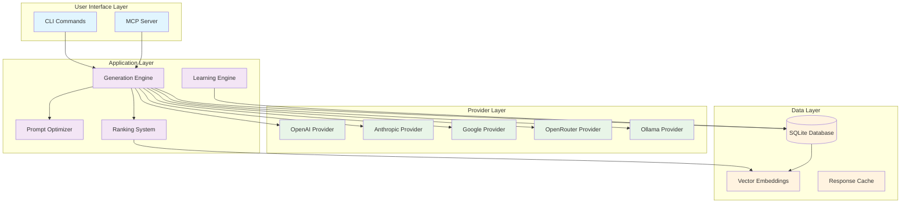

## Architectural Principles

### 1. Modularity
- Clear separation between packages (`pkg/` for public APIs, `internal/` for implementation)
- Interface-driven design for provider abstraction
- Pluggable components for extensibility

### 2. Configurability
- Hierarchical configuration system (defaults → file → env → flags)
- Provider-specific settings with sensible defaults
- Runtime configuration validation

### 3. Observability
- Structured logging with contextual information
- Comprehensive metrics collection
- Performance tracking and cost monitoring

### 4. Reliability
- Graceful error handling and recovery
- Provider failover mechanisms
- Data consistency guarantees

### 5. Performance
- Parallel processing where possible
- Efficient vector operations for embeddings
- Connection pooling and caching

## Core Components

### Generation Engine (`internal/engine/`)

The heart of the system, orchestrating the entire prompt generation process.

```go
type Engine struct {
    providers  *providers.Registry
    storage    *storage.Storage
    ranker     *ranking.Ranker
    selector   *selection.AISelector
    logger     *logrus.Logger
}

type GenerateOptions struct {
    Request        models.PromptRequest
    PhaseConfigs   map[models.Phase]models.PhaseConfig
    UseParallel    bool
    IncludeContext bool
    Persona        string
    TargetModel    string
}
```

**Responsibilities:**
- Coordinate multi-phase generation
- Manage provider selection and fallback
- Handle parallel execution
- Integrate ranking and optimization
- Persist results to storage

### Phase Handlers (`internal/phases/`)

Specialized processors for each alchemical phase:

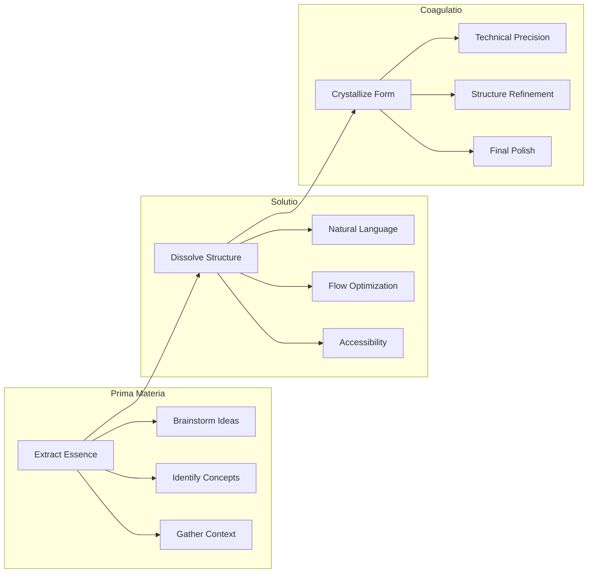

### Provider Registry (`pkg/providers/`)

Unified abstraction layer for AI providers:

```go
type Provider interface {
    Generate(ctx context.Context, request GenerateRequest, registry *Registry) (*GenerateResponse, error)
    GetEmbedding(ctx context.Context, text string, registry *Registry) ([]float32, error)
    SupportsEmbeddings() bool
    GetName() string
    GetModels() []string
}
```

**Design Benefits:**
- Consistent interface across all providers
- Easy addition of new providers
- Provider-specific optimizations
- Graceful degradation on failures

### Storage Layer (`internal/storage/`)

SQLite-based persistence with vector search capabilities:

```sql
-- Core schema
CREATE TABLE prompts (
    id TEXT PRIMARY KEY,
    content TEXT NOT NULL,
    phase TEXT NOT NULL,
    provider TEXT NOT NULL,
    model TEXT NOT NULL,
    temperature REAL,
    max_tokens INTEGER,
    tags TEXT,
    embedding BLOB,
    created_at DATETIME DEFAULT CURRENT_TIMESTAMP
);

-- Optimized indexes
CREATE INDEX idx_prompts_phase ON prompts(phase);
CREATE INDEX idx_prompts_provider ON prompts(provider);
CREATE INDEX idx_prompts_created_at ON prompts(created_at);
CREATE INDEX idx_prompts_tags ON prompts(tags);
```

### Learning System (`internal/learning/` & `internal/ranking/`)

AI-powered continuous improvement:

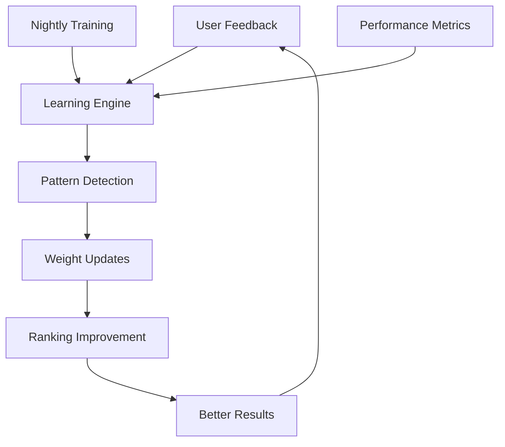

## Data Flow

### 1. Generation Flow

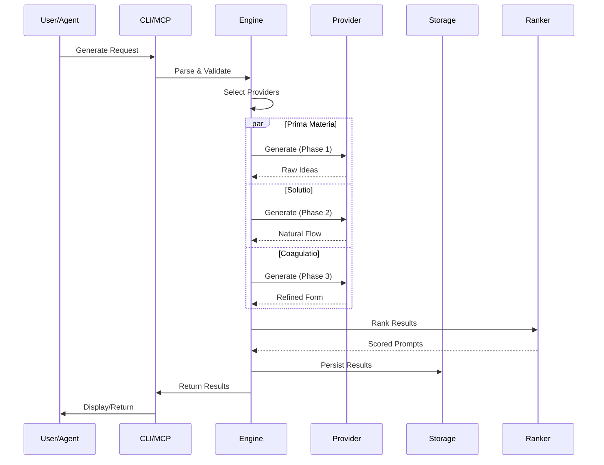

### 2. Search Flow

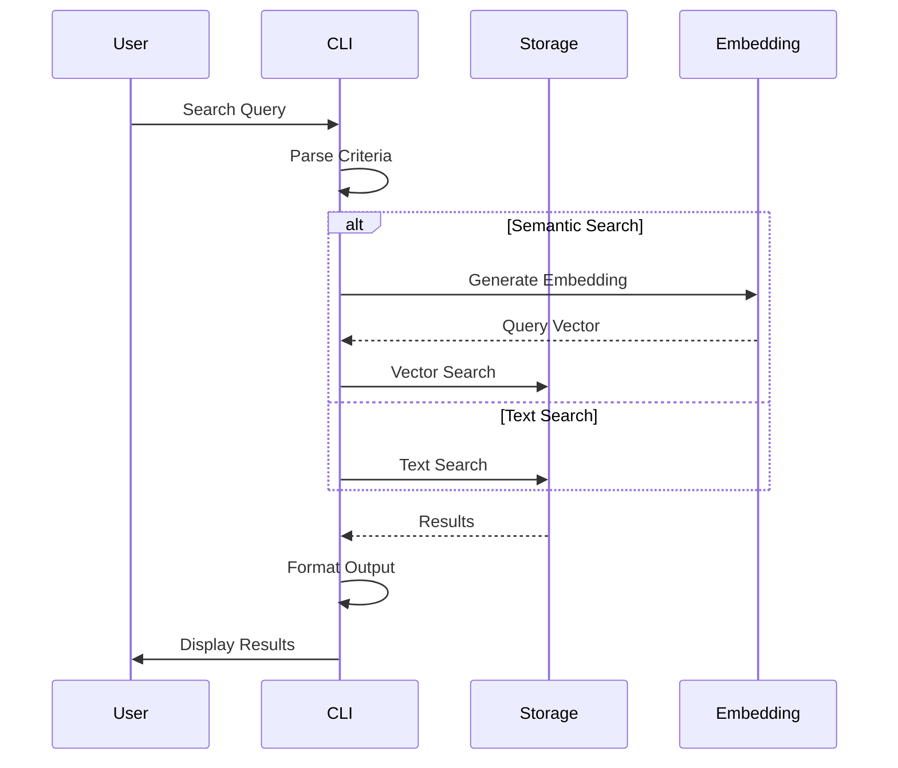

## Alchemical Process

The three-phase transformation process is the core innovation of Prompt Alchemy:

### Phase 1: Prima Materia (First Matter)
**Purpose**: Extract the raw essence and fundamental concepts
**Characteristics**:
- High creativity (temperature ~0.8)
- Broad exploration
- Concept identification
- Context gathering

**Provider Selection**: Optimized for creativity and brainstorming
- Default: OpenAI (GPT models excel at ideation)
- Alternative: OpenRouter (access to diverse models)

### Phase 2: Solutio (Dissolution)
**Purpose**: Dissolve rigid structures into natural, flowing language
**Characteristics**:
- Balanced creativity/structure (temperature ~0.7)
- Natural language optimization
- Human readability focus
- Accessibility enhancement

**Provider Selection**: Optimized for natural language
- Default: Anthropic (Claude excels at natural communication)
- Alternative: Google (Gemini for conversational flow)

### Phase 3: Coagulatio (Crystallization)
**Purpose**: Crystallize into precise, refined final form
**Characteristics**:
- Low temperature (~0.3-0.5)
- Technical precision
- Structure optimization
- Final polish

**Provider Selection**: Optimized for precision and structure
- Default: Google (Gemini for technical accuracy)
- Alternative: OpenAI (GPT for structured output)

## Provider Architecture

### Abstraction Layer

```go
type Registry struct {
    providers map[ProviderType]Provider
    configs   map[ProviderType]interface{}
    logger    *logrus.Logger
}

func (r *Registry) Get(providerType ProviderType) (Provider, error)
func (r *Registry) GetWithFallback(preferred ProviderType, fallbacks []ProviderType) (Provider, error)
```

### Provider Implementations

Each provider implements the common interface while optimizing for their specific capabilities:

```go
// OpenAI Provider
type OpenAIProvider struct {
    client *openai.Client
    config OpenAIConfig
}

// Anthropic Provider
type AnthropicProvider struct {
    client *anthropic.Client
    config AnthropicConfig
}

// Google Provider
type GoogleProvider struct {
    client *genai.Client
    config GoogleConfig
}
```

### Failover Strategy

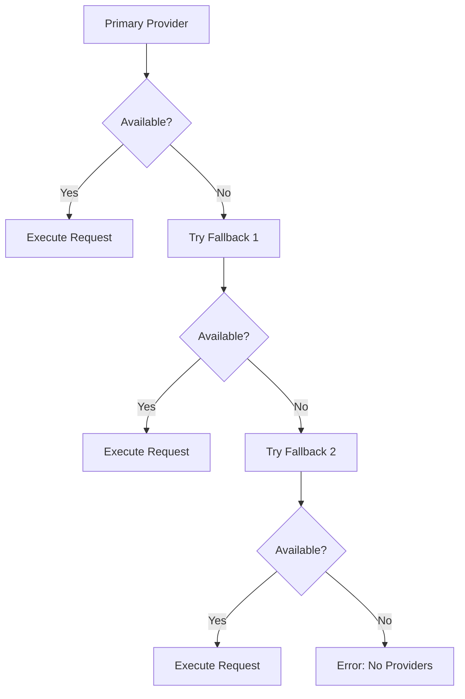

## Storage Layer

### Database Schema

```sql
-- Prompts table with full metadata
CREATE TABLE prompts (
    id TEXT PRIMARY KEY,
    content TEXT NOT NULL,
    phase TEXT NOT NULL,
    provider TEXT NOT NULL,
    model TEXT NOT NULL,
    temperature REAL,
    max_tokens INTEGER,
    tokens_used INTEGER,
    cost REAL,
    tags TEXT,
    embedding BLOB,
    embedding_model TEXT,
    embedding_dimensions INTEGER,
    parent_id TEXT,
    session_id TEXT,
    created_at DATETIME DEFAULT CURRENT_TIMESTAMP,
    updated_at DATETIME DEFAULT CURRENT_TIMESTAMP
);

-- Context and relationships
CREATE TABLE prompt_context (
    id TEXT PRIMARY KEY,
    prompt_id TEXT NOT NULL,
    context_type TEXT NOT NULL,
    context_content TEXT NOT NULL,
    FOREIGN KEY (prompt_id) REFERENCES prompts(id)
);

-- Performance metrics
CREATE TABLE metrics (
    id TEXT PRIMARY KEY,
    prompt_id TEXT NOT NULL,
    metric_type TEXT NOT NULL,
    metric_value REAL NOT NULL,
    recorded_at DATETIME DEFAULT CURRENT_TIMESTAMP,
    FOREIGN KEY (prompt_id) REFERENCES prompts(id)
);

-- Learning data
CREATE TABLE feedback (
    id TEXT PRIMARY KEY,
    prompt_id TEXT NOT NULL,
    feedback_type TEXT NOT NULL,
    feedback_value REAL NOT NULL,
    source TEXT,
    created_at DATETIME DEFAULT CURRENT_TIMESTAMP,
    FOREIGN KEY (prompt_id) REFERENCES prompts(id)
);
```

### Vector Search Implementation

```go
type VectorSearch struct {
    storage *Storage
    model   string
    dimensions int
}

func (vs *VectorSearch) SearchSimilar(queryEmbedding []float32, criteria SearchCriteria) ([]Prompt, []float64, error) {
    // Cosine similarity calculation
    // Optimized vector operations
    // Result ranking and filtering
}
```

## Learning System

### Architecture Overview

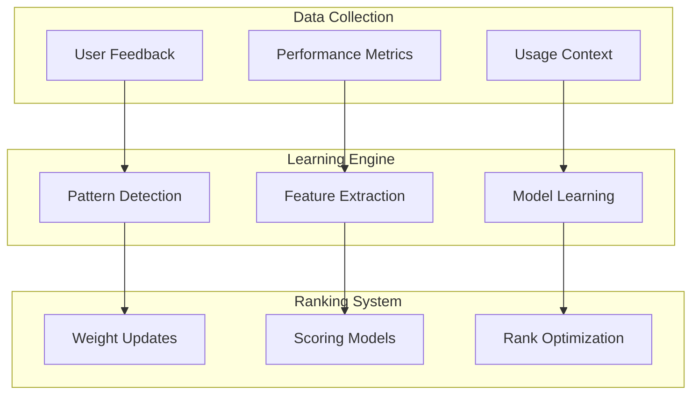

### Learning Components

1. **Pattern Detection**: Identifies successful prompt characteristics
2. **Feature Extraction**: Extracts relevant features from prompts and context
3. **Model Learning**: Updates ranking models based on feedback
4. **Weight Updates**: Adjusts scoring weights for different criteria

### Nightly Training Process

```go
func (l *Learner) RunNightlyTraining(ctx context.Context) error {
    // 1. Collect feedback data
    feedback := l.collectFeedback()
    
    // 2. Extract features
    features := l.extractFeatures(feedback)
    
    // 3. Update models
    err := l.updateModels(features)
    
    // 4. Validate improvements
    return l.validateImprovements()
}
```

## MCP Integration

### Server Architecture

```go
type MCPServer struct {
    storage    *storage.Storage
    engine     *engine.Engine
    ranker     *ranking.Ranker
    providers  *providers.Registry
    logger     *logrus.Logger
}

type MCPTool struct {
    Name        string
    Description string
    InputSchema map[string]interface{}
}
```

### Available Tools

1. **generate_prompts**: Multi-phase prompt generation
2. **search_prompts**: Text and semantic search
3. **optimize_prompt**: AI-powered optimization
4. **get_metrics**: Performance analytics
5. **update_prompt**: Modify existing prompts
6. **delete_prompt**: Remove prompts
7. **batch_generate**: Bulk generation
8. **validate_config**: Configuration validation
9. **get_providers**: Provider status
10. **train_model**: Manual training trigger

### Integration Flow

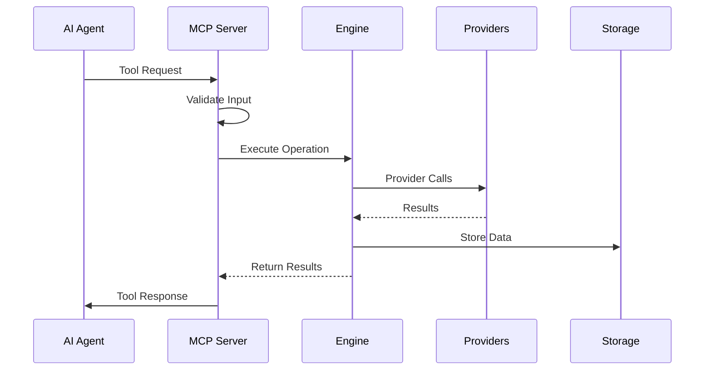

## Configuration System

### Hierarchical Configuration

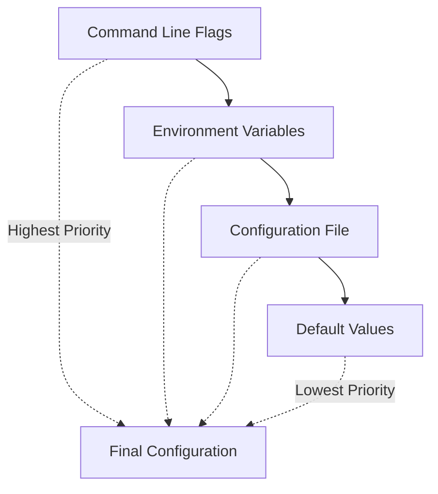

### Configuration Structure

```yaml
# Provider configurations
providers:
  openai:
    api_key: "${OPENAI_API_KEY}"
    model: "gpt-4o-mini"
    timeout: 30
    max_retries: 3
  
  anthropic:
    api_key: "${ANTHROPIC_API_KEY}"
    model: "claude-3-5-sonnet-20241022"
    timeout: 60
    max_retries: 2

# Phase configurations
phases:
  prima-materia:
    provider: "openai"
    temperature: 0.8
    max_tokens: 1500
  solutio:
    provider: "anthropic"
    temperature: 0.7
    max_tokens: 2000
  coagulatio:
    provider: "google"
    temperature: 0.4
    max_tokens: 1000

# Generation settings
generation:
  default_count: 3
  use_parallel: true
  include_context: true
  default_embedding_model: "text-embedding-3-small"
  default_embedding_dimensions: 1536

# Storage settings
storage:
  database_path: "~/.prompt-alchemy/prompts.db"
  backup_enabled: true
  backup_interval: "24h"
  vacuum_interval: "168h"

# Learning settings
learning:
  enabled: true
  learning_rate: 0.01
  batch_size: 32
  validation_split: 0.2
```

## Security Architecture

### API Key Management

```go
type SecureConfig struct {
    keys map[string]string
    mu   sync.RWMutex
}

func (sc *SecureConfig) GetKey(provider string) (string, error) {
    // Secure key retrieval
    // No logging or exposure
    // Environment variable fallback
}
```

### Input Validation

```go
type Validator struct {
    maxPromptLength int
    allowedPhases   []models.Phase
    sanitizer      *Sanitizer
}

func (v *Validator) ValidateRequest(req *models.PromptRequest) error {
    // Content sanitization
    // Parameter bounds checking
    // Injection prevention
}
```

### Data Protection

- No API keys in logs or error messages
- Secure storage of sensitive configuration
- Input sanitization for all user content
- SQL injection prevention with prepared statements
- Rate limiting for API calls

## Performance Design

### Optimization Strategies

1. **Parallel Processing**
   ```go
   func (e *Engine) generateParallel(phases []models.Phase) ([]*models.Prompt, error) {
       var wg sync.WaitGroup
       results := make(chan *models.Prompt, len(phases))
       
       for _, phase := range phases {
           wg.Add(1)
           go func(p models.Phase) {
               defer wg.Done()
               result := e.generatePhase(p)
               results <- result
           }(phase)
       }
       
       // Collect results
   }
   ```

2. **Connection Pooling**
   ```go
   type ProviderPool struct {
       clients chan *http.Client
       maxSize int
   }
   ```

3. **Caching Strategy**
   ```go
   type ResponseCache struct {
       cache map[string]*CacheEntry
       ttl   time.Duration
       mu    sync.RWMutex
   }
   ```

4. **Database Optimization**
   - Prepared statements for all queries
   - Batch operations for bulk inserts
   - Strategic indexing for common queries
   - Periodic VACUUM operations

### Performance Metrics

- Generation latency per phase
- Provider response times
- Database query performance
- Memory usage patterns
- Token consumption rates

## Extension Points

### Adding New Providers

1. **Implement Provider Interface**
   ```go
   type CustomProvider struct {
       client *CustomClient
       config CustomConfig
   }
   
   func (p *CustomProvider) Generate(ctx context.Context, req GenerateRequest, registry *Registry) (*GenerateResponse, error) {
       // Implementation
   }
   ```

2. **Register Provider**
   ```go
   func init() {
       providers.Register(providers.ProviderCustom, func(config interface{}) (providers.Provider, error) {
           return NewCustomProvider(config)
       })
   }
   ```

3. **Add Configuration Support**
   ```yaml
   providers:
     custom:
       api_key: "${CUSTOM_API_KEY}"
       endpoint: "https://api.custom.com"
   ```

### Custom Personas

```go
var CustomPersona = &Persona{
    Name:        "research",
    Description: "Academic research assistant",
    Temperature: 0.6,
    SystemPrompt: "You are a thorough academic researcher...",
    Phases: map[models.Phase]PhaseConfig{
        models.PhasePrimaMaterial: {Temperature: 0.7},
        models.PhaseSolutio:       {Temperature: 0.6},
        models.PhaseCoagulatio:    {Temperature: 0.4},
    },
}
```

### New Commands

1. **Create Command File**
   ```go
   var customCmd = &cobra.Command{
       Use:   "custom",
       Short: "Custom functionality",
       RunE:  runCustom,
   }
   ```

2. **Register with Root**
   ```go
   func init() {
       rootCmd.AddCommand(customCmd)
   }
   ```

## Deployment Architecture

### Standalone Deployment

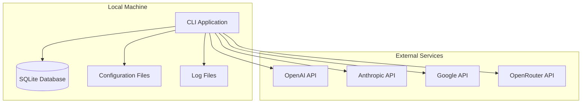

### Server Mode Deployment

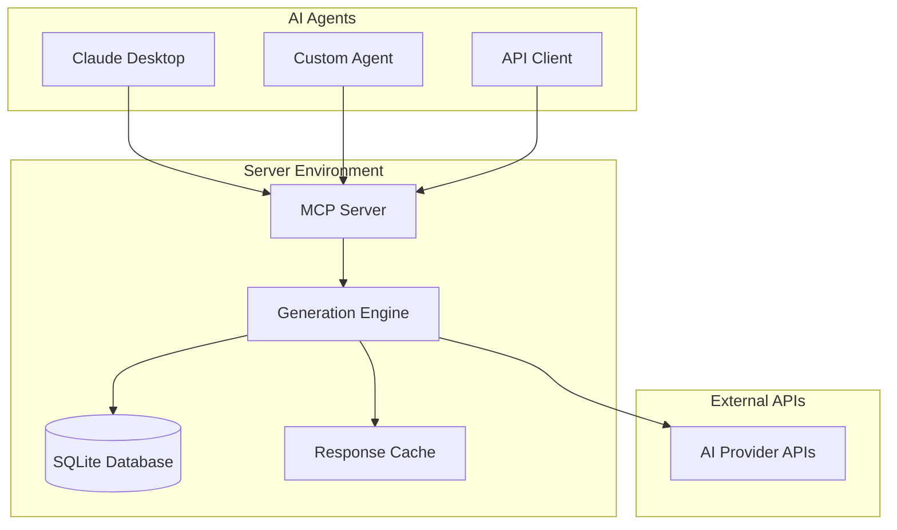

### Docker Deployment

```dockerfile
FROM golang:1.23-alpine AS builder
WORKDIR /app
COPY . .
RUN go build -o prompt-alchemy cmd/promgen/main.go

FROM alpine:latest
RUN apk --no-cache add ca-certificates
WORKDIR /root/
COPY --from=builder /app/prompt-alchemy .
COPY --from=builder /app/config.yaml .
CMD ["./prompt-alchemy", "serve"]
```

### Kubernetes Deployment

```yaml
apiVersion: apps/v1
kind: Deployment
metadata:
  name: prompt-alchemy
spec:
  replicas: 3
  selector:
    matchLabels:
      app: prompt-alchemy
  template:
    metadata:
      labels:
        app: prompt-alchemy
    spec:
      containers:
      - name: prompt-alchemy
        image: prompt-alchemy:latest
        ports:
        - containerPort: 8080
        env:
        - name: OPENAI_API_KEY
          valueFrom:
            secretKeyRef:
              name: api-keys
              key: openai
        volumeMounts:
        - name: data
          mountPath: /data
      volumes:
      - name: data
        persistentVolumeClaim:
          claimName: prompt-alchemy-data
```

## Design Decisions

### 1. Why SQLite?
- **Simplicity**: Zero-configuration, embedded database
- **Performance**: Fast for typical workloads (< 100K prompts)
- **Portability**: Single file, easy backup and migration
- **Vector Support**: BLOB storage for embeddings with efficient search

### 2. Why Three Phases?
- **Cognitive Model**: Mirrors human creative process
- **Provider Optimization**: Leverage different AI strengths
- **Quality Improvement**: Iterative refinement produces better results
- **Flexibility**: Users can skip phases or customize flow

### 3. Why Go?
- **Performance**: Fast compilation and execution
- **Concurrency**: Excellent goroutine support for parallel processing
- **Deployment**: Single binary with minimal dependencies
- **Ecosystem**: Rich HTTP client libraries and CLI frameworks

### 4. Why MCP Protocol?
- **Standardization**: Emerging standard for AI tool integration
- **Flexibility**: Works with multiple AI agents and platforms
- **Future-Proof**: Designed for the evolving AI ecosystem
- **Simplicity**: JSON-RPC based, easy to implement and debug

## Future Considerations

### Scalability Improvements
1. **PostgreSQL Migration**: For larger datasets and concurrent users
2. **Redis Caching**: For improved response times
3. **Microservices**: Split into generation, search, and learning services
4. **Load Balancing**: Distribute requests across multiple instances

### Feature Enhancements
1. **Plugin System**: Dynamic provider loading
2. **Streaming**: Real-time generation updates
3. **Collaboration**: Multi-user prompt sharing
4. **Analytics**: Advanced usage and performance analytics

### Infrastructure Evolution
1. **Cloud Native**: Kubernetes-first design
2. **Observability**: Prometheus metrics and distributed tracing
3. **Security**: OAuth2/OIDC integration, audit logging
4. **Compliance**: GDPR, SOC2 compliance features

This architecture provides a solid foundation for current requirements while maintaining flexibility for future growth and evolution.