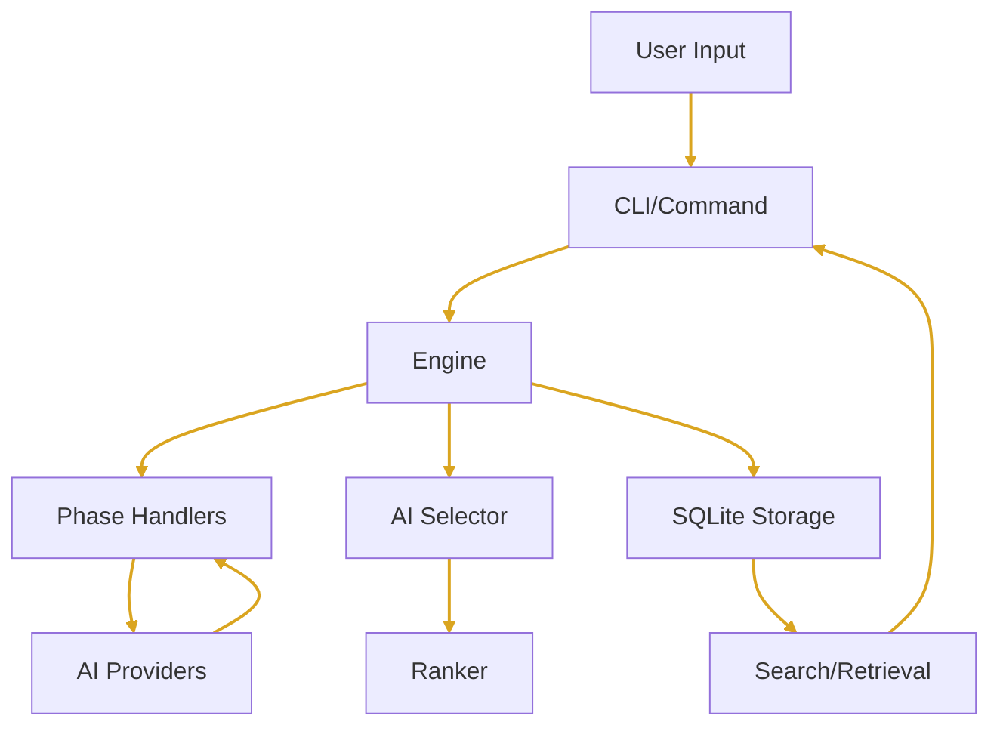

# Architecture

Prompt Alchemy is structured as a modular Go application with clear separation between public packages, internal implementations, and CLI commands.

### Core Components
- Engine: Orchestrates phases (internal/engine/)
- Phases: Handlers for Prima Materia, Solutio, Coagulatio (internal/phases/)
- Providers: Unified interface for LLMs (pkg/providers/)
- Selection: AI selector (internal/selection/)
- Ranking: Learning-to-rank (internal/ranking/)
- Storage: SQLite (internal/storage/)
- CLI: Cobra commands (cmd/)

### Data Flow


## Configuration System

Hierarchical configuration with Viper:

1. Default values
2. Configuration file (`~/.prompt-alchemy/config.yaml`)
3. Environment variables
4. Command-line flags

Priority: Flags > Env > File > Defaults

## Embedding System

### Standardization

All embeddings use:
- Model: `text-embedding-3-small`
- Dimensions: 1536
- Provider: OpenAI (fallback for others)

### Storage

Embeddings stored as BLOB in SQLite:
```go
// float32 slice → bytes
func float32SliceToBytes(floats []float32) []byte
```

### Similarity Search

Cosine similarity calculation:
```go
func CosineSimilarity(a, b []float32) float32
```

## Extension Points

### Adding a Provider

1. Implement `Provider` interface
2. Register in provider factory
3. Add configuration support
4. Update documentation

Example:
```go
type CustomProvider struct {
    client *CustomClient
    config Config
}

func (p *CustomProvider) Generate(...) (*GenerateResponse, error) {
    // Implementation
}
```

### Custom Personas

Add to `pkg/models/persona.go`:
```go
var CustomPersona = &Persona{
    Name:        "custom",
    Description: "Custom persona description",
    Temperature: 0.7,
    // ... other fields
}
```

### New Commands

1. Create command file in `internal/cmd/`
2. Register with root command
3. Implement business logic
4. Add tests

## Performance Considerations

### Optimization Strategies

1. **Parallel Generation** - Multiple providers simultaneously
2. **Connection Pooling** - Reuse HTTP clients
3. **Batch Operations** - Group database operations
4. **Caching** - Provider responses (when appropriate)

### Database Optimization

- Indexes on frequently queried fields
- VACUUM periodically
- Prepared statements
- Transaction batching

## Security

### API Key Management

- Never logged or displayed
- Environment variable support
- Secure storage in config
- Per-provider isolation

### Input Validation

- Prompt content sanitization
- Parameter bounds checking
- SQL injection prevention
- Rate limiting

## Monitoring and Debugging

### Logging

Structured logging with Logrus:
```go
log.WithFields(log.Fields{
    "provider": provider.Name(),
    "phase":    phase,
    "tokens":   result.TokensUsed,
}).Info("Generated prompt")
```

### Metrics Collection

Automatic tracking of:
- Generation times
- Token usage
- Provider errors
- Cost estimation

## Future Architecture Considerations

1. **Distributed Storage** - PostgreSQL with pgvector
2. **API Server** - REST/GraphQL interface
3. **Streaming** - Real-time generation
4. **Plugins** - Dynamic provider loading
5. **Cloud Native** - Kubernetes deployment