# Alchemical Process Flow

```mermaid
flowchart TD
    Start["`🌟 **Raw Idea**
    User Input`"] --> Validate{"`🔍 **Validate Input**
    Check Format & Content`"}
    
    Validate -->|Invalid| Error["`❌ **Error**
    Show Validation Issues`"]
    Validate -->|Valid| PrepPhases["`⚙️ **Prepare Phases**
    Configure Providers`"]
    
    PrepPhases --> PM_Start["`🌱 **Prima Materia Begins**
    Raw Material Extraction`"]
    
    subgraph "Prima Materia Phase"
        PM_Start --> PM_Provider["`🤖 **Select Provider**
        (Default: OpenAI)`"]
        PM_Provider --> PM_Generate["`⚗️ **Extract Essence**
        Brainstorm & Explore`"]
        PM_Generate --> PM_Store["`💾 **Store Result**
        Save Raw Generation`"]
    end
    
    PM_Store --> SO_Start["`💧 **Solutio Begins**
    Dissolution Process`"]
    
    subgraph "Solutio Phase"
        SO_Start --> SO_Provider["`🧠 **Select Provider**
        (Default: Anthropic)`"]
        SO_Provider --> SO_Context["`📝 **Add Context**
        Prima Materia Results`"]
        SO_Context --> SO_Generate["`🌊 **Flow Creation**
        Natural Language Form`"]
        SO_Generate --> SO_Store["`💾 **Store Result**
        Save Dissolved Form`"]
    end
    
    SO_Store --> CO_Start["`💎 **Coagulatio Begins**
    Crystallization Process`"]
    
    subgraph "Coagulatio Phase"
        CO_Start --> CO_Provider["`🌟 **Select Provider**
        (Default: Google)`"]
        CO_Provider --> CO_Context["`📋 **Combine Context**
        Previous Phase Results`"]
        CO_Context --> CO_Generate["`⚡ **Crystallize**
        Precise Refinement`"]
        CO_Generate --> CO_Store["`💾 **Store Result**
        Save Final Form`"]
    end
    
    CO_Store --> Rank["`🏆 **Ranking Engine**
    Evaluate All Results`"]
    
    subgraph "Evaluation & Storage"
        Rank --> Score["`📊 **Calculate Scores**
        Quality Metrics`"]
        Score --> Embed["`🧮 **Generate Embeddings**
        Vector Representations`"]
        Embed --> Save["`💾 **Persist Data**
        Database Storage`"]
    end
    
    Save --> Output["`✨ **Present Results**
    Ranked Prompt Options`"]
    
    subgraph "Parallel Processing"
        Parallel1["`⚗️ **Variant 1**`"]
        Parallel2["`⚗️ **Variant 2**`"]
        Parallel3["`⚗️ **Variant 3**`"]
    end
    
    PM_Generate -.->|If count > 1| Parallel1
    PM_Generate -.->|If count > 1| Parallel2
    PM_Generate -.->|If count > 1| Parallel3
    
    style Start fill:#FFD700,stroke:#333,stroke-width:3px,color:#000
    style PM_Start fill:#8BC34A,stroke:#333,stroke-width:2px,color:#fff
    style SO_Start fill:#03A9F4,stroke:#333,stroke-width:2px,color:#fff
    style CO_Start fill:#9C27B0,stroke:#333,stroke-width:2px,color:#fff
    style Output fill:#FF6B35,stroke:#333,stroke-width:3px,color:#fff
    style Error fill:#F44336,stroke:#333,stroke-width:2px,color:#fff
```

## Phase Characteristics

### 🌱 Prima Materia (First Matter)
- **Purpose**: Extract raw essence and explore possibilities
- **Approach**: Brainstorming, ideation, concept extraction
- **Output**: Foundational ideas and initial directions
- **Provider Strength**: Creative exploration (OpenAI GPT models excel here)

### 💧 Solutio (Dissolution)
- **Purpose**: Transform rigid structures into flowing language
- **Approach**: Natural conversation, human-readable formatting
- **Output**: Accessible, conversational prompts
- **Provider Strength**: Natural language flow (Claude excels here)

### 💎 Coagulatio (Crystallization)
- **Purpose**: Refine into precise, potent final form
- **Approach**: Technical accuracy, clarity, optimization
- **Output**: Production-ready, highly effective prompts
- **Provider Strength**: Precision and accuracy (Gemini excels here)

## Quality Metrics
- **Clarity**: How clear and understandable the prompt is
- **Specificity**: Level of detail and precision
- **Creativity**: Novel approaches and unique perspectives
- **Effectiveness**: Predicted performance with target models
- **Coherence**: Logical flow and structure