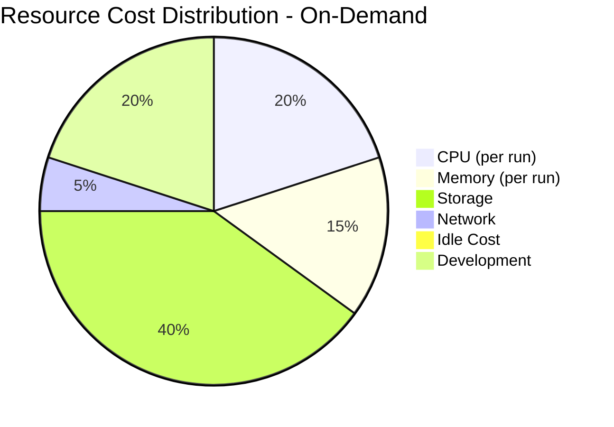
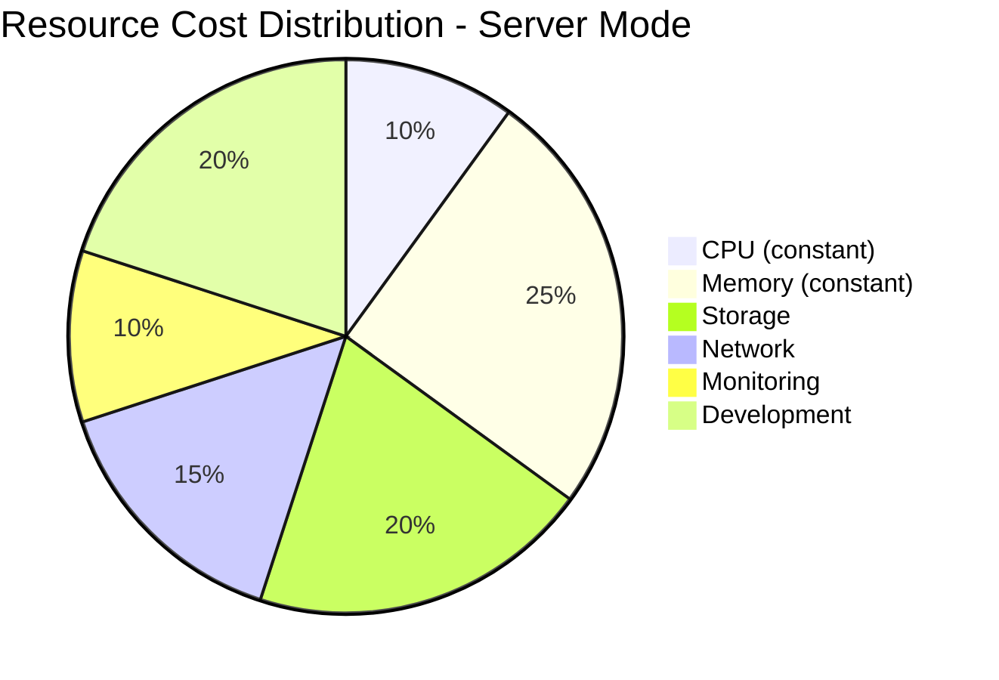

# Cost Analysis

```mermaid
pie title Resource Cost Distribution - On-Demand
    "CPU (per run)" : 20
    "Memory (per run)" : 15
    "Storage" : 40
    "Network" : 5
    "Idle Cost" : 0
    "Development" : 20
```

```mermaid
pie title Resource Cost Distribution - Server Mode
    "CPU (constant)" : 10
    "Memory (constant)" : 25
    "Storage" : 20
    "Network" : 15
    "Monitoring" : 10
    "Development" : 20
``` 