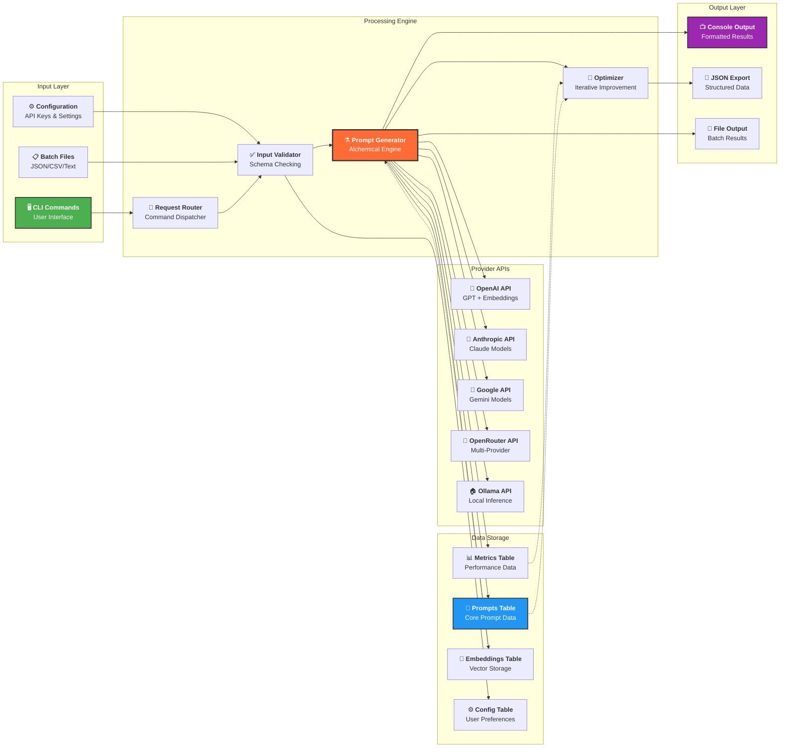

# Data Flow Architecture



## Data Flow Patterns

### 1. Simple Generation Flow
```
User Input → Validation → Generation → Storage → Output
```

### 2. Batch Processing Flow
```
Batch File → Parse → Validate → Queue → Process → Aggregate → Export
```

### 3. Optimization Flow
```
Existing Prompt → Analyze → Generate Variants → Evaluate → Select Best → Store
```

### 4. Search Flow
```
Query → Embedding → Vector Search → Rank Results → Format → Display
```

## Data Transformations

### Input Processing
- **CLI Arguments**: Parsed into structured request objects
- **Configuration**: Merged with defaults and validated
- **Batch Data**: Parsed from JSON/CSV into uniform format

### Generation Pipeline
- **Request Object**: Contains all generation parameters
- **Phase Results**: Structured outputs from each alchemical phase
- **Embeddings**: Vector representations for semantic operations
- **Metrics**: Performance and cost tracking data

### Storage Format
- **Prompts**: UUID, content, metadata, embeddings
- **Metrics**: Timestamps, costs, performance indicators
- **Relations**: Links between prompts, variants, and optimizations

### Output Formatting
- **Console**: Colorized, structured text output
- **JSON**: Machine-readable structured data
- **Files**: Batch processing results in various formats