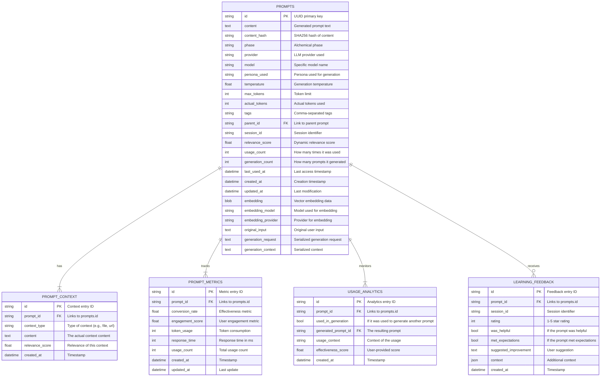

# Database Schema



## Key Relationships

- A **PROMPT** can have multiple **CONTEXT** entries, **METRICS** records, and **ANALYTICS** events.
- **USAGE_ANALYTICS** tracks how a prompt is used, potentially linking to a `generated_prompt_id`.
- **LEARNING_FEEDBACK** provides direct user feedback on a prompt's quality.

## Indexing Strategy
```sql
-- Core indexes for performance
CREATE INDEX idx_prompts_phase ON prompts(phase);
CREATE INDEX idx_prompts_provider ON prompts(provider);
CREATE INDEX idx_prompts_created_at ON prompts(created_at);
CREATE INDEX idx_prompts_relevance_score ON prompts(relevance_score);
CREATE INDEX idx_prompts_last_used_at ON prompts(last_used_at);

-- Foreign key indexes
CREATE INDEX idx_prompt_context_prompt_id ON prompt_context(prompt_id);
CREATE INDEX idx_prompt_metrics_prompt_id ON prompt_metrics(prompt_id);
CREATE INDEX idx_usage_analytics_prompt_id ON usage_analytics(prompt_id);
CREATE INDEX idx_learning_feedback_prompt_id ON learning_feedback(prompt_id);
```

## Data Types & Constraints

### Enumerations
- **Phase**: `'prima-materia', 'solutio', 'coagulatio'`
- **Provider**: `'openai', 'anthropic', 'google', 'openrouter', 'ollama'`
- **Status**: `'pending', 'running', 'completed', 'failed'`
- **Metric Type**: `'cost', 'time', 'tokens', 'quality'`

### Constraints
- All UUIDs are generated using UUID v4
- Scores are constrained between 0.0 and 1.0
- Temperatures are constrained between 0.0 and 2.0
- Token counts must be positive integers
- Timestamps use UTC timezone

### Storage Optimizations
- Embeddings stored as compressed BLOBs
- Large text content uses TEXT type
- JSON metadata enables flexible schema evolution
- Partitioning by date for large datasets