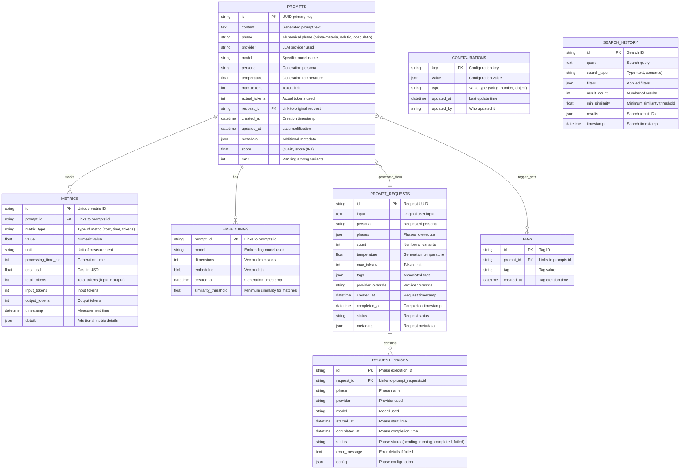

# Database Schema



## Key Relationships

### Core Data Flow
1. **User Request** → `PROMPT_REQUESTS` table
2. **Phase Execution** → `REQUEST_PHASES` table  
3. **Generated Prompts** → `PROMPTS` table
4. **Performance Data** → `METRICS` table
5. **Vector Data** → `EMBEDDINGS` table

### Indexing Strategy
```sql
-- Performance indexes
CREATE INDEX idx_prompts_phase ON prompts(phase);
CREATE INDEX idx_prompts_provider ON prompts(provider);
CREATE INDEX idx_prompts_created_at ON prompts(created_at);
CREATE INDEX idx_prompts_score ON prompts(score);

-- Search indexes  
CREATE INDEX idx_embeddings_model ON embeddings(model);
CREATE INDEX idx_tags_tag ON tags(tag);
CREATE INDEX idx_search_history_query ON search_history(query);

-- Foreign key indexes
CREATE INDEX idx_metrics_prompt_id ON metrics(prompt_id);
CREATE INDEX idx_embeddings_prompt_id ON embeddings(prompt_id);
CREATE INDEX idx_request_phases_request_id ON request_phases(request_id);
```

## Data Types & Constraints

### Enumerations
- **Phase**: `'prima-materia', 'solutio', 'coagulatio'`
- **Provider**: `'openai', 'anthropic', 'google', 'openrouter', 'ollama'`
- **Status**: `'pending', 'running', 'completed', 'failed'`
- **Metric Type**: `'cost', 'time', 'tokens', 'quality'`

### Constraints
- All UUIDs are generated using UUID v4
- Scores are constrained between 0.0 and 1.0
- Temperatures are constrained between 0.0 and 2.0
- Token counts must be positive integers
- Timestamps use UTC timezone

### Storage Optimizations
- Embeddings stored as compressed BLOBs
- Large text content uses TEXT type
- JSON metadata enables flexible schema evolution
- Partitioning by date for large datasets