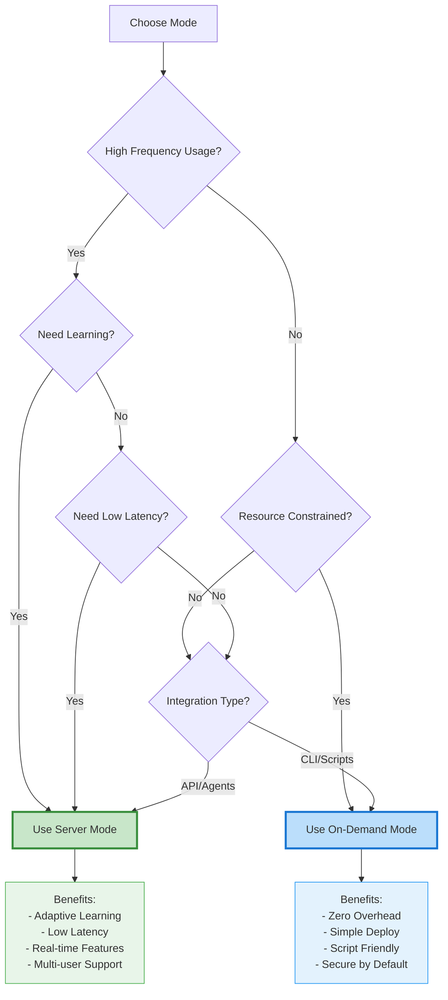

# Decision Flow Chart

```mermaid
flowchart TD
    Start[Choose Mode] --> Q1{High Frequency Usage?}
    
    Q1 -->|Yes| Q2{Need Learning?}
    Q1 -->|No| Q3{Resource Constrained?}
    
    Q2 -->|Yes| Server[Use Server Mode]
    Q2 -->|No| Q4{Need Low Latency?}
    
    Q3 -->|Yes| OnDemand[Use On-Demand Mode]
    Q3 -->|No| Q5{Integration Type?}
    
    Q4 -->|Yes| Server
    Q4 -->|No| Q5
    
    Q5 -->|CLI/Scripts| OnDemand
    Q5 -->|API/Agents| Server
    
    Server --> Benefits1[Benefits:<br/>- Adaptive Learning<br/>- Low Latency<br/>- Real-time Features<br/>- Multi-user Support]
    
    OnDemand --> Benefits2[Benefits:<br/>- Zero Overhead<br/>- Simple Deploy<br/>- Script Friendly<br/>- Secure by Default]
    
    style Server fill:#c8e6c9,stroke:#388e3c,stroke-width:3px
    style OnDemand fill:#bbdefb,stroke:#1976d2,stroke-width:3px
    style Benefits1 fill:#e8f5e9,stroke:#4caf50
    style Benefits2 fill:#e3f2fd,stroke:#2196f3
``` 