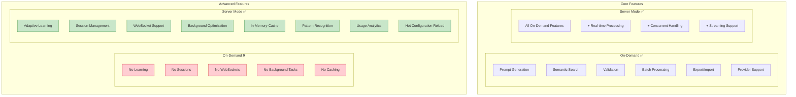

# Feature Availability by Mode

```mermaid
graph TB
    subgraph "Core Features"
        subgraph "On-Demand ✅"
            OD1[Prompt Generation]
            OD2[Semantic Search]
            OD3[Validation]
            OD4[Batch Processing]
            OD5[Export/Import]
            OD6[Provider Support]
        end
        
        subgraph "Server Mode ✅"
            SM1[All On-Demand Features]
            SM2[+ Real-time Processing]
            SM3[+ Concurrent Handling]
            SM4[+ Streaming Support]
        end
    end
    
    subgraph "Advanced Features"
        subgraph "On-Demand ❌"
            ODX1[No Learning]
            ODX2[No Sessions]
            ODX3[No WebSockets]
            ODX4[No Background Tasks]
            ODX5[No Caching]
        end
        
        subgraph "Server Mode ✅"
            SMA1[Adaptive Learning]
            SMA2[Session Management]
            SMA3[WebSocket Support]
            SMA4[Background Optimization]
            SMA5[In-Memory Cache]
            SMA6[Pattern Recognition]
            SMA7[Usage Analytics]
            SMA8[Hot Configuration Reload]
        end
    end
    
    style ODX1 fill:#ffcdd2,stroke:#d32f2f
    style ODX2 fill:#ffcdd2,stroke:#d32f2f
    style ODX3 fill:#ffcdd2,stroke:#d32f2f
    style ODX4 fill:#ffcdd2,stroke:#d32f2f
    style ODX5 fill:#ffcdd2,stroke:#d32f2f
    
    style SMA1 fill:#c8e6c9,stroke:#388e3c
    style SMA2 fill:#c8e6c9,stroke:#388e3c
    style SMA3 fill:#c8e6c9,stroke:#388e3c
    style SMA4 fill:#c8e6c9,stroke:#388e3c
    style SMA5 fill:#c8e6c9,stroke:#388e3c
    style SMA6 fill:#c8e6c9,stroke:#388e3c
    style SMA7 fill:#c8e6c9,stroke:#388e3c
    style SMA8 fill:#c8e6c9,stroke:#388e3c
``` 