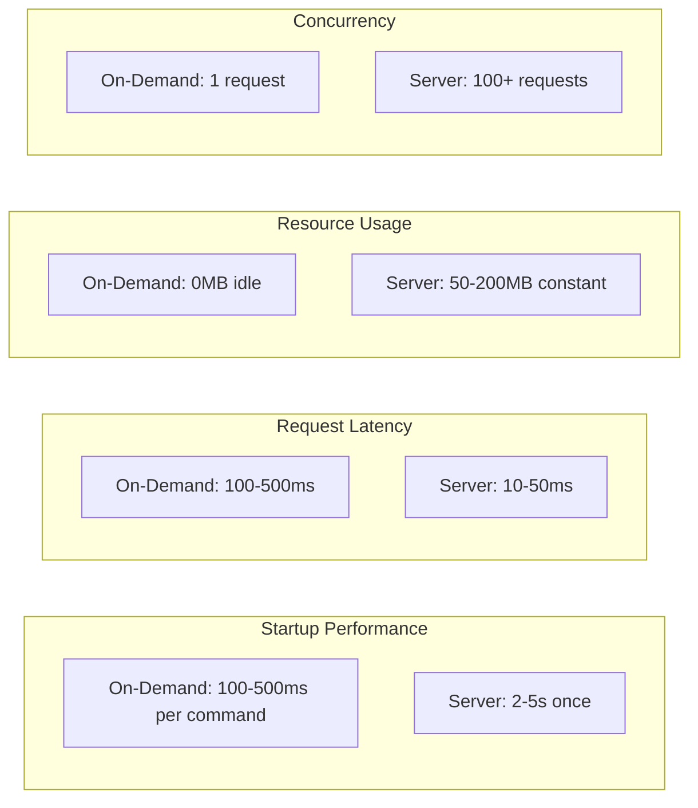
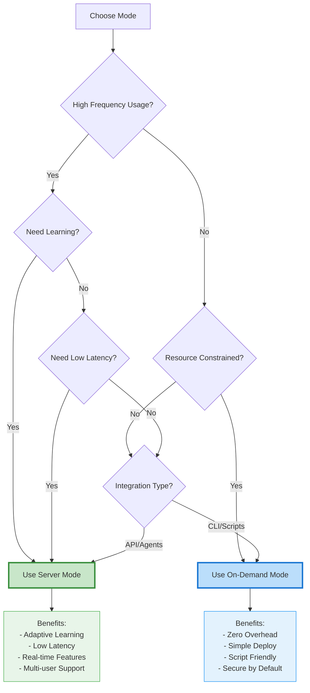
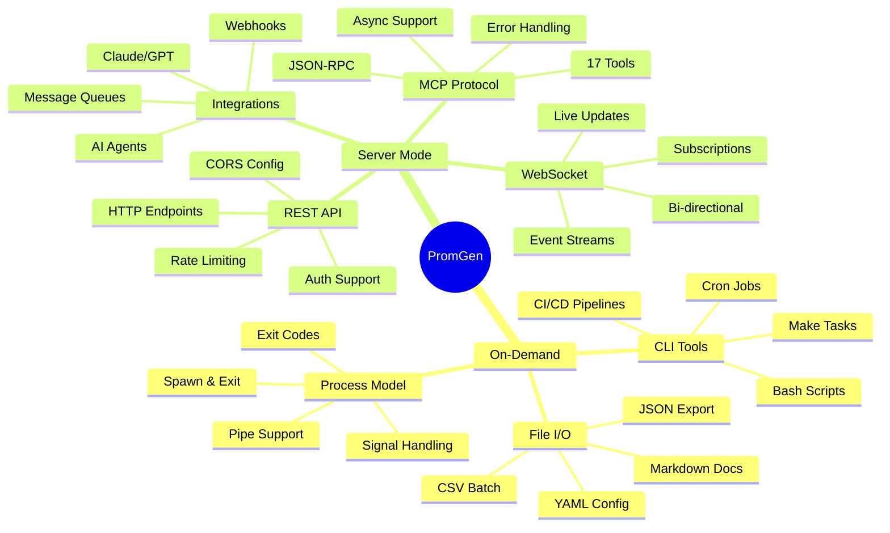
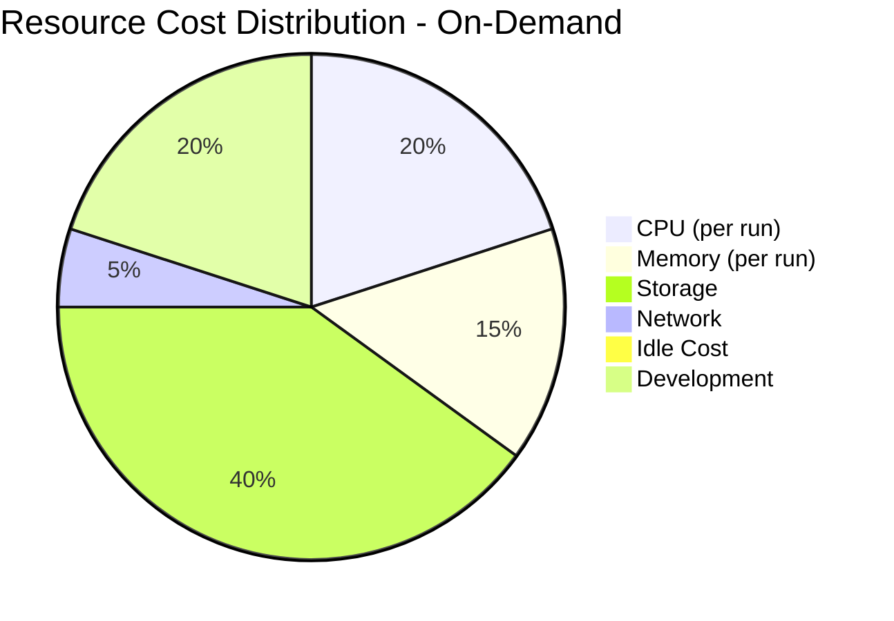
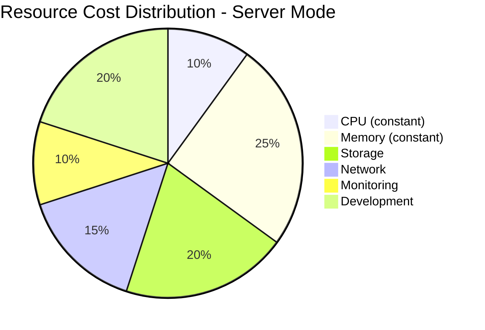

# Feature Comparison Matrix

## Feature Availability by Mode

```mermaid
graph TB
    subgraph "Core Features"
        subgraph "On-Demand ✅"
            OD1[Prompt Generation]
            OD2[Semantic Search]
            OD3[Validation]
            OD4[Batch Processing]
            OD5[Export/Import]
            OD6[Provider Support]
        end
        
        subgraph "Server Mode ✅"
            SM1[All On-Demand Features]
            SM2[+ Real-time Processing]
            SM3[+ Concurrent Handling]
            SM4[+ Streaming Support]
        end
    end
    
    subgraph "Advanced Features"
        subgraph "On-Demand ❌"
            ODX1[No Learning]
            ODX2[No Sessions]
            ODX3[No WebSockets]
            ODX4[No Background Tasks]
            ODX5[No Caching]
        end
        
        subgraph "Server Mode ✅"
            SMA1[Adaptive Learning]
            SMA2[Session Management]
            SMA3[WebSocket Support]
            SMA4[Background Optimization]
            SMA5[In-Memory Cache]
            SMA6[Pattern Recognition]
            SMA7[Usage Analytics]
            SMA8[Hot Configuration Reload]
        end
    end
    
    style ODX1 fill:#ffcdd2,stroke:#d32f2f
    style ODX2 fill:#ffcdd2,stroke:#d32f2f
    style ODX3 fill:#ffcdd2,stroke:#d32f2f
    style ODX4 fill:#ffcdd2,stroke:#d32f2f
    style ODX5 fill:#ffcdd2,stroke:#d32f2f
    
    style SMA1 fill:#c8e6c9,stroke:#388e3c
    style SMA2 fill:#c8e6c9,stroke:#388e3c
    style SMA3 fill:#c8e6c9,stroke:#388e3c
    style SMA4 fill:#c8e6c9,stroke:#388e3c
    style SMA5 fill:#c8e6c9,stroke:#388e3c
    style SMA6 fill:#c8e6c9,stroke:#388e3c
    style SMA7 fill:#c8e6c9,stroke:#388e3c
    style SMA8 fill:#c8e6c9,stroke:#388e3c
```

## Performance Comparison

```mermaid
graph LR
    subgraph "Startup Performance"
        ODS[On-Demand: 100-500ms per command]
        SMS[Server: 2-5s once]
    end
    
    subgraph "Request Latency"
        ODL[On-Demand: 100-500ms]
        SML[Server: 10-50ms]
    end
    
    subgraph "Resource Usage"
        ODR[On-Demand: 0MB idle]
        SMR[Server: 50-200MB constant]
    end
    
    subgraph "Concurrency"
        ODC[On-Demand: 1 request]
        SMC[Server: 100+ requests]
    end
```

## Decision Flow Chart

```mermaid
flowchart TD
    Start[Choose Mode] --> Q1{High Frequency Usage?}
    
    Q1 -->|Yes| Q2{Need Learning?}
    Q1 -->|No| Q3{Resource Constrained?}
    
    Q2 -->|Yes| Server[Use Server Mode]
    Q2 -->|No| Q4{Need Low Latency?}
    
    Q3 -->|Yes| OnDemand[Use On-Demand Mode]
    Q3 -->|No| Q5{Integration Type?}
    
    Q4 -->|Yes| Server
    Q4 -->|No| Q5
    
    Q5 -->|CLI/Scripts| OnDemand
    Q5 -->|API/Agents| Server
    
    Server --> Benefits1[Benefits:<br/>- Adaptive Learning<br/>- Low Latency<br/>- Real-time Features<br/>- Multi-user Support]
    
    OnDemand --> Benefits2[Benefits:<br/>- Zero Overhead<br/>- Simple Deploy<br/>- Script Friendly<br/>- Secure by Default]
    
    style Server fill:#c8e6c9,stroke:#388e3c,stroke-width:3px
    style OnDemand fill:#bbdefb,stroke:#1976d2,stroke-width:3px
    style Benefits1 fill:#e8f5e9,stroke:#4caf50
    style Benefits2 fill:#e3f2fd,stroke:#2196f3
```

## Feature Evolution Timeline

```mermaid
gantt
    title Feature Availability by Mode
    dateFormat X
    axisFormat %s
    
    section On-Demand Mode
    Core Features           :done, od1, 0, 10
    CLI Integration        :done, od2, 0, 10
    Batch Processing       :done, od3, 2, 8
    Export/Import          :done, od4, 3, 7
    Basic Metrics          :done, od5, 5, 5
    
    section Server Mode Only
    MCP Protocol           :active, sm1, 0, 10
    Adaptive Learning      :active, sm2, 2, 8
    Real-time Features     :active, sm3, 3, 7
    WebSocket Support      :active, sm4, 4, 6
    Pattern Recognition    :active, sm5, 5, 5
    Background Tasks       :active, sm6, 6, 4
    Session Management     :active, sm7, 7, 3
    Usage Analytics        :active, sm8, 8, 2
```

## Integration Capabilities

```mermaid
mindmap
  root((PromGen))
    On-Demand
      CLI Tools
        Bash Scripts
        CI/CD Pipelines
        Cron Jobs
        Make Tasks
      File I/O
        YAML Config
        JSON Export
        CSV Batch
        Markdown Docs
      Process Model
        Spawn & Exit
        Pipe Support
        Exit Codes
        Signal Handling
    Server Mode
      MCP Protocol
        17 Tools
        JSON-RPC
        Async Support
        Error Handling
      REST API
        HTTP Endpoints
        Auth Support
        Rate Limiting
        CORS Config
      WebSocket
        Live Updates
        Bi-directional
        Event Streams
        Subscriptions
      Integrations
        AI Agents
        Claude/GPT
        Webhooks
        Message Queues
```

## Cost Analysis

```mermaid
pie title Resource Cost Distribution - On-Demand
    "CPU (per run)" : 20
    "Memory (per run)" : 15
    "Storage" : 40
    "Network" : 5
    "Idle Cost" : 0
    "Development" : 20
```

```mermaid
pie title Resource Cost Distribution - Server Mode
    "CPU (constant)" : 10
    "Memory (constant)" : 25
    "Storage" : 20
    "Network" : 15
    "Monitoring" : 10
    "Development" : 20
```