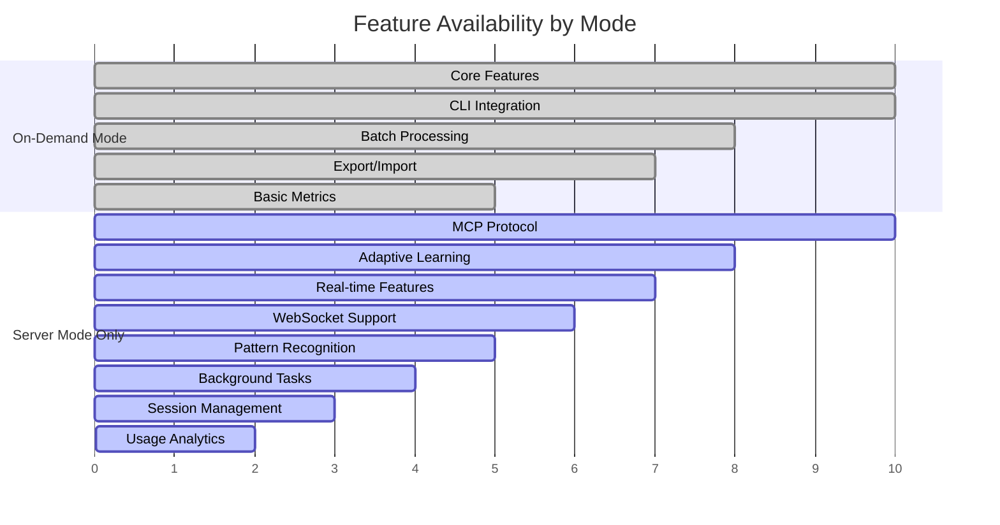

# Feature Evolution Timeline

```mermaid
gantt
    title Feature Availability by Mode
    dateFormat X
    axisFormat %s
    
    section On-Demand Mode
    Core Features           :done, od1, 0, 10
    CLI Integration        :done, od2, 0, 10
    Batch Processing       :done, od3, 2, 8
    Export/Import          :done, od4, 3, 7
    Basic Metrics          :done, od5, 5, 5
    
    section Server Mode Only
    MCP Protocol           :active, sm1, 0, 10
    Adaptive Learning      :active, sm2, 2, 8
    Real-time Features     :active, sm3, 3, 7
    WebSocket Support      :active, sm4, 4, 6
    Pattern Recognition    :active, sm5, 5, 5
    Background Tasks       :active, sm6, 6, 4
    Session Management     :active, sm7, 7, 3
    Usage Analytics        :active, sm8, 8, 2
``` 