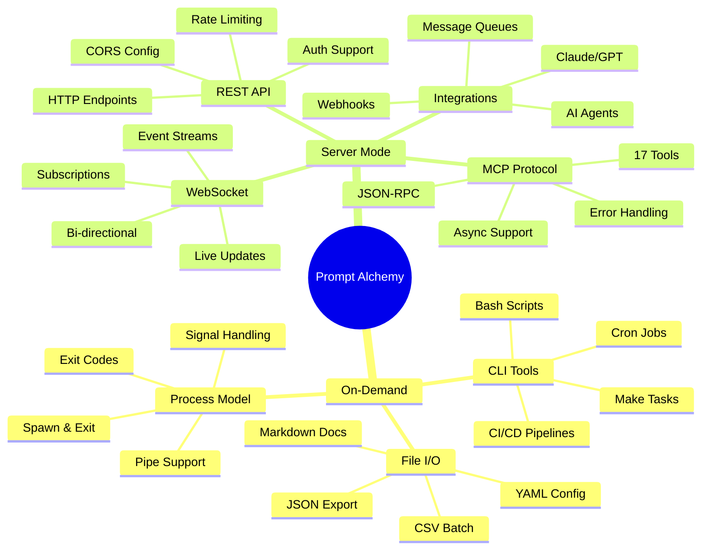

# Integration Capabilities

```mermaid
mindmap
  root((Prompt Alchemy))
    On-Demand
      CLI Tools
        Bash Scripts
        CI/CD Pipelines
        Cron Jobs
        Make Tasks
      File I/O
        YAML Config
        JSON Export
        CSV Batch
        Markdown Docs
      Process Model
        Spawn & Exit
        Pipe Support
        Exit Codes
        Signal Handling
    Server Mode
      MCP Protocol
        17 Tools
        JSON-RPC
        Async Support
        Error Handling
      REST API
        HTTP Endpoints
        Auth Support
        Rate Limiting
        CORS Config
      WebSocket
        Live Updates
        Bi-directional
        Event Streams
        Subscriptions
      Integrations
        AI Agents
        Claude/GPT
        Webhooks
        Message Queues
``` 