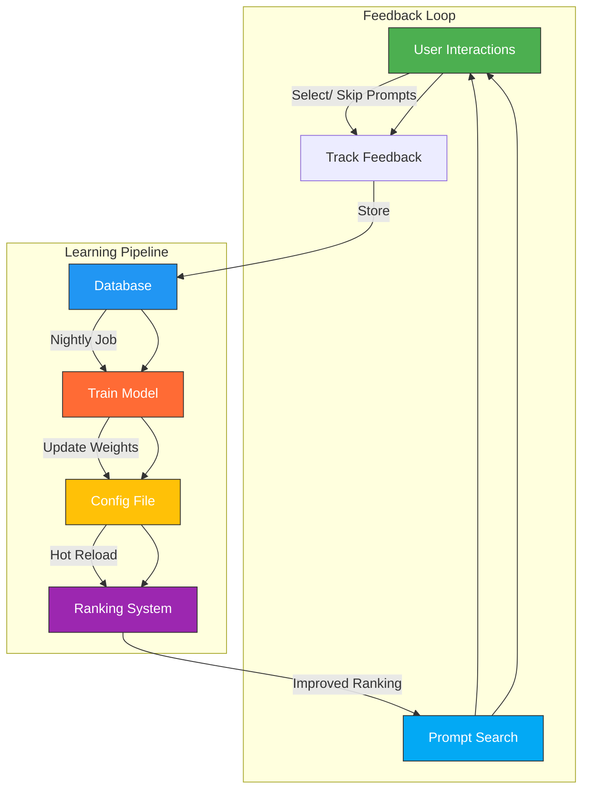

# Learning-to-Rank Flow

## Key Components

### User Interactions
- Captured during interactive prompt selection
- Tracks 'chosen' vs 'skipped' prompts per session
- Includes scores and timestamps

### Training Process
- Runs nightly
- Analyzes correlations in feedback
- Computes feature importances
- Updates ranking weights atomically

### Hot Reload
- Watches config file changes
- Thread-safe weight updates
- No restart required

### Improved Ranking
- Uses learned weights for better relevance
- Adapts to user preferences over time
- Enhances search results automatically 