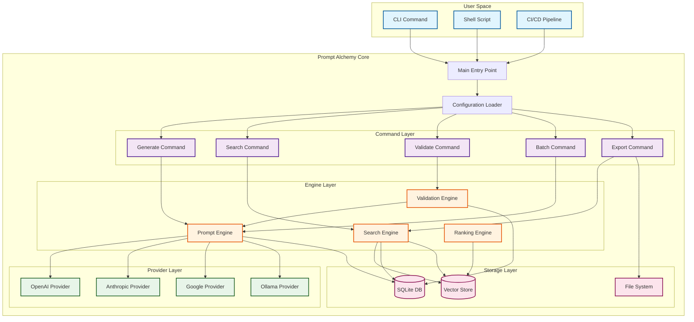

# On-Demand Mode Architecture

```mermaid
graph TB
    subgraph "User Space"
        CLI[CLI Command]
        Script[Shell Script]
        CICD[CI/CD Pipeline]
    end

    subgraph "Prompt Alchemy Core"
        Main[Main Entry Point]
        Config[Configuration Loader]
        
        subgraph "Command Layer"
            Generate[Generate Command]
            Search[Search Command]
            Validate[Validate Command]
            Batch[Batch Command]
            Export[Export Command]
        end
        
        subgraph "Engine Layer"
            PE[Prompt Engine]
            SE[Search Engine]
            VE[Validation Engine]
            RE[Ranking Engine]
        end
        
        subgraph "Provider Layer"
            OpenAI[OpenAI Provider]
            Anthropic[Anthropic Provider]
            Google[Google Provider]
            Ollama[Ollama Provider]
        end
        
        subgraph "Storage Layer"
            SQLite[(SQLite DB)]
            Vector[(Vector Store)]
            Files[File System]
        end
    end

    %% User interactions
    CLI --> Main
    Script --> Main
    CICD --> Main
    
    %% Main flow
    Main --> Config
    Config --> Generate
    Config --> Search
    Config --> Validate
    Config --> Batch
    Config --> Export
    
    %% Command to Engine
    Generate --> PE
    Search --> SE
    Validate --> VE
    Batch --> PE
    Export --> SE
    
    %% Engine to Provider
    PE --> OpenAI
    PE --> Anthropic
    PE --> Google
    PE --> Ollama
    
    SE --> Vector
    VE --> PE
    RE --> Vector
    
    %% Storage connections
    PE --> SQLite
    SE --> SQLite
    SE --> Vector
    VE --> SQLite
    Export --> Files
    
    %% Styling
    classDef userSpace fill:#e1f5fe,stroke:#01579b,stroke-width:2px
    classDef command fill:#f3e5f5,stroke:#4a148c,stroke-width:2px
    classDef engine fill:#fff3e0,stroke:#e65100,stroke-width:2px
    classDef provider fill:#e8f5e9,stroke:#1b5e20,stroke-width:2px
    classDef storage fill:#fce4ec,stroke:#880e4f,stroke-width:2px
    
    class CLI,Script,CICD userSpace
    class Generate,Search,Validate,Batch,Export command
    class PE,SE,VE,RE engine
    class OpenAI,Anthropic,Google,Ollama provider
    class SQLite,Vector,Files storage
``` 