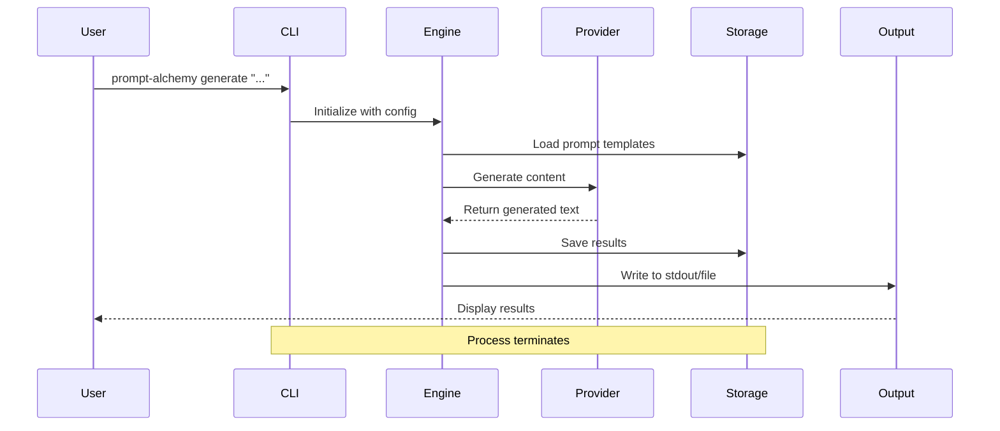

# Data Flow

```mermaid
sequenceDiagram
    participant User
    participant CLI
    participant Engine
    participant Provider
    participant Storage
    participant Output

    User->>CLI: prompt-alchemy generate "..."
    CLI->>Engine: Initialize with config
    Engine->>Storage: Load prompt templates
    Engine->>Provider: Generate content
    Provider-->>Engine: Return generated text
    Engine->>Storage: Save results
    Engine->>Output: Write to stdout/file
    Output-->>User: Display results
    Note over CLI,Storage: Process terminates
``` 