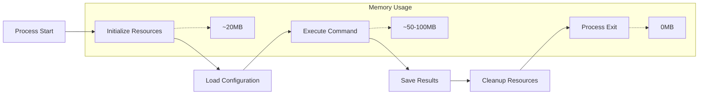

# Resource Lifecycle

```mermaid
graph LR
    Start[Process Start] --> Init[Initialize Resources]
    Init --> Load[Load Configuration]
    Load --> Execute[Execute Command]
    Execute --> Save[Save Results]
    Save --> Cleanup[Cleanup Resources]
    Cleanup --> Exit[Process Exit]
    
    subgraph "Memory Usage"
        Init -.-> M1[~20MB]
        Execute -.-> M2[~50-100MB]
        Exit -.-> M3[0MB]
    end
``` 