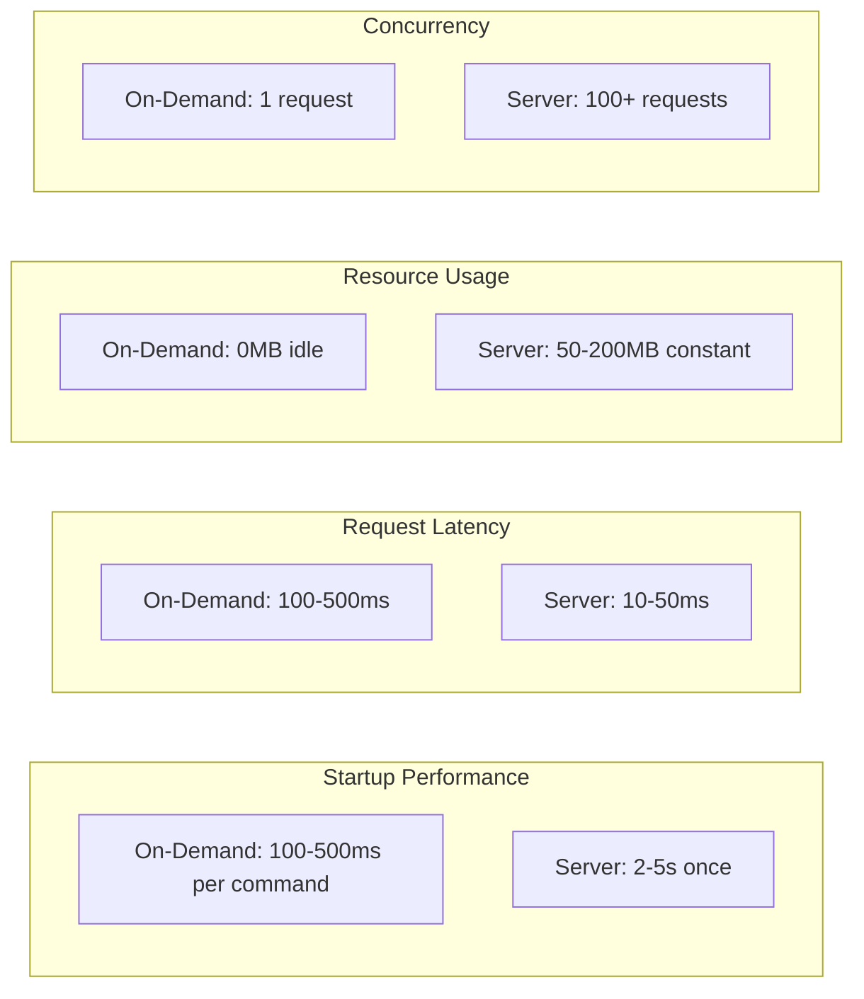

# Performance Comparison

```mermaid
graph LR
    subgraph "Startup Performance"
        ODS[On-Demand: 100-500ms per command]
        SMS[Server: 2-5s once]
    end
    
    subgraph "Request Latency"
        ODL[On-Demand: 100-500ms]
        SML[Server: 10-50ms]
    end
    
    subgraph "Resource Usage"
        ODR[On-Demand: 0MB idle]
        SMR[Server: 50-200MB constant]
    end
    
    subgraph "Concurrency"
        ODC[On-Demand: 1 request]
        SMC[Server: 100+ requests]
    end
``` 