# Provider Architecture

```mermaid
graph TB
    subgraph "Provider Interface Layer"
        Registry["`🏛️ **Provider Registry**
        Central Management`"]
        Interface["`📋 **Provider Interface**
        Standard Contract`"]
    end
    
    subgraph "Provider Implementations"
        subgraph "OpenAI Provider"
            OAI_Core["`🤖 **OpenAI Core**
            GPT Models`"]
            OAI_Embed["`🧮 **Embeddings**
            text-embedding-3-*`"]
            OAI_Rate["`⏱️ **Rate Limiter**
            Request Throttling`"]
        end
        
        subgraph "Anthropic Provider"
            ANT_Core["`🧠 **Anthropic Core**
            Claude Models`"]
            ANT_Stream["`🌊 **Streaming**
            Real-time Responses`"]
            ANT_Safety["`🛡️ **Safety Filter**
            Content Moderation`"]
        end
        
        subgraph "Google Provider"
            GOO_Core["`🌟 **Google Core**
            Gemini Models`"]
            GOO_Multi["`🖼️ **Multimodal**
            Text + Vision`"]
            GOO_Safety["`🔒 **Safety Settings**
            Configurable Filters`"]
        end
        
        subgraph "OpenRouter Provider"
            OR_Core["`🔗 **Router Core**
            Model Selection`"]
            OR_Fallback["`🔄 **Fallback Chain**
            Auto-retry Logic`"]
            OR_Cost["`💰 **Cost Tracking**
            Real-time Pricing`"]
        end
        
        subgraph "Ollama Provider"
            OLL_Core["`🏠 **Local Engine**
            Self-hosted Models`"]
            OLL_Models["`📦 **Model Manager**
            Download & Update`"]
            OLL_Embed["`🧮 **Local Embeddings**
            Offline Vectors`"]
        end
    end
    
    subgraph "Configuration & Selection"
        PhaseConfig["`⚗️ **Phase Configuration**
        Provider Mapping`"]
        LoadBalancer["`⚖️ **Load Balancer**
        Request Distribution`"]
        HealthCheck["`💚 **Health Monitor**
        Provider Status`"]
    end
    
    subgraph "Common Services"
        Cache["`💾 **Response Cache**
        Result Storage`"]
        Metrics["`📊 **Metrics Collector**
        Performance Tracking`"]
        Logger["`📝 **Request Logger**
        Audit Trail`"]
    end
    
    %% Interface connections
    Registry --> Interface
    Interface --> OAI_Core
    Interface --> ANT_Core
    Interface --> GOO_Core
    Interface --> OR_Core
    Interface --> OLL_Core
    
    %% Configuration connections
    PhaseConfig --> Registry
    LoadBalancer --> Registry
    HealthCheck --> Registry
    
    %% Service connections
    OAI_Core --> Cache
    ANT_Core --> Cache
    GOO_Core --> Cache
    OR_Core --> Cache
    OLL_Core --> Cache
    
    Registry --> Metrics
    Interface --> Logger
    
    %% Internal provider connections
    OAI_Core --> OAI_Embed
    OAI_Core --> OAI_Rate
    ANT_Core --> ANT_Stream
    ANT_Core --> ANT_Safety
    GOO_Core --> GOO_Multi
    GOO_Core --> GOO_Safety
    OR_Core --> OR_Fallback
    OR_Core --> OR_Cost
    OLL_Core --> OLL_Models
    OLL_Core --> OLL_Embed
    
    style Registry fill:#FF6B35,stroke:#333,stroke-width:3px,color:#fff
    style Interface fill:#4CAF50,stroke:#333,stroke-width:2px,color:#fff
    style OAI_Core fill:#00A8E8,stroke:#333,stroke-width:2px,color:#fff
    style ANT_Core fill:#FF7F50,stroke:#333,stroke-width:2px,color:#fff
    style GOO_Core fill:#4285F4,stroke:#333,stroke-width:2px,color:#fff
    style OR_Core fill:#9C27B0,stroke:#333,stroke-width:2px,color:#fff
    style OLL_Core fill:#2E7D32,stroke:#333,stroke-width:2px,color:#fff
```



## Provider Characteristics

### 🤖 OpenAI Provider
- **Models**: GPT-4, GPT-3.5, GPT-4 Turbo
- **Strengths**: Creative generation, embeddings, general purpose
- **Best For**: Prima Materia phase (ideation and exploration)
- **Features**: Function calling, streaming, embeddings API
- **Rate Limits**: Configurable per model tier

### 🧠 Anthropic Provider  
- **Models**: Claude 3 (Haiku, Sonnet, Opus), Claude 2
- **Strengths**: Long context, safety, natural conversation
- **Best For**: Solutio phase (natural language flow)
- **Features**: 200k context, constitutional AI, safety filters
- **Rate Limits**: Message-based limits

### 🌟 Google Provider
- **Models**: Gemini Pro, Gemini Pro Vision, Gemini Ultra
- **Strengths**: Multimodal, fast inference, accuracy
- **Best For**: Coagulatio phase (precision and refinement)
- **Features**: Vision capabilities, structured output, safety settings
- **Rate Limits**: Request per minute limits

### 🔗 OpenRouter Provider
- **Models**: 100+ models from various providers
- **Strengths**: Model diversity, cost optimization, fallbacks
- **Best For**: Experimentation and cost optimization
- **Features**: Auto-routing, cost tracking, unified API
- **Rate Limits**: Varies by underlying model

### 🏠 Ollama Provider
- **Models**: Llama 2, Code Llama, Mistral, custom models
- **Strengths**: Privacy, offline operation, no API costs
- **Best For**: Development, privacy-sensitive workflows
- **Features**: Local inference, model management, custom training
- **Rate Limits**: Hardware-dependent

## Configuration Examples

### Phase-Specific Provider Assignment
```yaml
phases:
  prima-materia:
    provider: openai
    model: o4-mini
  solutio:
    provider: anthropic  
    model: claude-3-sonnet
  coagulatio:
    provider: google
    model: gemini-pro
```

### Fallback Configuration
```yaml
providers:
  openai:
    fallback: ["anthropic", "openrouter"]
  anthropic:
    fallback: ["openai", "google"]
```