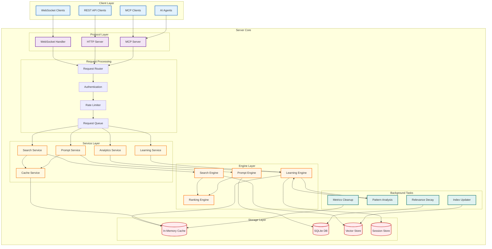
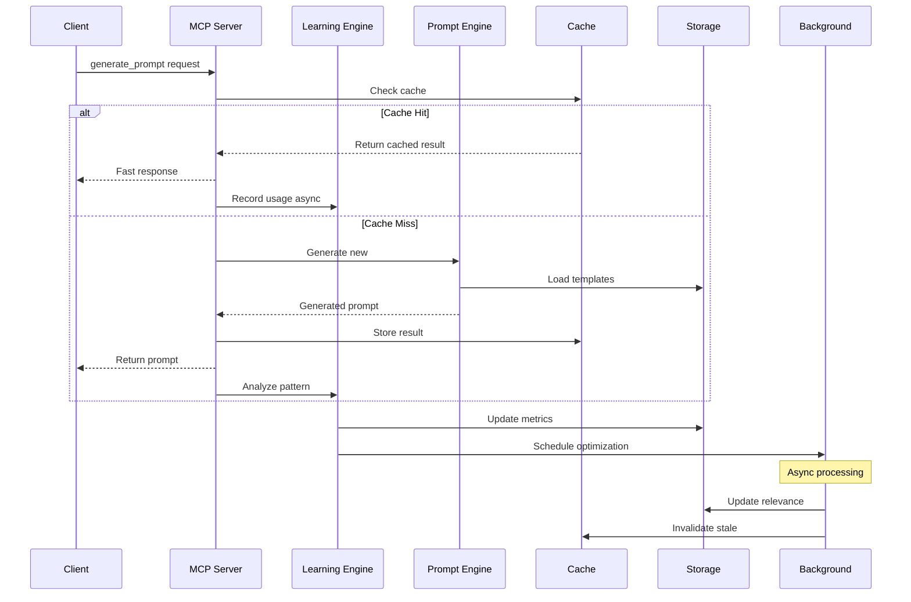
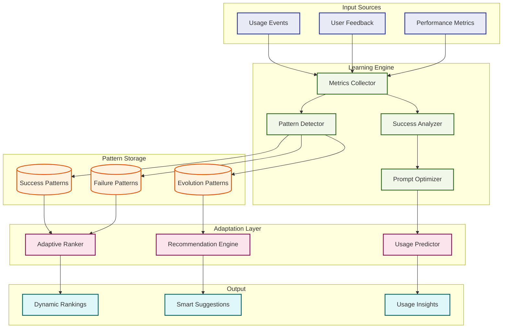
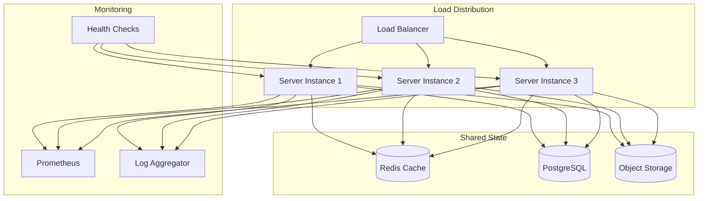

# Server Mode Architecture

```mermaid
graph TB
    subgraph "Client Layer"
        AI[AI Agents]
        API[REST API Clients]
        MCP[MCP Clients]
        WS[WebSocket Clients]
    end

    subgraph "Server Core"
        subgraph "Protocol Layer"
            MCPS[MCP Server]
            HTTP[HTTP Server]
            WSS[WebSocket Handler]
        end
        
        subgraph "Request Processing"
            Router[Request Router]
            Auth[Authentication]
            RL[Rate Limiter]
            Queue[Request Queue]
        end
        
        subgraph "Service Layer"
            PS[Prompt Service]
            LS[Learning Service]
            SS[Search Service]
            AS[Analytics Service]
            CS[Cache Service]
        end
        
        subgraph "Engine Layer"
            PE[Prompt Engine]
            LE[Learning Engine]
            SE[Search Engine]
            RE[Ranking Engine]
        end
        
        subgraph "Background Tasks"
            Decay[Relevance Decay]
            Pattern[Pattern Analysis]
            Cleanup[Metrics Cleanup]
            Index[Index Updater]
        end
        
        subgraph "Storage Layer"
            Memory[(In-Memory Cache)]
            SQLite[(SQLite DB)]
            Vector[(Vector Store)]
            Sessions[(Session Store)]
        end
    end

    %% Client connections
    AI --> MCPS
    API --> HTTP
    MCP --> MCPS
    WS --> WSS
    
    %% Protocol to Router
    MCPS --> Router
    HTTP --> Router
    WSS --> Router
    
    %% Router flow
    Router --> Auth
    Auth --> RL
    RL --> Queue
    
    %% Queue to Services
    Queue --> PS
    Queue --> LS
    Queue --> SS
    Queue --> AS
    
    %% Services to Engines
    PS --> PE
    PS --> CS
    LS --> LE
    SS --> SE
    SS --> CS
    AS --> LE
    
    %% Engine connections
    PE --> RE
    SE --> RE
    LE --> Pattern
    
    %% Background tasks
    Decay --> SQLite
    Pattern --> LE
    Cleanup --> Memory
    Index --> Vector
    
    %% Storage connections
    CS --> Memory
    PE --> SQLite
    SE --> Vector
    LE --> Sessions
    LE --> Memory
    
    %% Styling
    classDef client fill:#e3f2fd,stroke:#1565c0,stroke-width:2px
    classDef protocol fill:#f3e5f5,stroke:#6a1b9a,stroke-width:2px
    classDef service fill:#fff8e1,stroke:#f57f17,stroke-width:2px
    classDef engine fill:#fef5e7,stroke:#ff6f00,stroke-width:2px
    classDef background fill:#e0f2f1,stroke:#00695c,stroke-width:2px
    classDef storage fill:#ffebee,stroke:#c62828,stroke-width:2px
    
    class AI,API,MCP,WS client
    class MCPS,HTTP,WSS protocol
    class PS,LS,SS,AS,CS service
    class PE,LE,SE,RE engine
    class Decay,Pattern,Cleanup,Index background
    class Memory,SQLite,Vector,Sessions storage
```

## Request Flow with Learning

```mermaid
sequenceDiagram
    participant Client
    participant MCP Server
    participant Learning Engine
    participant Prompt Engine
    participant Cache
    participant Storage
    participant Background

    Client->>MCP Server: generate_prompt request
    MCP Server->>Cache: Check cache
    
    alt Cache Hit
        Cache-->>MCP Server: Return cached result
        MCP Server-->>Client: Fast response
        MCP Server->>Learning Engine: Record usage async
    else Cache Miss
        MCP Server->>Prompt Engine: Generate new
        Prompt Engine->>Storage: Load templates
        Prompt Engine-->>MCP Server: Generated prompt
        MCP Server->>Cache: Store result
        MCP Server-->>Client: Return prompt
        MCP Server->>Learning Engine: Analyze pattern
    end
    
    Learning Engine->>Storage: Update metrics
    Learning Engine->>Background: Schedule optimization
    
    Note over Background: Async processing
    Background->>Storage: Update relevance
    Background->>Cache: Invalidate stale
```

## Learning System Architecture

```mermaid
graph TB
    subgraph "Input Sources"
        Usage[Usage Events]
        Feedback[User Feedback]
        Performance[Performance Metrics]
    end
    
    subgraph "Learning Engine"
        Collector[Metrics Collector]
        Detector[Pattern Detector]
        Analyzer[Success Analyzer]
        Optimizer[Prompt Optimizer]
    end
    
    subgraph "Pattern Storage"
        Success[(Success Patterns)]
        Failure[(Failure Patterns)]
        Evolution[(Evolution Patterns)]
    end
    
    subgraph "Adaptation Layer"
        Ranker[Adaptive Ranker]
        Recommender[Recommendation Engine]
        Predictor[Usage Predictor]
    end
    
    subgraph "Output"
        Rankings[Dynamic Rankings]
        Suggestions[Smart Suggestions]
        Insights[Usage Insights]
    end
    
    %% Input flow
    Usage --> Collector
    Feedback --> Collector
    Performance --> Collector
    
    %% Learning flow
    Collector --> Detector
    Detector --> Success
    Detector --> Failure
    Detector --> Evolution
    
    Collector --> Analyzer
    Analyzer --> Optimizer
    
    %% Pattern usage
    Success --> Ranker
    Failure --> Ranker
    Evolution --> Recommender
    
    Optimizer --> Predictor
    
    %% Output generation
    Ranker --> Rankings
    Recommender --> Suggestions
    Predictor --> Insights
    
    %% Styling
    classDef input fill:#e8eaf6,stroke:#283593,stroke-width:2px
    classDef learning fill:#f1f8e9,stroke:#33691e,stroke-width:2px
    classDef pattern fill:#fff3e0,stroke:#e65100,stroke-width:2px
    classDef adapt fill:#fce4ec,stroke:#880e4f,stroke-width:2px
    classDef output fill:#e0f7fa,stroke:#006064,stroke-width:2px
    
    class Usage,Feedback,Performance input
    class Collector,Detector,Analyzer,Optimizer learning
    class Success,Failure,Evolution pattern
    class Ranker,Recommender,Predictor adapt
    class Rankings,Suggestions,Insights output
```

## High Availability Features

```mermaid
graph TB
    subgraph "Load Distribution"
        LB[Load Balancer]
        S1[Server Instance 1]
        S2[Server Instance 2]
        S3[Server Instance 3]
    end
    
    subgraph "Shared State"
        Redis[(Redis Cache)]
        PG[(PostgreSQL)]
        Minio[(Object Storage)]
    end
    
    subgraph "Monitoring"
        Health[Health Checks]
        Metrics[Prometheus]
        Logs[Log Aggregator]
    end
    
    LB --> S1
    LB --> S2
    LB --> S3
    
    S1 --> Redis
    S2 --> Redis
    S3 --> Redis
    
    S1 --> PG
    S2 --> PG
    S3 --> PG
    
    S1 --> Minio
    S2 --> Minio
    S3 --> Minio
    
    Health --> S1
    Health --> S2
    Health --> S3
    
    S1 --> Metrics
    S2 --> Metrics
    S3 --> Metrics
    
    S1 --> Logs
    S2 --> Logs
    S3 --> Logs
```