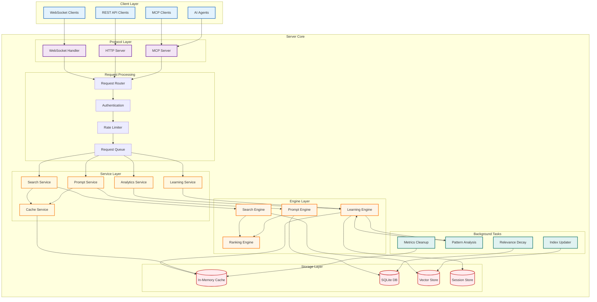

# Server Mode Architecture

```mermaid
graph TB
    subgraph "Client Layer"
        AI[AI Agents]
        API[REST API Clients]
        MCP[MCP Clients]
        WS[WebSocket Clients]
    end

    subgraph "Server Core"
        subgraph "Protocol Layer"
            MCPS[MCP Server]
            HTTP[HTTP Server]
            WSS[WebSocket Handler]
        end
        
        subgraph "Request Processing"
            Router[Request Router]
            Auth[Authentication]
            RL[Rate Limiter]
            Queue[Request Queue]
        end
        
        subgraph "Service Layer"
            PS[Prompt Service]
            LS[Learning Service]
            SS[Search Service]
            AS[Analytics Service]
            CS[Cache Service]
        end
        
        subgraph "Engine Layer"
            PE[Prompt Engine]
            LE[Learning Engine]
            SE[Search Engine]
            RE[Ranking Engine]
        end
        
        subgraph "Background Tasks"
            Decay[Relevance Decay]
            Pattern[Pattern Analysis]
            Cleanup[Metrics Cleanup]
            Index[Index Updater]
        end
        
        subgraph "Storage Layer"
            Memory[(In-Memory Cache)]
            SQLite[(SQLite DB)]
            Vector[(Vector Store)]
            Sessions[(Session Store)]
        end
    end

    %% Client connections
    AI --> MCPS
    API --> HTTP
    MCP --> MCPS
    WS --> WSS
    
    %% Protocol to Router
    MCPS --> Router
    HTTP --> Router
    WSS --> Router
    
    %% Router flow
    Router --> Auth
    Auth --> RL
    RL --> Queue
    
    %% Queue to Services
    Queue --> PS
    Queue --> LS
    Queue --> SS
    Queue --> AS
    
    %% Services to Engines
    PS --> PE
    PS --> CS
    LS --> LE
    SS --> SE
    SS --> CS
    AS --> LE
    
    %% Engine connections
    PE --> RE
    SE --> RE
    LE --> Pattern
    
    %% Background tasks
    Decay --> SQLite
    Pattern --> LE
    Cleanup --> Memory
    Index --> Vector
    
    %% Storage connections
    CS --> Memory
    PE --> SQLite
    SE --> Vector
    LE --> Sessions
    LE --> Memory
    
    %% Styling
    classDef client fill:#e3f2fd,stroke:#1565c0,stroke-width:2px
    classDef protocol fill:#f3e5f5,stroke:#6a1b9a,stroke-width:2px
    classDef service fill:#fff8e1,stroke:#f57f17,stroke-width:2px
    classDef engine fill:#fef5e7,stroke:#ff6f00,stroke-width:2px
    classDef background fill:#e0f2f1,stroke:#00695c,stroke-width:2px
    classDef storage fill:#ffebee,stroke:#c62828,stroke-width:2px
    
    class AI,API,MCP,WS client
    class MCPS,HTTP,WSS protocol
    class PS,LS,SS,AS,CS service
    class PE,LE,SE,RE engine
    class Decay,Pattern,Cleanup,Index background
    class Memory,SQLite,Vector,Sessions storage
``` 