# System Architecture

```mermaid
graph TB
    subgraph "Prompt Alchemy System"
        CLI["`🖥️ **CLI Interface**
        Commands & User Interaction`"]
        
        subgraph "Core Engine"
            PE["`⚗️ **Prompt Engine**
            Alchemical Orchestration`"]
            RE["`🎯 **Ranking Engine** 
            Quality Assessment`"]
            SE["`🔍 **Search Engine**
            Semantic Discovery`"]
        end
        
        subgraph "Provider Layer"
            OpenAI["`🤖 **OpenAI**
            GPT Models + Embeddings`"]
            Anthropic["`🧠 **Anthropic**
            Claude Models`"]
            Google["`🌟 **Google**
            Gemini Models`"]
            OpenRouter["`🔗 **OpenRouter**
            Multi-Model Gateway`"]
            Ollama["`🏠 **Ollama**
            Local Models`"]
        end
        
        subgraph "Storage Layer"
            SQLite["`💾 **SQLite Database**
            Prompts & Metadata`"]
            Embeddings["`🧮 **Vector Store**
            Semantic Embeddings`"]
            Metrics["`📊 **Metrics Store**
            Performance Data`"]
        end
        
        subgraph "Alchemical Phases"
            PM["`🌱 **Prima Materia**
            Raw Idea Extraction`"]
            SO["`💧 **Solutio**
            Natural Language Flow`"]
            CO["`💎 **Coagulatio**
            Precision Crystallization`"]
        end
    end
    
    User["`👤 **User**
    Command Input`"] --> CLI
    CLI --> PE
    PE --> PM
    PM --> SO
    SO --> CO
    
    PE --> OpenAI
    PE --> Anthropic
    PE --> Google
    PE --> OpenRouter
    PE --> Ollama
    
    PE --> SQLite
    SE --> Embeddings
    RE --> Metrics
    
    PE --> RE
    CLI --> SE
    
    style CLI fill:#4CAF50,stroke:#333,stroke-width:2px,color:#fff
    style PE fill:#FF6B35,stroke:#333,stroke-width:3px,color:#fff
    style PM fill:#8BC34A,stroke:#333,stroke-width:2px,color:#fff
    style SO fill:#03A9F4,stroke:#333,stroke-width:2px,color:#fff
    style CO fill:#9C27B0,stroke:#333,stroke-width:2px,color:#fff
```

## Component Responsibilities

### CLI Interface
- Command parsing and validation
- User interaction and feedback
- Output formatting and display
- Configuration management

### Prompt Engine
- Orchestrates the three alchemical phases
- Manages provider selection and coordination
- Handles parallel processing and optimization
- Aggregates and ranks results

### Alchemical Phases
- **Prima Materia**: Extracts core concepts and explores possibilities
- **Solutio**: Transforms rigid ideas into natural, flowing language
- **Coagulatio**: Crystallizes prompts into precise, refined forms

### Provider Layer
- Abstracts different LLM APIs
- Handles authentication and rate limiting
- Provides embeddings and generation capabilities
- Manages fallback and error handling

### Storage Layer
- Persistent storage of prompts and metadata
- Vector embeddings for semantic search
- Performance metrics and analytics
- Configuration and user preferences