# System Architecture

```mermaid
graph TB
    subgraph "User & Agent Interfaces"
        User["`👤 **User**`"]
        Agent["`🤖 **AI Agent**`"]
    end

    subgraph "Prompt Alchemy System"
        subgraph "Interface Layer"
            CLI["`🖥️ **CLI Interface**`"]
            MCPServer["`🌐 **MCP Server**`"]
        end

        subgraph "Core Engine"
            PE["`⚗️ **Prompt Engine**`"]
            SE["`🔍 **Search Engine**`"]
            LE["`🧠 **Learning Engine**`"]
            RE["`🎯 **Ranking Engine**`"]
        end

        subgraph "Provider Layer"
            Providers["`🔌 **Provider Registry**<br/>(OpenAI, Anthropic, Google, etc.)`"]
        end

        subgraph "Storage Layer"
            SQLite["`💾 **SQLite Database**<br/>(Prompts, Metrics, Feedback)`"]
            Embeddings["`🧮 **Vector Store**<br/>(Inside SQLite)`"]
        end

        subgraph "Alchemical Phases"
            Phases["`🔄 **Phased Generation**<br/>(Prima Materia, Solutio, Coagulatio)`"]
        end
    end

    %% Connections
    User --> CLI
    Agent --> MCPServer
    CLI --> PE
    CLI --> SE
    MCPServer --> PE
    MCPServer --> SE
    MCPServer --> LE

    PE --> Phases
    Phases --> Providers
    PE --> RE
    PE --> SQLite

    SE --> Embeddings
    
    LE --> SQLite
    LE --> RE

    RE --> SQLite
    
    SQLite -- "stores" --> Embeddings

    %% Styling
    classDef interface fill:#e1f5fe,stroke:#01579b
    classDef core fill:#f3e5f5,stroke:#4a148c
    classDef provider fill:#e8f5e8,stroke:#1b5e20
    classDef storage fill:#fff3e0,stroke:#e65100
    classDef phases fill:#fce4ec,stroke:#880e4f

    class CLI,MCPServer interface
    class PE,SE,LE,RE core
    class Providers provider
    class SQLite,Embeddings storage
    class Phases phases
```

## Component Responsibilities

### Interface Layer
- **CLI Interface**: Handles command-line parsing, user interaction, and output formatting.
- **MCP Server**: Exposes core functionality to AI agents via the Model Context Protocol.

### Core Engine
- **Prompt Engine**: Orchestrates the three alchemical phases, manages provider selection, and ranks results.
- **Search Engine**: Performs text and semantic vector searches over the prompt database.
- **Learning Engine**: Processes user feedback, detects patterns, and updates ranking models.
- **Ranking Engine**: Scores and ranks prompts based on quality, relevance, and learned weights.

### Alchemical Phases
- **Prima Materia**: Extracts core concepts and explores possibilities.
- **Solutio**: Transforms rigid ideas into natural, flowing language.
- **Coagulatio**: Crystallizes prompts into precise, refined forms.

### Provider Layer
- **Provider Registry**: A unified abstraction layer for all external LLM APIs (OpenAI, Anthropic, etc.), handling authentication, rate limiting, and failover.

### Storage Layer
- **SQLite Database**: The primary data store for prompts, user feedback, performance metrics, and configuration.
- **Vector Store**: Manages vector embeddings (stored as BLOBs in SQLite) for semantic search.