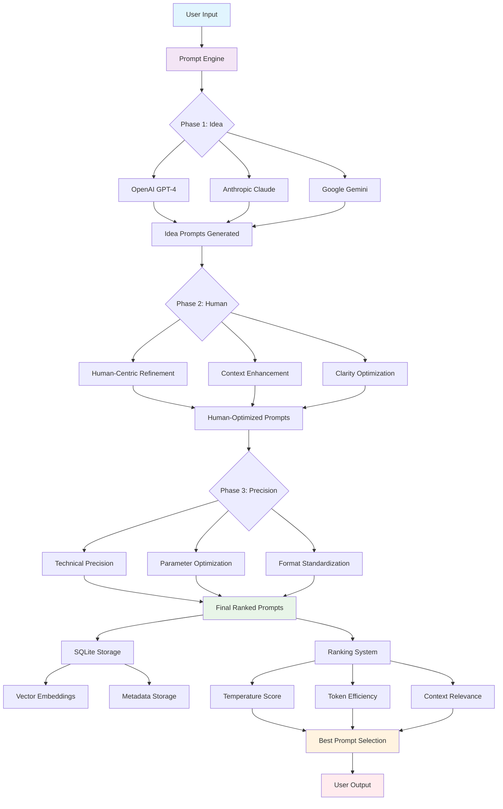
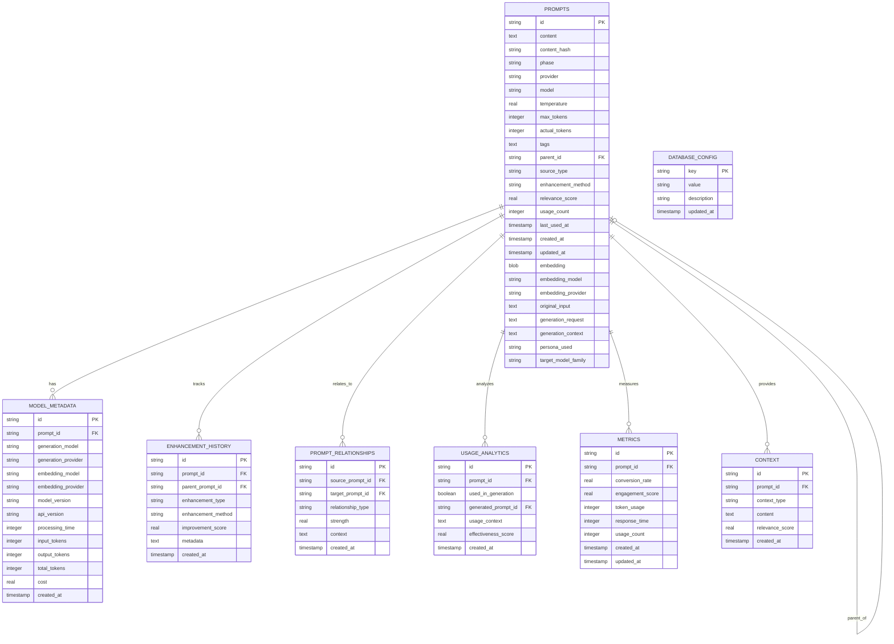
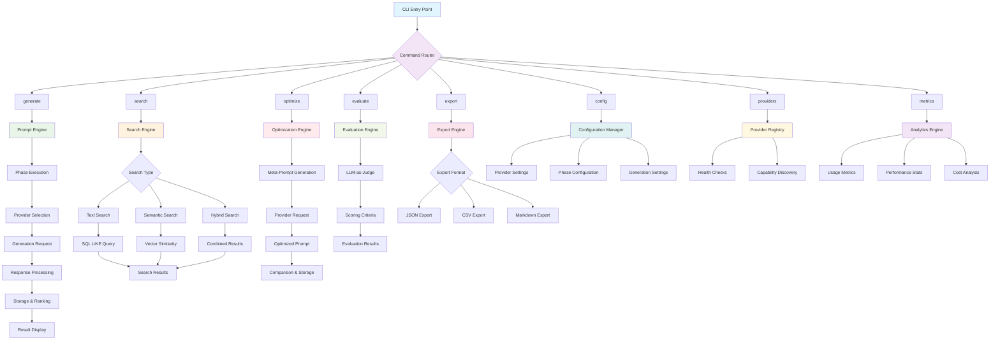
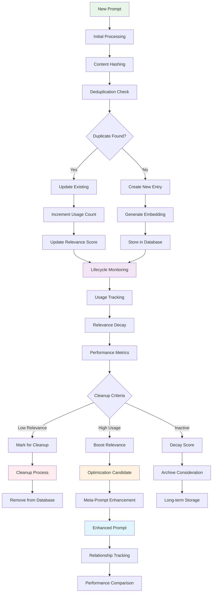
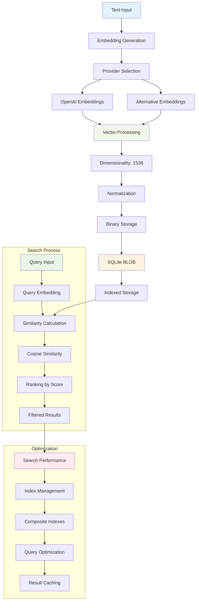
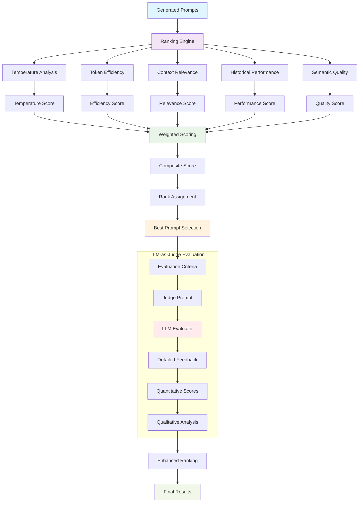

# Architecture Diagrams

This page contains detailed diagrams illustrating the key concepts and architecture of Prompt Alchemy.

## 1. Multi-Phase Prompt Generation Flow

The core workflow of Prompt Alchemy follows a three-phase approach where each phase refines the prompt for different qualities:



## 2. Provider Architecture

The provider system abstracts different LLM services through a common interface:

```mermaid
graph TB
    A[Provider Interface] --> B[OpenAI Provider]
    A --> C[Anthropic Provider]
    A --> D[Google Provider]
    A --> E[OpenRouter Provider]
    A --> F[Ollama Provider]
    
    B --> G[OpenAI API]
    C --> H[Anthropic API]
    D --> I[Google API]
    E --> J[OpenRouter API]
    F --> K[Local Ollama]
    
    subgraph "Provider Capabilities"
        B --> L[Generation + Embeddings]
        C --> M[Generation Only]
        D --> N[Generation Only]
        E --> O[Generation + Embeddings]
        F --> P[Generation Only (Local)]
    end
    
    subgraph "Provider Registry"
        Q[Registry Manager] --> R[Provider Discovery]
        Q --> S[Health Checks]
        Q --> T[Load Balancing]
        Q --> U[Failover Logic]
    end
    
    A --> Q
    
    style A fill:#e3f2fd
    style Q fill:#f1f8e9
    style L fill:#e8f5e8
    style M fill:#fff3e0
    style N fill:#fff3e0
    style O fill:#e8f5e8
    style P fill:#fff3e0
```

## 3. Database Schema and Storage Architecture

The storage layer uses SQLite with vector embeddings for semantic search:



## 4. CLI Command Flow

The command-line interface provides various commands for prompt management:



## 5. Data Flow and Lifecycle Management

The system implements sophisticated lifecycle management for prompts:



## 6. Vector Embedding and Semantic Search

The system uses vector embeddings for semantic search capabilities:



## 7. Ranking and Evaluation System

The ranking system evaluates prompts across multiple dimensions:



## Key Features Illustrated

1. **Multi-Phase Generation**: Three distinct phases (Idea, Human, Precision) each optimizing for different qualities
2. **Provider Abstraction**: Unified interface supporting multiple LLM providers with different capabilities
3. **Vector-Enabled Storage**: SQLite with BLOB embeddings for semantic search and relationship tracking
4. **Lifecycle Management**: Automated relevance scoring, usage tracking, and cleanup processes
5. **Comprehensive Analytics**: Usage metrics, performance tracking, and cost analysis
6. **Flexible Command Interface**: Multiple CLI commands for different use cases
7. **Intelligent Ranking**: Multi-dimensional scoring with optional LLM-as-Judge evaluation

These diagrams provide a comprehensive view of how Prompt Alchemy orchestrates complex prompt engineering workflows while maintaining flexibility and extensibility.