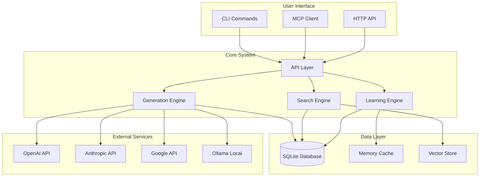
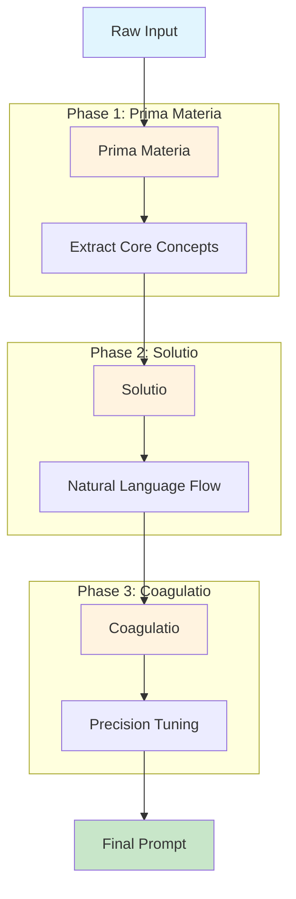
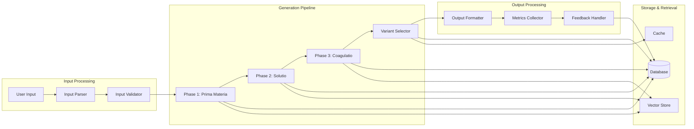
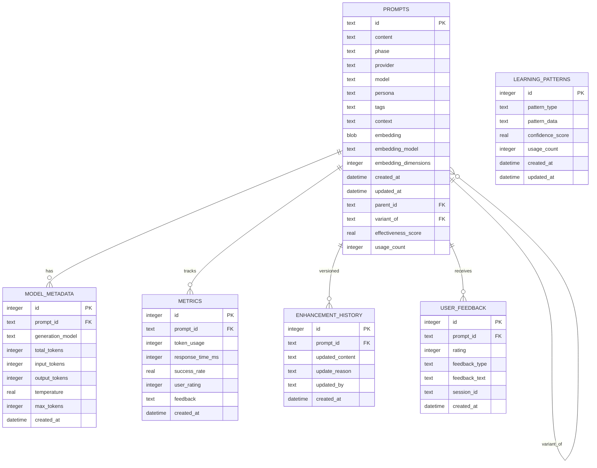
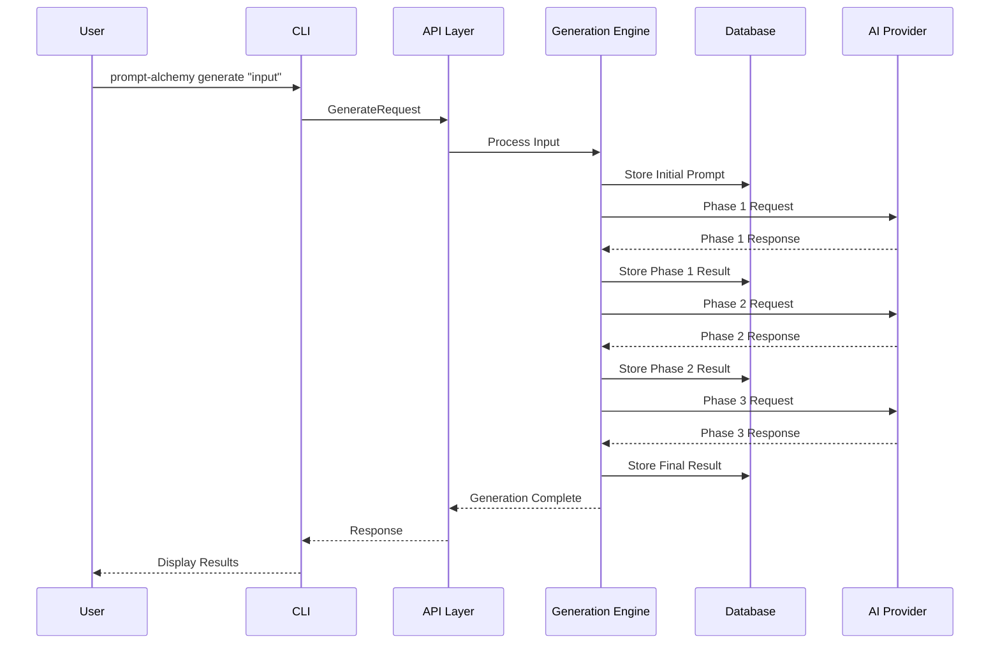
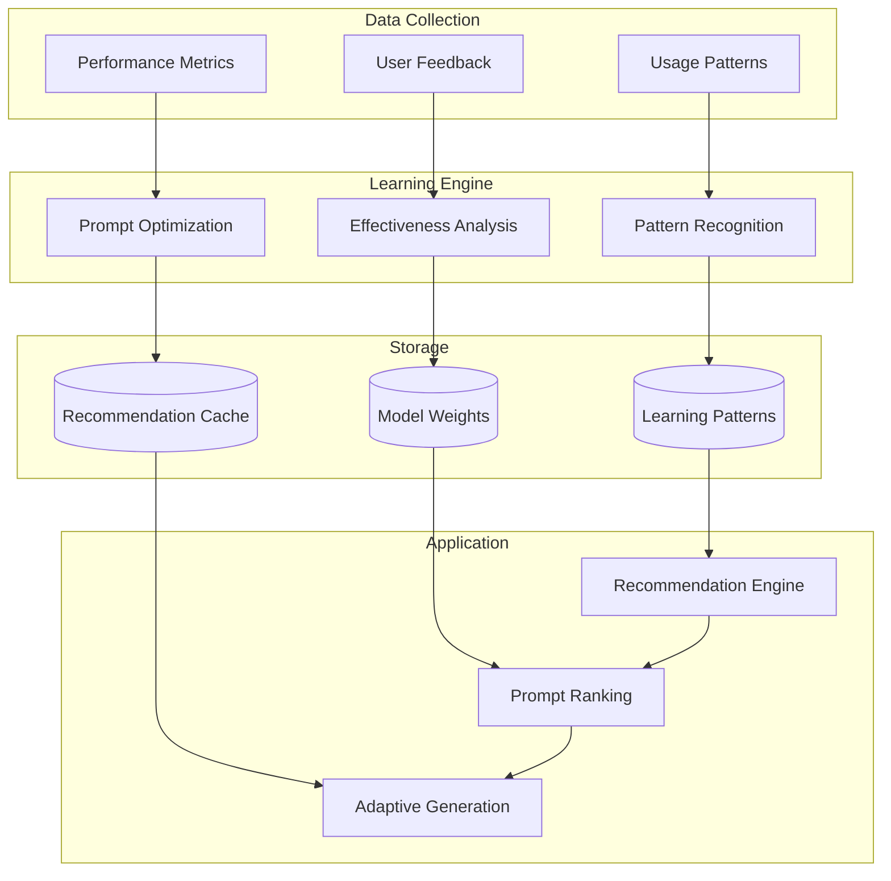
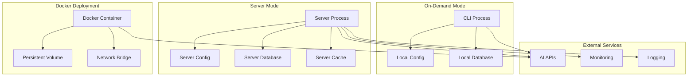
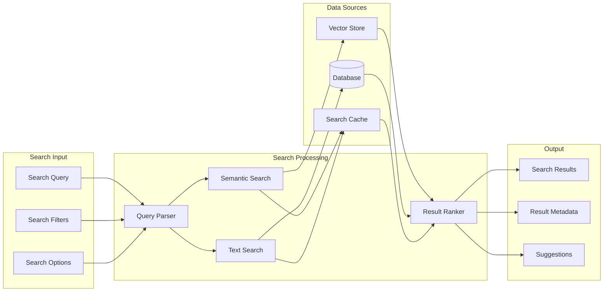
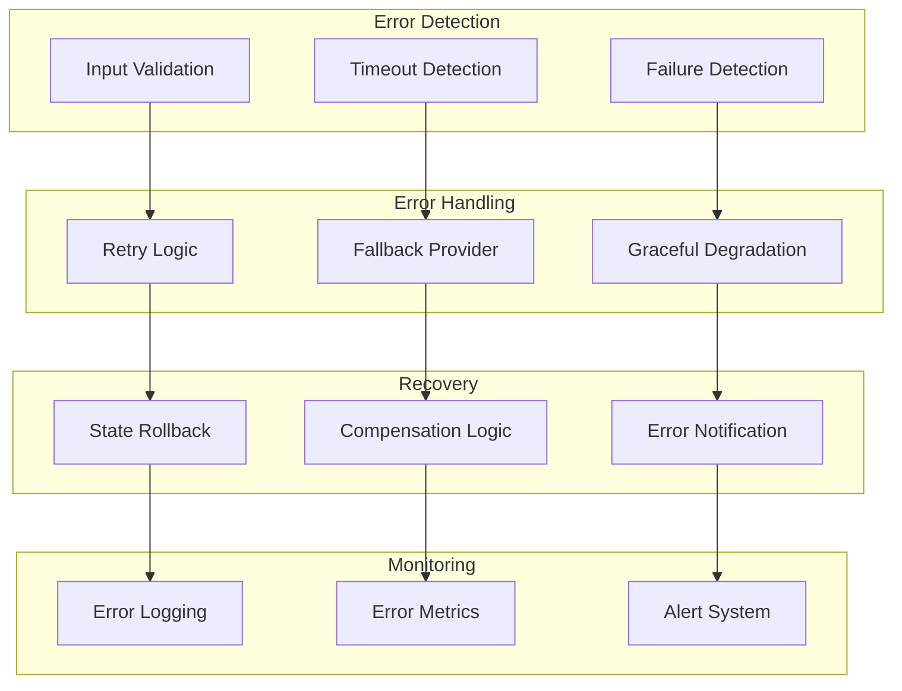
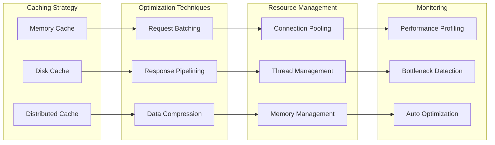

# Architecture Diagrams

This page provides visual representations of Prompt Alchemy's architecture, data flow, and system components using Mermaid diagrams.

## System Overview

## Alchemical Process Flow

## Data Flow Architecture

## Database Schema

## Component Interaction

## Learning System Architecture

## Deployment Architecture

## Search and Retrieval Flow

## Error Handling and Recovery

## Performance Optimization

## Next Steps

- Explore the [Architecture]({{ site.baseurl }}/architecture) documentation for detailed system design
- Review the [Database]({{ site.baseurl }}/database) schema for data structure details
- Check the [CLI Reference]({{ site.baseurl }}/cli-reference) for command-line interface
- Learn about [MCP Integration]({{ site.baseurl }}/mcp-integration) for AI agent connectivity