# Architecture Diagrams

This page contains detailed diagrams illustrating the key concepts and architecture of Prompt Alchemy.

> **Note**: These diagrams are rendered as static images for GitHub Pages compatibility. To regenerate them from the source Mermaid diagrams, run `scripts/render-diagrams.sh`.

## 1. Multi-Phase Prompt Generation Flow

The core workflow of Prompt Alchemy follows a three-phase approach where each phase refines the prompt for different qualities:

The diagram shows:
- **Phase 1 (Idea)**: Initial generation using multiple LLM providers (OpenAI GPT-4, Anthropic Claude, Google Gemini)
- **Phase 2 (Human)**: Human-centric refinement focusing on context enhancement and clarity optimization
- **Phase 3 (Precision)**: Technical precision with parameter optimization and format standardization
- **Storage & Ranking**: Final prompts are stored in SQLite with vector embeddings and ranked by multiple criteria

## 2. Provider Architecture

The provider system abstracts different LLM services through a common interface:

Key components:
- **Provider Interface**: Common abstraction for all LLM providers
- **Provider Implementations**: OpenAI, Anthropic, Google, OpenRouter, and Ollama
- **Provider Capabilities**: Different providers support different features (generation, embeddings)
- **Provider Registry**: Manages provider discovery, health checks, and failover logic

## 3. Database Schema and Storage Architecture

The storage layer uses SQLite with vector embeddings for semantic search:

The schema includes:
- **PROMPTS**: Core prompt storage with embeddings and metadata
- **MODEL_METADATA**: Tracks model performance and costs
- **ENHANCEMENT_HISTORY**: Records prompt improvements
- **PROMPT_RELATIONSHIPS**: Maps relationships between prompts
- **USAGE_ANALYTICS**: Tracks effectiveness and usage patterns
- **METRICS**: Performance and engagement metrics
- **CONTEXT**: Additional contextual information
- **DATABASE_CONFIG**: System configuration storage

## 4. CLI Command Flow

The command-line interface provides various commands for prompt management:

Commands include:
- **generate**: Multi-phase prompt generation
- **search**: Text, semantic, and hybrid search
- **optimize**: Meta-prompt enhancement
- **evaluate**: LLM-as-Judge evaluation
- **export**: Multiple export formats (JSON, CSV, Markdown)
- **config**: Configuration management
- **providers**: Provider health and capabilities
- **metrics**: Analytics and performance stats

## 5. Data Flow and Lifecycle Management

The system implements sophisticated lifecycle management for prompts:

Lifecycle stages:
- **Initial Processing**: Content hashing and deduplication
- **Storage**: Embedding generation and database storage
- **Monitoring**: Usage tracking and relevance scoring
- **Optimization**: Performance-based enhancement candidates
- **Cleanup**: Removal of low-relevance prompts
- **Archival**: Long-term storage for inactive prompts

## 6. Vector Embedding and Semantic Search

The system uses vector embeddings for semantic search capabilities:

Process flow:
- **Embedding Generation**: Text converted to 1536-dimensional vectors
- **Storage**: Binary storage in SQLite BLOBs
- **Search**: Cosine similarity for semantic matching
- **Optimization**: Indexed storage and query optimization

## 7. Ranking and Evaluation System

The ranking system evaluates prompts across multiple dimensions:

Evaluation criteria:
- **Temperature Analysis**: Creativity vs. consistency scoring
- **Token Efficiency**: Cost-effectiveness measurement
- **Context Relevance**: Semantic quality assessment
- **Historical Performance**: Past usage success rates
- **LLM-as-Judge**: Detailed qualitative evaluation

## Key Features Illustrated

1. **Multi-Phase Generation**: Three distinct phases (Idea, Human, Precision) each optimizing for different qualities
2. **Provider Abstraction**: Unified interface supporting multiple LLM providers with different capabilities
3. **Vector-Enabled Storage**: SQLite with BLOB embeddings for semantic search and relationship tracking
4. **Lifecycle Management**: Automated relevance scoring, usage tracking, and cleanup processes
5. **Comprehensive Analytics**: Usage metrics, performance tracking, and cost analysis
6. **Flexible Command Interface**: Multiple CLI commands for different use cases
7. **Intelligent Ranking**: Multi-dimensional scoring with optional LLM-as-Judge evaluation

These diagrams provide a comprehensive view of how Prompt Alchemy orchestrates complex prompt engineering workflows while maintaining flexibility and extensibility.

## Diagram Sources

The original Mermaid diagram sources are maintained in the project repository. To update these diagrams:

1. Edit the Mermaid source in `docs/diagrams-mermaid.md`
2. Run `scripts/render-diagrams.sh` to regenerate the SVG files
3. Commit both the source and generated files

This ensures the diagrams stay up-to-date with the project architecture while remaining viewable on GitHub Pages.