# Architectural Diagrams

This page contains detailed diagrams illustrating the alchemical architecture and processes of Prompt Alchemy.

## Core Architecture Diagrams

### 🏛️ [System Architecture](./assets/diagrams/system-architecture)
Comprehensive overview of the entire Prompt Alchemy system, showing how the CLI interface, alchemical engine, provider layer, and storage components work together.

### ⚗️ [Alchemical Process Flow](./assets/diagrams/alchemical-process)
Detailed flow of the three sacred phases of transformation: Prima Materia → Solutio → Coagulatio, including parallel processing and quality evaluation.

### 🔄 [Data Flow Architecture](./assets/diagrams/data-flow)
How data moves through the system, from user input through processing, storage, and output, including feedback loops and optimization paths.

### 🤖 [Provider Architecture](./assets/diagrams/provider-architecture)
The provider abstraction layer that enables seamless integration with multiple LLM services (OpenAI, Anthropic, Google, OpenRouter, Ollama).

### 💾 [Database Schema](./assets/diagrams/database-schema)
Complete database design with tables, relationships, and indexes that power the intelligent storage and retrieval system.

### 🏆 [Learning-to-Rank Flow](./assets/diagrams/learning-to-rank)
The adaptive learning pipeline from user feedback to improved prompt ranking.

## Operational Mode Diagrams

### 🖥️ [On-Demand Mode Architecture](./assets/diagrams/on-demand-architecture)
Complete architecture for command-line interface mode, showing stateless execution flow and resource lifecycle.

### 🌐 [Server Mode Architecture](./assets/diagrams/server-mode-architecture)
Comprehensive server mode design including MCP protocol layer, learning engine, and high-availability features.

### 📊 [Feature Comparison Matrix](./assets/diagrams/feature-comparison-matrix)
Visual comparison of feature availability, performance characteristics, and integration capabilities between modes.

## Quick Visual Overview

### The Alchemical Transformation Process

```mermaid
flowchart LR
    subgraph "🌱 Prima Materia"
        PM["`**Raw Idea**
        Brainstorming
        Core Extraction`"]
    end
    
    subgraph "💧 Solutio" 
        SO["`**Natural Flow**
        Conversational
        Human-Readable`"]
    end
    
    subgraph "💎 Coagulatio"
        CO["`**Crystallized Form**
        Precise
        Production-Ready`"]
    end
    
    Input["`📝 **User Input**
    Raw Concept`"] --> PM
    PM --> SO
    SO --> CO
    CO --> Output["`✨ **Golden Prompt**
    Refined Result`"]
    
    style Input fill:#FFD700,stroke:#333,stroke-width:2px,color:#000
    style PM fill:#8BC34A,stroke:#333,stroke-width:2px,color:#fff
    style SO fill:#03A9F4,stroke:#333,stroke-width:2px,color:#fff
    style CO fill:#9C27B0,stroke:#333,stroke-width:2px,color:#fff
    style Output fill:#FF6B35,stroke:#333,stroke-width:2px,color:#fff
```

### System Components Overview

```mermaid
graph TB
    subgraph "User Interface"
        CLI["`🖥️ **CLI Commands**
        generate, search, metrics`"]
    end
    
    subgraph "Alchemical Engine"
        Engine["`⚗️ **Prompt Engine**
        Transformation Orchestrator`"]
        Phases["`🔄 **Phase Manager**
        Sacred Transformation`"]
        Ranking["`🏆 **Quality Assessor**
        Result Evaluation`"]
    end
    
    subgraph "Provider Network"
        OpenAI["`🤖 **OpenAI**`"]
        Anthropic["`🧠 **Anthropic**`"]
        Google["`🌟 **Google**`"]
        Others["`🔗 **Others**`"]
    end
    
    subgraph "Intelligent Storage"
        Database["`💾 **SQLite**
        Core Data`"]
        Vectors["`🧮 **Embeddings**
        Semantic Search`"]
        Analytics["`📊 **Metrics**
        Performance Data`"]
    end
    
    CLI --> Engine
    Engine --> Phases
    Engine --> OpenAI
    Engine --> Anthropic
    Engine --> Google
    Engine --> Others
    Engine --> Ranking
    Ranking --> Database
    Database --> Vectors
    Database --> Analytics
    
    style CLI fill:#4CAF50,stroke:#333,stroke-width:2px,color:#fff
    style Engine fill:#FF6B35,stroke:#333,stroke-width:3px,color:#fff
    style Database fill:#2196F3,stroke:#333,stroke-width:2px,color:#fff
```

## Alchemical Principles

### Phase Characteristics

| Phase | Symbol | Purpose | Provider Strength | Output Quality |
|-------|--------|---------|------------------|----------------|
| **Prima Materia** | 🌱 | Raw essence extraction, brainstorming | Creative exploration (GPT excels) | Foundational ideas |
| **Solutio** | 💧 | Natural language flow, accessibility | Conversational AI (Claude excels) | Human-readable prompts |
| **Coagulatio** | 💎 | Precision crystallization, refinement | Technical accuracy (Gemini excels) | Production-ready prompts |

### Quality Transmutation

```mermaid
graph LR
    subgraph "Input Quality"
        Raw["`❓ **Raw Idea**
        Uncertain
        Unstructured`"]
    end
    
    subgraph "Transformation Process"
        T1["`⚗️ **Extract**`"] 
        T2["`🌊 **Dissolve**`"]
        T3["`💎 **Crystallize**`"]
    end
    
    subgraph "Output Quality" 
        Gold["`✨ **Golden Prompt**
        Clear
        Effective
        Ready-to-Use`"]
    end
    
    Raw --> T1
    T1 --> T2  
    T2 --> T3
    T3 --> Gold
    
    style Raw fill:#B0BEC5,stroke:#333,stroke-width:2px,color:#000
    style Gold fill:#FFD700,stroke:#333,stroke-width:2px,color:#000
```

## Technical Implementation

The diagrams linked above provide detailed technical specifications for:

- **Scalability**: How the system handles multiple concurrent requests
- **Reliability**: Fallback mechanisms and error handling
- **Performance**: Optimization strategies and caching layers  
- **Extensibility**: Plugin architecture and provider interfaces
- **Security**: API key management and data protection

## Navigation

- 📚 **[Getting Started](./getting-started)** - Begin your alchemical journey
- 🛠️ **[Installation](./installation)** - Set up your laboratory
- 📖 **[Usage Guide](./usage)** - Master the art of prompt alchemy
- 🏗️ **[Architecture](./architecture)** - Deep technical understanding
- 🔌 **[MCP Integration](./mcp-integration)** - AI assistant connectivity

---

*These diagrams illustrate the sophisticated engineering behind the seemingly magical process of transforming raw ideas into golden prompts through the ancient art of linguistic alchemy.*