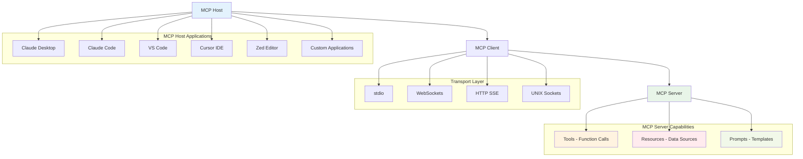

# Model Context Protocol (MCP) Integration Guide

This guide covers how to integrate Prompt Alchemy with various AI assistants and IDEs using the Model Context Protocol (MCP).

## What is MCP?

The Model Context Protocol (MCP) is an open standard introduced by Anthropic that enables AI applications to connect with external data sources, tools, and systems. Think of it as "USB for AI integrations" - a standardized way for different applications to interact with language models.

## MCP Architecture



## Core Components

### 1. MCP Hosts
Applications that users interact with:
- Claude Desktop
- Claude Code CLI
- IDEs (VS Code, Cursor, Zed)
- Custom AI applications

### 2. MCP Clients
Live within host applications and manage connections to MCP servers (1:1 relationship).

### 3. MCP Servers
External programs that expose three main capabilities:
- **Tools**: Functions that LLMs can call (e.g., weather API, database queries)
- **Resources**: Data sources that LLMs can access (similar to REST API endpoints)
- **Prompts**: Pre-defined templates for optimal tool/resource usage

## Creating a Prompt Alchemy MCP Server

### Python Implementation

```python
import asyncio
import json
from typing import List, Dict, Any
import mcp.types as types
from mcp.server import Server
from mcp.server.stdio import stdio_server

# Initialize the MCP server
app = Server("prompt-alchemy-server")

@app.list_tools()
async def list_tools() -> List[types.Tool]:
    """List available Prompt Alchemy tools."""
    return [
        types.Tool(
            name="generate_prompt",
            description="Generate a multi-phase prompt using Prompt Alchemy",
            inputSchema={
                "type": "object",
                "properties": {
                    "prima_materia": {"type": "string", "description": "The initial raw material for the prompt"},
                    "provider": {"type": "string", "description": "LLM provider (openai, anthropic, google, openrouter, ollama)"},
                    "persona": {"type": "string", "description": "Persona to use (code, creative, analytical)"},
                    "temperature": {"type": "number", "description": "Temperature for generation (0.0-1.0)"},
                    "max_tokens": {"type": "integer", "description": "Maximum tokens for generation"}
                },
                "required": ["prima_materia"]
            }
        ),
        types.Tool(
            name="search_prompts",
            description="Search existing prompts in the database",
            inputSchema={
                "type": "object",
                "properties": {
                    "query": {"type": "string", "description": "Search query"},
                    "semantic": {"type": "boolean", "description": "Use semantic search"},
                    "limit": {"type": "integer", "description": "Maximum results to return"}
                },
                "required": ["query"]
            }
        ),
        types.Tool(
            name="optimize_prompt",
            description="Optimize an existing prompt using meta-prompting",
            inputSchema={
                "type": "object",
                "properties": {
                    "prompt_id": {"type": "string", "description": "ID of prompt to optimize"},
                    "criteria": {"type": "string", "description": "Optimization criteria"},
                    "target_model": {"type": "string", "description": "Target model for optimization"}
                },
                "required": ["prompt_id"]
            }
        )
    ]

@app.list_resources()
async def list_resources() -> List[types.Resource]:
    """List available Prompt Alchemy resources."""
    return [
        types.Resource(
            uri="prompt-alchemy://prompts",
            name="Prompt Database",
            description="Access to stored prompts and their metadata"
        ),
        types.Resource(
            uri="prompt-alchemy://metrics",
            name="Usage Metrics",
            description="Analytics and performance data"
        ),
        types.Resource(
            uri="prompt-alchemy://providers",
            name="Provider Status",
            description="Status and configuration of LLM providers"
        )
    ]

@app.call_tool()
async def call_tool(name: str, arguments: Dict[str, Any]) -> List[types.TextContent]:
    """Handle tool calls from MCP clients."""
    if name == "generate_prompt":
        # Execute prompt generation
        result = await generate_prompt_handler(arguments)
        return [types.TextContent(type="text", text=json.dumps(result, indent=2))]
    
    elif name == "search_prompts":
        # Execute prompt search
        result = await search_prompts_handler(arguments)
        return [types.TextContent(type="text", text=json.dumps(result, indent=2))]
    
    elif name == "optimize_prompt":
        # Execute prompt optimization
        result = await optimize_prompt_handler(arguments)
        return [types.TextContent(type="text", text=json.dumps(result, indent=2))]
    
    else:
        raise ValueError(f"Unknown tool: {name}")

async def generate_prompt_handler(args: Dict[str, Any]) -> Dict[str, Any]:
    """Handle prompt generation requests."""
    # This would integrate with the actual Prompt Alchemy engine
    return {
        "status": "success",
        "phases": {
            "prima-materia": "Generated prima materia phase prompt",
            "solutio": "Generated solutio phase prompt", 
            "coagulatio": "Generated coagulatio phase prompt"
        },
        "best_prompt": "Final optimized prompt",
        "ranking_score": 0.95
    }

async def search_prompts_handler(args: Dict[str, Any]) -> Dict[str, Any]:
    """Handle prompt search requests."""
    # This would integrate with the database search functionality
    return {
        "status": "success",
        "results": [
            {
                "id": "prompt_123",
                "content": "Example prompt content",
                "score": 0.92,
                "created_at": "2024-01-01T00:00:00Z"
            }
        ]
    }

async def optimize_prompt_handler(args: Dict[str, Any]) -> Dict[str, Any]:
    """Handle prompt optimization requests."""
    # This would integrate with the optimization engine
    return {
        "status": "success",
        "original_prompt": "Original prompt content",
        "optimized_prompt": "Optimized prompt content",
        "improvement_score": 0.15
    }

async def main():
    """Main MCP server entry point."""
    async with stdio_server() as streams:
        await app.run(
            streams[0],
            streams[1],
            app.create_initialization_options()
        )

if __name__ == "__main__":
    asyncio.run(main())
```

### TypeScript Implementation

```typescript
import { Server } from "@modelcontextprotocol/sdk/server/index.js";
import { StdioServerTransport } from "@modelcontextprotocol/sdk/server/stdio.js";
import {
  CallToolRequestSchema,
  ListToolsRequestSchema,
  ListResourcesRequestSchema,
} from "@modelcontextprotocol/sdk/types.js";

const server = new Server({
  name: "prompt-alchemy-server",
  version: "1.0.0"
}, {
  capabilities: {
    tools: {},
    resources: {}
  }
});

// List available tools
server.setRequestHandler(ListToolsRequestSchema, async () => {
  return {
    tools: [
      {
        name: "generate_prompt",
        description: "Generate a multi-phase prompt using Prompt Alchemy",
        inputSchema: {
          type: "object",
          properties: {
            prima_materia: { type: "string", description: "The initial raw material for the prompt" },
            provider: { type: "string", description: "LLM provider" },
            persona: { type: "string", description: "Persona to use" }
          },
          required: ["prima_materia"]
        }
      },
      {
        name: "search_prompts",
        description: "Search existing prompts in the database",
        inputSchema: {
          type: "object",
          properties: {
            query: { type: "string", description: "Search query" },
            semantic: { type: "boolean", description: "Use semantic search" }
          },
          required: ["query"]
        }
      }
    ]
  };
});

// List available resources
server.setRequestHandler(ListResourcesRequestSchema, async () => {
  return {
    resources: [
      {
        uri: "prompt-alchemy://prompts",
        name: "Prompt Database",
        description: "Access to stored prompts and their metadata"
      },
      {
        uri: "prompt-alchemy://metrics",
        name: "Usage Metrics", 
        description: "Analytics and performance data"
      }
    ]
  };
});

// Handle tool calls
server.setRequestHandler(CallToolRequestSchema, async (request) => {
  const { name, arguments: args } = request.params;
  
  switch (name) {
    case "generate_prompt":
      return {
        content: [
          {
            type: "text",
            text: JSON.stringify(await generatePrompt(args), null, 2)
          }
        ]
      };
    
    case "search_prompts":
      return {
        content: [
          {
            type: "text", 
            text: JSON.stringify(await searchPrompts(args), null, 2)
          }
        ]
      };
    
    default:
      throw new Error(`Unknown tool: ${name}`);
  }
});

async function generatePrompt(args: any) {
  // Implementation would integrate with Prompt Alchemy
  return {
    status: "success",
    phases: {
      "prima-materia": "Generated prima materia phase prompt",
      solutio: "Generated solutio phase prompt",
      coagulatio: "Generated coagulatio phase prompt"
    },
    best_prompt: "Final optimized prompt",
    ranking_score: 0.95
  };
}

async function searchPrompts(args: any) {
  // Implementation would integrate with database
  return {
    status: "success",
    results: [
      {
        id: "prompt_123",
        content: "Example prompt content",
        score: 0.92,
        created_at: new Date().toISOString()
      }
    ]
  };
}

// Start the server
async function main() {
  const transport = new StdioServerTransport();
  await server.connect(transport);
}

main().catch(console.error);
```

## Integration with AI Assistants

### Claude Desktop Integration

1. **Install Claude Desktop**: Download from [claude.ai](https://claude.ai)

2. **Configure MCP Server**: Edit Claude Desktop configuration:

```json
{
  "mcpServers": {
    "prompt-alchemy": {
      "command": "python",
      "args": ["path/to/prompt-alchemy-mcp-server.py"],
      "env": {
        "PROMPT_ALCHEMY_CONFIG": "~/.prompt-alchemy/config.yaml"
      }
    }
  }
}
```

3. **Usage**: Once configured, Claude Desktop will automatically:
   - Load available tools and resources
   - Allow you to generate prompts through natural language
   - Search existing prompts semantically
   - Optimize prompts based on criteria

### Claude Code Integration

1. **Install Claude Code**: Follow the [installation guide](https://docs.anthropic.com/claude/docs/claude-code)

2. **Configure MCP**: Add to your Claude Code configuration:

```bash
# Add MCP server to Claude Code
claude config set mcp.servers.prompt-alchemy.command "python"
claude config set mcp.servers.prompt-alchemy.args '["path/to/prompt-alchemy-mcp-server.py"]'
```

3. **Usage**: Use Claude Code with MCP integration:
   - Generate prompts directly in terminal
   - Search and optimize prompts in context
   - Access prompt analytics and metrics

### IDE Integration

#### VS Code

1. **Install MCP Extension**: Install an MCP-compatible extension

2. **Configure Server**: Add to VS Code settings:

```json
{
  "mcp.servers": {
    "prompt-alchemy": {
      "command": "python",
      "args": ["path/to/prompt-alchemy-mcp-server.py"]
    }
  }
}
```

#### Cursor IDE

1. **Built-in MCP Support**: Cursor has native MCP support

2. **Configuration**: Add to Cursor settings:

```json
{
  "mcp": {
    "servers": {
      "prompt-alchemy": {
        "command": "python",
        "args": ["path/to/prompt-alchemy-mcp-server.py"]
      }
    }
  }
}
```

#### Zed Editor

1. **Install Zed**: Download from [zed.dev](https://zed.dev)

2. **Configure MCP**: Add to Zed configuration:

```json
{
  "assistant": {
    "mcp_servers": {
      "prompt-alchemy": {
        "command": "python",
        "args": ["path/to/prompt-alchemy-mcp-server.py"]
      }
    }
  }
}
```

### Other AI Assistants

#### Gemini Integration

While Gemini doesn't natively support MCP, you can create a bridge:

1. **Create HTTP Bridge**: Convert MCP server to HTTP API

```python
from flask import Flask, request, jsonify
import asyncio

app = Flask(__name__)

@app.route('/generate', methods=['POST'])
async def generate_prompt():
    data = request.json
    # Bridge to MCP server
    result = await call_mcp_tool("generate_prompt", data)
    return jsonify(result)

@app.route('/search', methods=['POST'])
async def search_prompts():
    data = request.json
    result = await call_mcp_tool("search_prompts", data)
    return jsonify(result)
```

2. **Gemini Integration**: Use the HTTP API with Gemini's function calling

#### ChatGPT Integration

Similar to Gemini, create custom GPT actions:

```json
{
  "openapi": "3.0.0",
  "info": {
    "title": "Prompt Alchemy API",
    "version": "1.0.0"
  },
  "paths": {
    "/generate": {
      "post": {
        "summary": "Generate prompt",
        "requestBody": {
          "required": true,
          "content": {
            "application/json": {
              "schema": {
                "type": "object",
                "properties": {
                  "prima_materia": {"type": "string"},
                  "provider": {"type": "string"}
                }
              }
            }
          }
        }
      }
    }
  }
}
```

## Transport Options

### stdio (Standard Input/Output)
- **Use case**: Command-line tools, simple integrations
- **Configuration**: Direct process spawning
- **Pros**: Simple, widely supported
- **Cons**: Limited to local processes

### WebSockets
- **Use case**: Real-time applications, web-based tools
- **Configuration**: WebSocket endpoint
- **Pros**: Real-time, bidirectional communication
- **Cons**: More complex setup

### HTTP Server-Sent Events (SSE)
- **Use case**: Web applications, streaming responses
- **Configuration**: HTTP endpoint with SSE support
- **Pros**: Good for streaming, web-friendly
- **Cons**: One-way communication

### UNIX Sockets
- **Use case**: High-performance local communication
- **Configuration**: Socket file path
- **Pros**: Fast, secure local communication
- **Cons**: UNIX/Linux only

## Best Practices

1. **Security**: Always validate inputs and authenticate connections
2. **Error Handling**: Implement robust error handling and logging
3. **Performance**: Use appropriate transport for your use case
4. **Documentation**: Document your tools and resources clearly
5. **Testing**: Test with multiple MCP clients
6. **Monitoring**: Implement health checks and metrics

## Troubleshooting

### Common Issues

1. **Connection Failures**
   - Check transport configuration
   - Verify server is running
   - Check firewall settings

2. **Tool Execution Errors**
   - Validate input schemas
   - Check error logs
   - Verify dependencies

3. **Performance Issues**
   - Monitor resource usage
   - Optimize database queries
   - Consider caching strategies

### Debug Mode

Enable debug logging:

```python
import logging
logging.basicConfig(level=logging.DEBUG)
```

### Health Checks

Implement health check endpoints:

```python
@app.list_resources()
async def health_check():
    return [
        types.Resource(
            uri="prompt-alchemy://health",
            name="Health Check",
            description="Server health status"
        )
    ]
```

## Future Enhancements

1. **Advanced Analytics**: Real-time metrics and monitoring
2. **Multi-tenant Support**: Support for multiple users/organizations
3. **Plugin System**: Extensible architecture for custom providers
4. **Cloud Integration**: Support for cloud-based deployments
5. **Enhanced Security**: OAuth, API keys, rate limiting

## Contributing

To contribute to MCP integration:

1. Fork the repository
2. Create a feature branch
3. Implement MCP server functionality
4. Add tests and documentation
5. Submit a pull request

## Resources

- [MCP Official Documentation](https://modelcontextprotocol.io/)
- [MCP GitHub Repository](https://github.com/modelcontextprotocol)
- [Claude Desktop MCP Guide](https://claude.ai/mcp)
- [Anthropic MCP Blog Post](https://www.anthropic.com/news/model-context-protocol)

This integration guide provides a comprehensive foundation for connecting Prompt Alchemy with various AI assistants and development environments through the Model Context Protocol.

## Next Steps

For detailed information about available MCP tools, resources, and prompts, see the [MCP Tools Reference](./mcp-tools).