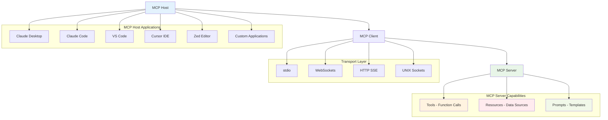

# Model Context Protocol (MCP) Integration Guide

This guide covers how to integrate Prompt Alchemy with various AI assistants and IDEs using the Model Context Protocol (MCP).

## What is MCP?

The Model Context Protocol (MCP) is an open standard introduced by Anthropic that enables AI applications to connect with external data sources, tools, and systems. Think of it as "USB for AI integrations" - a standardized way for different applications to interact with language models.

## MCP Architecture



## Core Components

### 1. MCP Hosts
Applications that users interact with:
- Claude Desktop
- Claude Code CLI
- IDEs (VS Code, Cursor, Zed)
- Custom AI applications

### 2. MCP Clients
Live within host applications and manage connections to MCP servers (1:1 relationship).

### 3. MCP Servers
External programs that expose three main capabilities:
- **Tools**: Functions that LLMs can call (e.g., weather API, database queries)
- **Resources**: Data sources that LLMs can access (similar to REST API endpoints)
- **Prompts**: Pre-defined templates for optimal tool/resource usage

## Prompt Alchemy MCP Server Implementation

Prompt Alchemy includes a built-in MCP server that exposes 17 tools for AI agents to interact with the system. The server uses the JSON-RPC 2.0 protocol over stdio transport.

### Starting the MCP Server

```bash
# Start the MCP server
prompt-alchemy serve
```

The server listens on stdin/stdout for JSON-RPC messages from MCP clients.

### Available Tools

The MCP server provides 17 comprehensive tools:

#### 1. **generate_prompts**
Generate AI prompts using a phased approach with multiple providers and personas.

**Parameters:**
- `input` (string, required): The input text or idea to generate prompts for
- `phases` (string): Comma-separated phases to use (default: "idea,human,precision")
- `count` (integer): Number of prompt variants to generate (default: 3)
- `persona` (string): AI persona to use (code, writing, analysis, generic) (default: "code")
- `provider` (string): Override provider for all phases
- `temperature` (number): Temperature for generation 0.0-1.0 (default: 0.7)
- `max_tokens` (integer): Maximum tokens for generation (default: 2000)
- `tags` (string): Comma-separated tags for organization
- `target_model` (string): Target model family for optimization
- `save` (boolean): Save generated prompts to database (default: true)
- `output_format` (string): Output format - console, json, markdown (default: "console")

#### 2. **batch_generate_prompts**
Generate multiple prompts efficiently from various input formats.

**Parameters:**
- `inputs` (array, required): Array of input objects for batch processing
- `workers` (integer): Number of concurrent workers 1-20 (default: 3)
- `skip_errors` (boolean): Continue processing despite failures (default: false)
- `timeout` (integer): Per-job timeout in seconds (default: 300)
- `output_format` (string): Output format - json, summary (default: "json")

#### 3. **search_prompts**
Search existing prompts using text or semantic search.

**Parameters:**
- `query` (string): Search query (optional for filtered searches)
- `semantic` (boolean): Use semantic search with embeddings (default: false)
- `similarity` (number): Minimum similarity threshold 0.0-1.0 (default: 0.5)
- `phase` (string): Filter by phase (idea, human, precision)
- `provider` (string): Filter by provider
- `tags` (string): Filter by tags (comma-separated)
- `since` (string): Filter by creation date (YYYY-MM-DD)
- `limit` (integer): Maximum number of results (default: 10)
- `output_format` (string): Output format - table, json, markdown (default: "table")

#### 4. **get_prompt_by_id**
Get detailed information about a specific prompt.

**Parameters:**
- `prompt_id` (string, required): UUID of the prompt to retrieve
- `include_metrics` (boolean): Include performance metrics (default: true)
- `include_context` (boolean): Include context information (default: true)

#### 5. **optimize_prompt**
Optimize prompts using AI-powered meta-prompting and self-improvement.

**Parameters:**
- `prompt` (string, required): Prompt to optimize
- `task` (string, required): Task description for optimization context
- `persona` (string): AI persona to use (default: "code")
- `target_model` (string): Target model family for optimization
- `judge_provider` (string): Provider to use for evaluation (default: "openai")
- `max_iterations` (integer): Maximum optimization iterations (default: 3)
- `target_score` (number): Target quality score 0.0-1.0 (default: 0.8)
- `save` (boolean): Save optimization results (default: true)
- `output_format` (string): Output format - console, json, markdown (default: "console")

#### 6. **update_prompt**
Update an existing prompt's content, tags, or parameters.

**Parameters:**
- `prompt_id` (string, required): UUID of the prompt to update
- `content` (string): New content for the prompt
- `tags` (string): New tags (comma-separated)
- `temperature` (number): New temperature 0.0-1.0
- `max_tokens` (integer): New max tokens

#### 7. **delete_prompt**
Delete an existing prompt and its associated data.

**Parameters:**
- `prompt_id` (string, required): UUID of the prompt to delete

#### 8. **track_prompt_relationship**
Track relationships between prompts for enhanced discovery.

**Parameters:**
- `source_prompt_id` (string, required): UUID of the source prompt
- `target_prompt_id` (string, required): UUID of the target prompt
- `relationship_type` (string, required): Type of relationship (derived_from, similar_to, inspired_by, merged_with)
- `strength` (number): Relationship strength 0.0-1.0 (default: 0.5)
- `context` (string): Context explaining the relationship

#### 9. **get_metrics**
Get prompt performance metrics and analytics.

**Parameters:**
- `phase` (string): Filter by phase
- `provider` (string): Filter by provider
- `since` (string): Filter by creation date (YYYY-MM-DD)
- `limit` (integer): Maximum number of prompts to analyze (default: 100)
- `report` (string): Generate report (daily, weekly, monthly)
- `output_format` (string): Output format - table, json, markdown (default: "table")
- `export` (string): Export to file (csv, json, excel)

#### 10. **get_database_stats**
Get comprehensive database statistics including lifecycle information.

**Parameters:**
- `include_relationships` (boolean): Include prompt relationship statistics (default: true)
- `include_enhancements` (boolean): Include enhancement history statistics (default: true)
- `include_usage` (boolean): Include usage analytics (default: true)

#### 11. **run_lifecycle_maintenance**
Run database lifecycle maintenance including relevance scoring and cleanup.

**Parameters:**
- `update_relevance` (boolean): Update relevance scores with decay (default: true)
- `cleanup_old` (boolean): Remove old and low-relevance prompts (default: true)
- `dry_run` (boolean): Show what would be cleaned up without doing it (default: false)

#### 12. **get_providers**
List available providers and their capabilities.

**Parameters:** None

#### 13. **test_providers**
Test provider connectivity and functionality.

**Parameters:**
- `providers` (array): Specific providers to test (empty for all)
- `test_generation` (boolean): Test generation capabilities (default: true)
- `test_embeddings` (boolean): Test embedding capabilities (default: true)
- `output_format` (string): Output format - json, table (default: "table")

#### 14. **get_config**
View current configuration settings and system status.

**Parameters:**
- `show_providers` (boolean): Include provider configurations (default: true)
- `show_phases` (boolean): Include phase assignments (default: true)
- `show_generation` (boolean): Include generation settings (default: true)

#### 15. **validate_config**
Validate configuration settings and provide optimization suggestions.

**Parameters:**
- `categories` (array): Validation categories to check (default: ["all"])
- `fix` (boolean): Apply automatic fixes where possible (default: false)
- `output_format` (string): Output format - json, report (default: "report")

#### 16. **get_version**
Get version and build information.

**Parameters:**
- `detailed` (boolean): Include detailed build information (default: false)

### Protocol Details

#### Request Format
```json
{
  "jsonrpc": "2.0",
  "id": "unique-request-id",
  "method": "tools/call",
  "params": {
    "name": "generate_prompts",
    "arguments": {
      "input": "Create a REST API for user management",
      "phases": "idea,human,precision",
      "count": 3
    }
  }
}
```

#### Response Format
```json
{
  "jsonrpc": "2.0",
  "id": "unique-request-id",
  "result": {
    "content": [
      {
        "type": "text",
        "text": "Generated 3 prompts using persona 'code'..."
      }
    ],
    "isError": false
  }
}
```

#### Error Response
```json
{
  "jsonrpc": "2.0",
  "id": "unique-request-id",
  "error": {
    "code": -32602,
    "message": "Invalid params",
    "data": "input is required"
  }
}
```

## Integration with AI Assistants

### Claude Desktop Integration

1. **Install Claude Desktop**: Download from [claude.ai](https://claude.ai)

2. **Configure MCP Server**: Edit Claude Desktop configuration file:
   - On macOS: `~/Library/Application Support/Claude/claude_desktop_config.json`
   - On Windows: `%APPDATA%\Claude\claude_desktop_config.json`

```json
{
  "mcpServers": {
    "prompt-alchemy": {
      "command": "prompt-alchemy",
      "args": ["serve"],
      "env": {
        "PROMPT_ALCHEMY_DATA_DIR": "~/.prompt-alchemy"
      }
    }
  }
}
```

3. **Usage**: Once configured, Claude Desktop will automatically:
   - Connect to the Prompt Alchemy MCP server
   - Load all 17 available tools
   - Allow you to generate prompts through natural language
   - Search existing prompts semantically
   - Optimize prompts based on criteria
   - Access database statistics and maintenance functions

### Claude Code Integration

1. **Install Claude Code**: Follow the [installation guide](https://docs.anthropic.com/claude/docs/claude-code)

2. **Configure MCP**: Add to your Claude Code configuration:

```bash
# Add MCP server to Claude Code
claude config set mcp.servers.prompt-alchemy.command "prompt-alchemy"
claude config set mcp.servers.prompt-alchemy.args '["serve"]'
claude config set mcp.servers.prompt-alchemy.env.PROMPT_ALCHEMY_DATA_DIR "~/.prompt-alchemy"
```

3. **Usage**: Use Claude Code with MCP integration:
   - Generate prompts directly in terminal
   - Search and optimize prompts in context
   - Access prompt analytics and metrics
   - Run batch operations
   - Manage database lifecycle
   - Test provider connectivity

### IDE Integration

#### VS Code

1. **Install MCP Extension**: Install an MCP-compatible extension from the marketplace

2. **Configure Server**: Add to VS Code settings.json:

```json
{
  "mcp.servers": {
    "prompt-alchemy": {
      "command": "prompt-alchemy",
      "args": ["serve"],
      "env": {
        "PROMPT_ALCHEMY_DATA_DIR": "~/.prompt-alchemy"
      }
    }
  }
}
```

#### Cursor IDE

1. **Built-in MCP Support**: Cursor has native MCP support

2. **Configuration**: Add to Cursor settings:

```json
{
  "mcp": {
    "servers": {
      "prompt-alchemy": {
        "command": "prompt-alchemy",
        "args": ["serve"],
        "env": {
          "PROMPT_ALCHEMY_DATA_DIR": "~/.prompt-alchemy"
        }
      }
    }
  }
}
```

#### Zed Editor

1. **Install Zed**: Download from [zed.dev](https://zed.dev)

2. **Configure MCP**: Add to Zed configuration:

```json
{
  "assistant": {
    "mcp_servers": {
      "prompt-alchemy": {
        "command": "prompt-alchemy",
        "args": ["serve"],
        "env": {
          "PROMPT_ALCHEMY_DATA_DIR": "~/.prompt-alchemy"
        }
      }
    }
  }
}
```

### Other AI Assistants

#### Custom MCP Clients

For AI assistants that don't natively support MCP, you can create a client that connects to the Prompt Alchemy MCP server:

```javascript
// Example Node.js MCP client
const { spawn } = require('child_process');
const readline = require('readline');

class PromptAlchemyClient {
  constructor() {
    this.server = spawn('prompt-alchemy', ['serve']);
    this.rl = readline.createInterface({
      input: this.server.stdout,
      output: this.server.stdin
    });
    this.requestId = 0;
  }

  async callTool(toolName, args) {
    const request = {
      jsonrpc: "2.0",
      id: ++this.requestId,
      method: "tools/call",
      params: {
        name: toolName,
        arguments: args
      }
    };
    
    this.server.stdin.write(JSON.stringify(request) + '\n');
    
    return new Promise((resolve, reject) => {
      this.rl.once('line', (line) => {
        const response = JSON.parse(line);
        if (response.error) {
          reject(new Error(response.error.message));
        } else {
          resolve(response.result);
        }
      });
    });
  }

  async generatePrompts(input, options = {}) {
    return this.callTool('generate_prompts', {
      input,
      ...options
    });
  }

  async searchPrompts(query, options = {}) {
    return this.callTool('search_prompts', {
      query,
      ...options
    });
  }
}

// Usage
const client = new PromptAlchemyClient();
const result = await client.generatePrompts('Create a REST API');
console.log(result);
```

#### HTTP Bridge for Non-MCP Systems

For systems that can't directly use stdio communication, create an HTTP bridge:

```javascript
// Express.js HTTP bridge server
const express = require('express');
const { PromptAlchemyClient } = require('./client');

const app = express();
const client = new PromptAlchemyClient();

app.use(express.json());

// Expose MCP tools as HTTP endpoints
app.post('/api/generate', async (req, res) => {
  try {
    const result = await client.generatePrompts(req.body.input, req.body.options);
    res.json(result);
  } catch (error) {
    res.status(500).json({ error: error.message });
  }
});

app.post('/api/search', async (req, res) => {
  try {
    const result = await client.searchPrompts(req.body.query, req.body.options);
    res.json(result);
  } catch (error) {
    res.status(500).json({ error: error.message });
  }
});

app.listen(3000, () => {
  console.log('HTTP Bridge running on port 3000');
});
```

## Transport Options

### stdio (Standard Input/Output)
- **Use case**: Command-line tools, simple integrations
- **Configuration**: Direct process spawning
- **Pros**: Simple, widely supported
- **Cons**: Limited to local processes

### WebSockets
- **Use case**: Real-time applications, web-based tools
- **Configuration**: WebSocket endpoint
- **Pros**: Real-time, bidirectional communication
- **Cons**: More complex setup

### HTTP Server-Sent Events (SSE)
- **Use case**: Web applications, streaming responses
- **Configuration**: HTTP endpoint with SSE support
- **Pros**: Good for streaming, web-friendly
- **Cons**: One-way communication

### UNIX Sockets
- **Use case**: High-performance local communication
- **Configuration**: Socket file path
- **Pros**: Fast, secure local communication
- **Cons**: UNIX/Linux only

## Best Practices

1. **Security**: Always validate inputs and authenticate connections
2. **Error Handling**: Implement robust error handling and logging
3. **Performance**: Use appropriate transport for your use case
4. **Documentation**: Document your tools and resources clearly
5. **Testing**: Test with multiple MCP clients
6. **Monitoring**: Implement health checks and metrics

## Troubleshooting

### Common Issues

1. **Connection Failures**
   - Ensure `prompt-alchemy` is in your PATH
   - Check that the binary has execute permissions
   - Verify database initialization: `prompt-alchemy migrate`
   - Check log output: `prompt-alchemy --log-level debug serve`

2. **Tool Execution Errors**
   - Check provider configuration: `prompt-alchemy providers`
   - Validate API keys are set correctly
   - Review error messages in MCP client logs
   - Ensure database is not locked by another process

3. **Performance Issues**
   - Run database maintenance: Use `run_lifecycle_maintenance` tool
   - Check database size and consider cleanup
   - Monitor provider response times with `test_providers` tool
   - Review embedding coverage with `get_database_stats` tool

### Debug Mode

Enable debug logging when starting the server:

```bash
prompt-alchemy --log-level debug serve
```

Or set environment variable:
```bash
export PROMPT_ALCHEMY_LOG_LEVEL=debug
prompt-alchemy serve
```

### Testing the MCP Server

Test the server directly using JSON-RPC:

```bash
# Initialize the server
echo '{"jsonrpc":"2.0","id":1,"method":"initialize","params":{}}' | prompt-alchemy serve

# List available tools
echo '{"jsonrpc":"2.0","id":2,"method":"tools/list","params":{}}' | prompt-alchemy serve

# Call a tool
echo '{"jsonrpc":"2.0","id":3,"method":"tools/call","params":{"name":"get_version","arguments":{"detailed":true}}}' | prompt-alchemy serve
```

### Provider Issues

If providers are not working:

1. Test provider connectivity:
   ```json
   {
     "jsonrpc": "2.0",
     "id": 1,
     "method": "tools/call",
     "params": {
       "name": "test_providers",
       "arguments": {}
     }
   }
   ```

2. Check configuration:
   ```json
   {
     "jsonrpc": "2.0",
     "id": 2,
     "method": "tools/call",
     "params": {
       "name": "get_config",
       "arguments": {}
     }
   }
   ```

3. Validate configuration:
   ```json
   {
     "jsonrpc": "2.0",
     "id": 3,
     "method": "tools/call",
     "params": {
       "name": "validate_config",
       "arguments": {"fix": true}
     }
   }
   ```

## Future Enhancements

1. **Advanced Analytics**: Real-time metrics and monitoring
2. **Multi-tenant Support**: Support for multiple users/organizations
3. **Plugin System**: Extensible architecture for custom providers
4. **Cloud Integration**: Support for cloud-based deployments
5. **Enhanced Security**: OAuth, API keys, rate limiting

## Contributing

To contribute to MCP integration:

1. Fork the repository
2. Create a feature branch
3. Implement MCP server functionality
4. Add tests and documentation
5. Submit a pull request

## Resources

- [MCP Official Documentation](https://modelcontextprotocol.io/)
- [MCP GitHub Repository](https://github.com/modelcontextprotocol)
- [Claude Desktop MCP Guide](https://claude.ai/mcp)
- [Anthropic MCP Blog Post](https://www.anthropic.com/news/model-context-protocol)

This integration guide provides a comprehensive foundation for connecting Prompt Alchemy with various AI assistants and development environments through the Model Context Protocol.

## Next Steps

For detailed information about available MCP tools, resources, and prompts, see the [MCP Tools Reference](./mcp-tools).