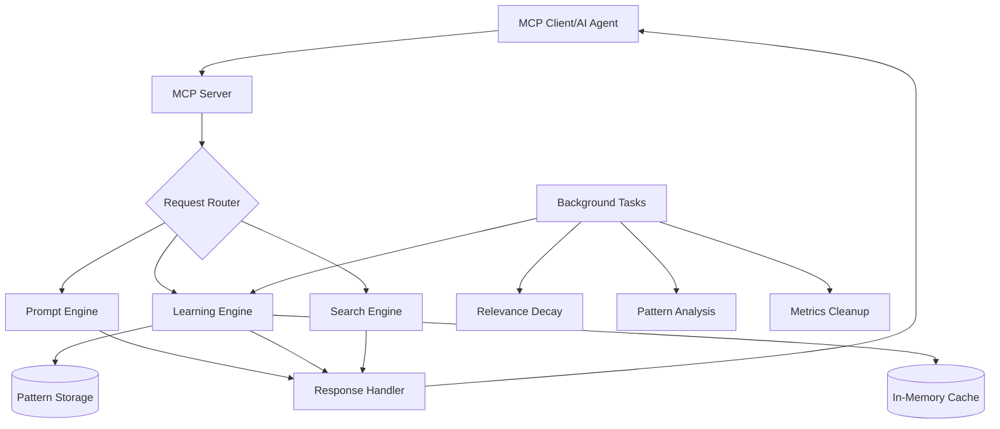

# On-Demand vs Server Mode

Prompt Alchemy offers two distinct operational modes to suit different use cases and infrastructure requirements. This comprehensive guide explains the differences, features, pros and cons of each mode.

## Overview

### On-Demand Mode (CLI)
The default mode where Prompt Alchemy runs as a command-line tool, executing tasks and terminating after completion. Perfect for development, scripting, and resource-conscious environments.

### Server Mode (MCP Server)
A persistent service that runs continuously, exposing Prompt Alchemy's capabilities through the Model Context Protocol (MCP). Ideal for AI agents, integrations, and production environments.

## Quick Comparison

| Aspect | On-Demand | Server Mode |
|--------|-----------|-------------|
| Interface | CLI commands (e.g., prompt-alchemy generate) | HTTP API + MCP tools |
| Use Case | Quick, one-off generations | Production, integrated services |
| Persistence | Config file + local SQLite | Full persistent state |
| Features | Basic generation, search, metrics | + Real-time learning, 17 MCP tools, concurrent processing |
| Startup | Instant | Runs as daemon |

Switch modes with prompt-alchemy serve for server.

## Mode Details

### On-Demand Mode

#### How It Works
```bash
# Each command runs independently
prompt-alchemy generate "Create a REST API"
prompt-alchemy search "authentication"
prompt-alchemy validate prompt.yaml
```

#### Architecture


#### Available Features
- ✅ Prompt generation with alchemical phases
- ✅ Semantic search across prompt library
- ✅ Prompt validation and testing
- ✅ Batch processing
- ✅ Export/Import functionality
- ✅ Basic metrics tracking
- ⚠️ Limited learning (no real-time adaptation)
- ❌ No continuous monitoring
- ❌ No WebSocket/real-time features

#### Pros
1. **Minimal Resource Usage**: Zero memory footprint when not running
2. **Simple Deployment**: No daemon management required
3. **Script-Friendly**: Easy integration with bash/shell scripts
4. **Predictable**: Same input always produces same output
5. **Secure**: No exposed network ports
6. **Version Control**: Easy to pin specific versions

#### Cons
1. **Startup Overhead**: Must initialize on every run
2. **No State Persistence**: Can't maintain context between runs
3. **Limited Learning**: Can't adapt based on real-time usage
4. **No Real-Time Features**: Can't push updates or notifications
5. **Integration Limitations**: Requires process spawning

### Server Mode

#### How It Works
```bash
# Start once, use continuously
prompt-alchemy serve

# Or with specific configuration
prompt-alchemy serve --port 8080 --learning-enabled
```

#### Architecture


#### Available Features
- ✅ All on-demand features
- ✅ Real-time adaptive learning
- ✅ Pattern recognition and optimization
- ✅ Session management
- ✅ WebSocket support for live updates
- ✅ Concurrent request handling
- ✅ In-memory caching
- ✅ Background optimization tasks
- ✅ Usage analytics and insights
- ✅ Multi-user support

#### MCP Tools Available (17 total)
1. **generate_prompt** - Create prompts with alchemical transformation
2. **search_prompts** - Semantic search with relevance scoring
3. **validate_prompt** - Real-time validation with feedback
4. **get_prompt_by_id** - Direct prompt retrieval
5. **list_prompts** - Browse with filtering and pagination
6. **export_prompts** - Bulk export capabilities
7. **import_prompts** - Bulk import with validation
8. **batch_generate** - Concurrent batch processing
9. **test_prompt** - Live testing with providers
10. **get_metrics** - Real-time performance metrics
11. **optimize_prompt** - AI-powered optimization
12. **get_prompt_history** - Version tracking
13. **compare_prompts** - Side-by-side analysis
14. **create_prompt_template** - Template management
15. **track_prompt_relationship** - Relationship mapping
16. **record_feedback** - Learning feedback loop
17. **get_recommendations** - AI-powered suggestions

#### Pros
1. **High Performance**: No startup overhead after initial launch
2. **Adaptive Learning**: Continuously improves recommendations
3. **Real-Time Features**: WebSocket support, live updates
4. **Concurrent Processing**: Handle multiple requests efficiently
5. **Rich Integration**: Native MCP protocol support
6. **Stateful Operations**: Maintains context and sessions
7. **Background Optimization**: Automatic pattern detection

#### Cons
1. **Resource Usage**: Constant memory consumption (~50-200MB)
2. **Complexity**: Requires process management
3. **Security Considerations**: Exposed network endpoint
4. **Monitoring Required**: Need health checks and logs
5. **Update Complexity**: Requires graceful restart

## Feature Comparison Matrix

### Core Features

| Feature | On-Demand | Server Mode |
|---------|-----------|-------------|
| **Prompt Generation** | ✅ Full | ✅ Full + Learning |
| **Semantic Search** | ✅ Full | ✅ Full + Cached |
| **Validation** | ✅ Full | ✅ Full + Real-time |
| **Batch Processing** | ✅ Sequential | ✅ Parallel |
| **Export/Import** | ✅ Full | ✅ Full + Streaming |

### Advanced Features

| Feature | On-Demand | Server Mode |
|---------|-----------|-------------|
| **Adaptive Learning** | ❌ | ✅ Real-time |
| **Pattern Recognition** | ❌ | ✅ Continuous |
| **Session Management** | ❌ | ✅ Multi-user |
| **WebSocket Support** | ❌ | ✅ Full |
| **Background Tasks** | ❌ | ✅ Automated |
| **Usage Analytics** | ⚠️ Basic | ✅ Comprehensive |
| **Caching** | ❌ | ✅ In-memory |
| **Hot Reload** | ❌ | ✅ Config watch |

### Performance Characteristics

| Metric | On-Demand | Server Mode |
|--------|-----------|-------------|
| **Startup Time** | 100-500ms | 2-5s (once) |
| **Request Latency** | 100-500ms | 10-50ms |
| **Memory Usage** | 0MB (idle) | 50-200MB |
| **CPU Usage** | 0% (idle) | 0.1-1% (idle) |
| **Concurrent Requests** | 1 | 100+ |

## Use Case Recommendations

### Choose On-Demand Mode When:
- 🎯 Building CI/CD pipelines
- 🎯 Creating development scripts
- 🎯 Resource-constrained environments (Raspberry Pi, containers)
- 🎯 Infrequent usage patterns (< 1 request/minute)
- 🎯 Simple automation tasks
- 🎯 Security-sensitive environments (air-gapped networks)
- 🎯 Batch processing workflows
- 🎯 Command-line tool integration

### Choose Server Mode When:
- 🎯 Integrating with AI assistants (Claude, GPT, Copilot)
- 🎯 Building production services
- 🎯 Need real-time features (WebSocket updates)
- 🎯 High-frequency usage (> 10 requests/minute)
- 🎯 Multi-user environments
- 🎯 Want adaptive learning from usage patterns
- 🎯 Building SaaS applications
- 🎯 Need session state management

## Real-World Examples

### On-Demand Mode Use Cases

#### 1. Git Commit Message Generator
```bash
#!/bin/bash
# commit-msg.sh - Generate commit messages from staged changes

changes=$(git diff --staged --name-only)
prompt="Generate a commit message for these changes: $changes"
message=$(prompt-alchemy generate "$prompt" --format plain)
git commit -m "$message"
```

#### 2. Documentation Generator Pipeline
```yaml
# .github/workflows/generate-docs.yml
name: Generate API Documentation
on: [push]

jobs:
  generate:
    runs-on: ubuntu-latest
    steps:
      - uses: actions/checkout@v3
      - name: Install Prompt Alchemy
        run: |
          curl -L https://github.com/jonwraymond/prompt-alchemy/releases/latest/download/prompt-alchemy-linux-amd64 -o prompt-alchemy
          chmod +x prompt-alchemy
      - name: Generate Docs
        run: |
          for file in api/*.yaml; do
            ./prompt-alchemy generate "Create API documentation for $file" > "docs/$(basename $file .yaml).md"
          done
      - name: Commit Documentation
        run: |
          git add docs/
          git commit -m "Update API documentation" || true
          git push
```

#### 3. Code Review Assistant
```bash
#!/bin/bash
# review.sh - Generate code review comments

diff=$(git diff main...HEAD)
prompt="Review this code and suggest improvements: $diff"
prompt-alchemy generate "$prompt" \
  --persona code_reviewer \
  --format markdown \
  > review-comments.md
```

### Server Mode Use Cases

#### 1. VS Code Extension Integration
```typescript
// extension.ts
import { MCPClient } from '@modelcontextprotocol/sdk';

const client = new MCPClient('http://localhost:8080');

export async function generateDocstring(code: string) {
  const result = await client.call('generate_prompt', {
    input: `Generate JSDoc for: ${code}`,
    persona: 'documentation',
    context: { language: 'typescript' }
  });
  
  // Record usage for learning
  await client.call('record_feedback', {
    prompt_id: result.prompt_id,
    effectiveness: 0.9,
    context: 'vscode-docstring'
  });
  
  return result.content;
}
```

#### 2. Slack Bot with Learning
```python
# slack_bot.py
import asyncio
from slack_bolt.async_app import AsyncApp
from mcp_client import MCPClient

app = AsyncApp(token=SLACK_BOT_TOKEN)
mcp = MCPClient("http://prompt-alchemy:8080")

@app.message("generate")
async def handle_generate(message, say):
    # Get user's request
    prompt = message['text'].replace('generate', '').strip()
    
    # Generate with context
    result = await mcp.call('generate_prompt', {
        'input': prompt,
        'context': {
            'channel': message['channel'],
            'user': message['user'],
            'thread_ts': message.get('thread_ts')
        }
    })
    
    # Send response
    response = await say(result['content'], thread_ts=message['ts'])
    
    # Track for learning
    asyncio.create_task(track_reaction(
        result['prompt_id'],
        message['ts'],
        response['ts']
    ))

async def track_reaction(prompt_id, message_ts, response_ts):
    # Wait for reactions
    await asyncio.sleep(60)
    
    # Check reactions and record feedback
    reactions = await get_reactions(response_ts)
    effectiveness = calculate_effectiveness(reactions)
    
    await mcp.call('record_feedback', {
        'prompt_id': prompt_id,
        'effectiveness': effectiveness,
        'rating': len(reactions.get('thumbsup', [])),
        'context': 'slack-reaction'
    })
```

#### 3. API Gateway with Caching
```javascript
// api-gateway.js
const express = require('express');
const { MCPClient } = require('@modelcontextprotocol/sdk');

const app = express();
const mcp = new MCPClient(process.env.PROMPT_ALCHEMY_URL);

// Middleware for usage tracking
app.use(async (req, res, next) => {
  req.startTime = Date.now();
  req.sessionId = req.headers['x-session-id'] || crypto.randomUUID();
  next();
});

app.post('/api/generate', async (req, res) => {
  try {
    // Check cache first (server-side caching)
    const cached = await mcp.call('search_prompts', {
      query: req.body.prompt,
      limit: 1,
      min_similarity: 0.95
    });

    if (cached.results.length > 0) {
      return res.json({
        content: cached.results[0].content,
        cached: true,
        prompt_id: cached.results[0].id
      });
    }

    // Generate new prompt
    const result = await mcp.call('generate_prompt', {
      input: req.body.prompt,
      persona: req.body.persona || 'general',
      temperature: req.body.temperature || 0.7,
      context: {
        session_id: req.sessionId,
        user_agent: req.headers['user-agent'],
        api_version: 'v1'
      }
    });

    res.json({
      content: result.content,
      cached: false,
      prompt_id: result.prompt_id
    });

    // Async feedback recording
    const duration = Date.now() - req.startTime;
    mcp.call('record_feedback', {
      prompt_id: result.prompt_id,
      session_id: req.sessionId,
      generation_time: duration,
      effectiveness: duration < 1000 ? 0.9 : 0.7
    }).catch(console.error);

  } catch (error) {
    res.status(500).json({ error: error.message });
  }
});

// Learning analytics endpoint
app.get('/api/analytics', async (req, res) => {
  const stats = await mcp.call('get_learning_stats');
  res.json(stats);
});

app.listen(3000);
```

## Migration Guide

### From On-Demand to Server Mode

1. **Update Configuration**
```yaml
# config.yaml
mode: server
server:
  port: 8080
  host: 0.0.0.0
learning:
  enabled: true
  learning_rate: 0.1
```

2. **Start Server**
```bash
# Basic start
prompt-alchemy serve

# With systemd
sudo systemctl start prompt-alchemy
```

3. **Update Integrations**
```javascript
// Before (CLI)
const result = execSync('prompt-alchemy generate "..."');

// After (MCP)
const client = new MCPClient('http://localhost:8080');
const result = await client.call('generate_prompt', {...});
```

### From Server Mode to On-Demand

1. **Export Data**
```bash
# Export learned patterns and data
curl http://localhost:8080/api/export > backup.json
```

2. **Stop Server**
```bash
sudo systemctl stop prompt-alchemy
```

3. **Use CLI Directly**
```bash
# Back to simple CLI usage
prompt-alchemy generate "Create API endpoint"
```

## Best Practices

### On-Demand Mode
1. **Use Shell Scripts**: Automate common workflows
2. **Cache Results**: Store generated prompts locally
3. **Batch Operations**: Process multiple items at once
4. **Version Control**: Track prompt configurations

### Server Mode
1. **Monitor Health**: Set up health check endpoints
2. **Configure Limits**: Set appropriate resource limits
3. **Enable Learning**: Maximize adaptive features
4. **Secure Endpoints**: Use authentication if exposed
5. **Regular Backups**: Export learned patterns

## Security Considerations

### On-Demand Mode
- ✅ No network exposure
- ✅ Process isolation
- ✅ Minimal attack surface
- ⚠️ Check script permissions

### Server Mode
- ⚠️ Network endpoint exposure
- ⚠️ Authentication recommended
- ⚠️ Rate limiting advised
- ✅ MCP protocol security
- ✅ Input validation built-in

## Troubleshooting

### Common On-Demand Issues
```bash
# Issue: Slow startup
# Solution: Use --no-update-check flag
prompt-alchemy --no-update-check generate "..."

# Issue: Path not found
# Solution: Use absolute paths
prompt-alchemy validate /absolute/path/to/prompt.yaml
```

### Common Server Issues
```bash
# Issue: Port already in use
# Solution: Change port or find process
prompt-alchemy serve --port 8081

# Issue: High memory usage
# Solution: Adjust learning parameters
# config.yaml
learning:
  feedback_window: 12h  # Reduce from 24h
  pattern_limit: 5000   # Reduce from 10000
```

## Conclusion

Both modes serve different purposes in the Prompt Alchemy ecosystem:

- **On-Demand Mode**: Perfect for development, scripting, and resource-conscious deployments
- **Server Mode**: Ideal for production services, AI integrations, and when adaptive learning is valuable

Choose based on your specific requirements, infrastructure constraints, and desired features. Both modes use the same core engine, ensuring consistent prompt quality regardless of deployment choice.

---

*Next: [Learning Mode Configuration](learning-mode.md) | [MCP Integration Guide](mcp-integration.md)*